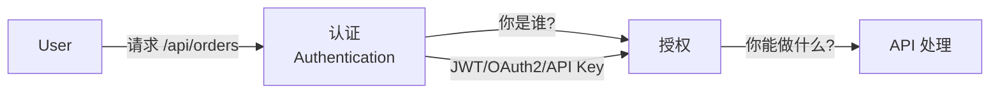

# API 认证与授权安全

> API 认证问题占 OWASP API Security Top 10 的 4 个位置——身份是 API 安全的核心。

---

## 认证 vs 授权



## JWT 安全

### 常见漏洞

```python
import jwt

# ❌ 漏洞1：算法混淆（alg:none）
token = jwt.encode({"user": "admin"}, key="", algorithm="none")
# 服务端用公钥验证，但客户端指定 alg=none → 绕过签名

# ✅ 修复
jwt.decode(token, public_key, algorithms=["RS256"], options={
    "require": ["exp", "iat", "iss"],
    "verify_signature": True,
    "verify_exp": True
})

# ❌ 漏洞2：算法混淆（RS256 → HS256）
# 服务端使用 RS256（非对称），但接受 HS256（对称）
# 攻击者使用公钥作为 HS256 的密钥签名 JWT
# 服务端用同样的公钥解密... 通过！

# ✅ 修复：明确指定允许的算法
jwt.decode(token, public_key, algorithms=["RS256"])

# ❌ 漏洞3：无过期时间
token = jwt.encode({"user": "admin"}, secret)  # 缺少 exp 字段
# 令牌永不过期

# ✅ 修复：设置短过期时间
token = jwt.encode({
    "user": "admin",
    "exp": datetime.utcnow() + timedelta(minutes=15),
    "iat": datetime.utcnow(),
    "iss": "api.company.com"
}, secret, algorithm="HS256")
```

## OAuth 2.0 安全

### Authorization Code + PKCE（推荐）

```python
import requests
import hashlib
import base64
import secrets

# OAuth 2.1 强制 PKCE

class OAuthClient:
    def __init__(self, client_id, redirect_uri):
        self.client_id = client_id
        self.redirect_uri = redirect_uri
    
    def create_pkce_challenge(self):
        """生成 PKCE 验证码"""
        code_verifier = secrets.token_urlsafe(64)
        code_challenge = base64.urlsafe_b64encode(
            hashlib.sha256(code_verifier.encode()).digest()
        ).rstrip(b'=').decode()
        return code_verifier, code_challenge
    
    def get_auth_url(self):
        """生成授权请求 URL"""
        _, challenge = self.create_pkce_challenge()
        return (
            f"https://auth.server/authorize?"
            f"response_type=code&"
            f"client_id={self.client_id}&"
            f"redirect_uri={self.redirect_uri}&"
            f"code_challenge={challenge}&"
            f"code_challenge_method=S256&"
            f"state={secrets.token_hex(16)}&"
            f"scope=openid profile"
        )
```

### 常见 OAuth 漏洞

```
1. CSRF 攻击授权回调
   ❌ 缺少 state 参数
   ✅ 每次请求生成随机 state 并在回调中验证

2. 重定向 URI 遍历
   ❌ redirect_uri 未校验 → 可跳转到任意 URL
   ✅ 白名单校验 redirect_uri（完全匹配）

3. 授权码拦截
   ❌ 使用 URL 参数传递授权码
   ✅ 使用 POST/PKCE 防止拦截

4. 刷新令牌泄露
   ❌ 刷新令牌永久有效
   ✅ 设置刷新令牌有效期 + 轮换机制
```

## API Key 管理

```python
import secrets
import hashlib
import hmac

class APIKeyManager:
    def __init__(self):
        # API Key 格式: company_prefix_xxxxxxxxxxxxxxxxxxxxxxxxxxx
        self.prefix = "comp_"
    
    def generate_api_key(self) -> tuple[str, str]:
        """生成 API Key 和对应的哈希（存库）"""
        raw_key = self.prefix + secrets.token_urlsafe(32)
        # 只存储哈希值——这样数据库泄露也无法使用
        key_hash = hashlib.sha256(raw_key.encode()).hexdigest()
        return raw_key, key_hash  # raw_key 仅返回一次
    
    def verify_api_key(self, raw_key: str, stored_hash: str) -> bool:
        """验证 API Key"""
        computed = hashlib.sha256(raw_key.encode()).hexdigest()
        return hmac.compare_digest(computed, stored_hash)
```

## 速率限制（Rate Limiting）

```python
from fastapi import FastAPI, HTTPException
from slowapi import Limiter, _rate_limit_exceeded_handler
from slowapi.util import get_remote_address

limiter = Limiter(key_func=get_remote_address)
app = FastAPI()
app.state.limiter = limiter
app.add_exception_handler(429, _rate_limit_exceeded_handler)

# 按端点设置不同限制
@app.get("/api/public")
@limiter.limit("100/minute")
async def public_api(request: Request):
    return {"status": "public"}

@app.post("/api/login")
@limiter.limit("5/minute")  # 登录接口严格限制
async def login(request: Request):
    return {"status": "login"}

# 按用户级别
@app.get("/api/premium")
@limiter.limit("1000/hour")
async def premium_api(request: Request):
    return {"status": "premium"}
```

## API 安全强化清单

```
认证层:
[ ] 密码使用 bcrypt/argon2（不自己加密）
[ ] JWT 使用 RS256/ES256（不无算法）
[ ] JWT 过期时间 ≤ 15 分钟
[ ] 刷新令牌有轮换机制
[ ] API Key 支持即时吊销
[ ] MFA 默认开启

授权层:
[ ] 每一个 API 端点做授权检查
[ ] 使用 RBAC/ABAC 模型
[ ] 水平越权检查（A 不能访问 B 的资源）
[ ] 批量接口限制

传输层:
[ ] HTTPS 强制（HSTS 配置）
[ ] API Key 不在 URL 中传递
[ ] CORS 白名单配置

日志与监控:
[ ] 所有 API 请求记录审计日志
[ ] 异常调用模式告警（暴力破解/爬虫）
[ ] 敏感操作（删除/权限变更）额外确认
```

*上一篇：[API 安全设计](01-api-security.md)*

*下一篇：[API 渗透测试实战](02-api-pentesting.md)*
