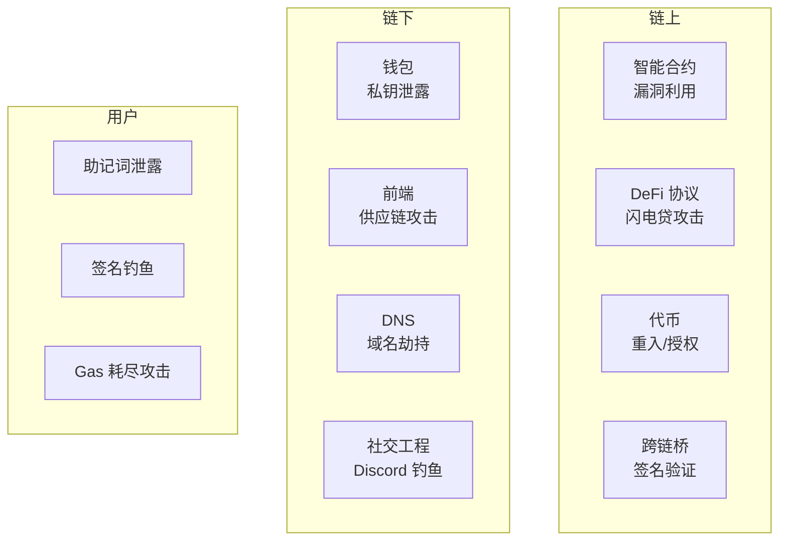

# 区块链与Web3安全概述

> Web3 安全损失在 2024 年超过 20 亿美元——智能合约漏洞是头号杀手。

---

## 攻击面全景



## 智能合约攻击类型

| 攻击类型 | 损失(TLH) | 经典案例 |
|---------|-----------|---------|
| 重入攻击 | $300M+ | The DAO (2016) |
| 闪电贷攻击 | $1.2B+ | Cream/BSC 多次 |
| 预言机操纵 | $500M+ | Venus (BNB) |
| 权限漏洞 | $600M+ | Ronin Bridge |
| 签名重放 | $200M+ | Multichain |
| 治理攻击 | $200M+ | Beanstalk |

## 重入攻击详解

```solidity
// ❌ 漏洞合约：先转账后更新状态
contract VulnerableBank {
    mapping(address => uint256) public balances;

    function withdraw(uint256 _amount) public {
        require(balances[msg.sender] >= _amount);
        (bool success, ) = msg.sender.call{value: _amount}("");
        require(success, "Transfer failed");
        balances[msg.sender] -= _amount; // 状态更新在转账之后！
    }
}

// 💀 攻击合约：利用 fallback 递归调用
contract Attacker {
    VulnerableBank public target;

    function attack() external payable {
        target.withdraw(1 ether); // 触发第一次提款
    }

    // fallback 在收到 ETH 后自动调用
    fallback() external payable {
        if (address(target).balance >= 1 ether) {
            target.withdraw(1 ether); // 递归提款
        }
    }
}
```

## 闪电贷攻击（Flash Loan）

```solidity
// 闪电贷攻击流程
// 1. 利用闪电贷借出大量资金（无需抵押）
// 2. 操纵 DEX 价格预言机
// 3. 利用价差获利（同时清算他人头寸）
// 4. 归还闪电贷 + 利息

// 防御：使用 TWAP（时间加权平均价格）预言机
// 而非瞬时价格

// Uniswap TWAP
contract DefensiveOracle {
    function getTWAP() public view returns (uint256) {
        uint32[] memory secondsAgo = new uint32[](2);
        secondsAgo[0] = 3600; // 1小时前的累积价格
        secondsAgo[1] = 0;    // 当前累积价格
        (uint160[] memory tickCumulatives,) = 
            IUniswapV3Pool(pool).observe(secondsAgo);
        return TickMath.getSqrtRatioAtTick(
            int24((tickCumulatives[1] - tickCumulatives[0]) / 3600)
        );
    }
}
```

## 跨链桥攻击

跨链桥是 Web3 最大攻击面之一（Ronin $620M, Wormhole $325M, Harmony $100M）

```solidity
// 跨链桥签名验证漏洞（简化版）
contract VulnerableBridge {
    mapping(bytes32 => bool) public processedTxs;

    function executeTx(
        bytes memory txData,
        bytes[] memory signatures
    ) external {
        bytes32 txHash = keccak256(txData);
        require(!processedTxs[txHash], "Already processed");
        
        // ❌ 漏洞：签名的消息缺少 chainId + nonce
        // 导致同一笔交易可在多个链上重放
        require(verifySignatures(txHash, signatures), "Invalid sig");
        
        processedTxs[txHash] = true;
        // 执行跨链交易...
    }
}
```

## 安全实践清单

```
✅ 开发阶段：
  - 使用 OpenZeppelin 审计过的合约库（不重新造轮子）
  - 遵循 Checks-Effects-Interactions 模式
  - 所有函数参数进行边界检查
  - 使用 Slither/Mythril 静态分析

✅ 测试阶段：
  - Foundry 模糊测试（Fuzz Testing）
  - 代码覆盖率 > 95%
  - 第三方安全审计（至少 2 家）
  - Bug Bounty 计划（Immunefi）

✅ 线上阶段：
  - 多签治理（>= 3/5）
  - 时间锁（Timelock，至少 24 小时延迟）
  - 暂停/紧急停止机制
  - 实时监控告警（Forta/Chainlink）
```

## 学习资源

| 资源 | 类型 | 链接 |
|------|------|------|
| Ethernaut | CTF 挑战 | ethernaut.openzeppelin.com |
| Damn Vulnerable DeFi | CTF 挑战 | damm-vulnerable-defi.xyz |
| Secureum | 安全课程 | secureum.substack.com |
| SWC Registry | 漏洞分类 | swcregistry.io |
| REKT News | 攻击事件 | rekt.news |
| Immunefi | Bug Bounty | immunefi.com |
