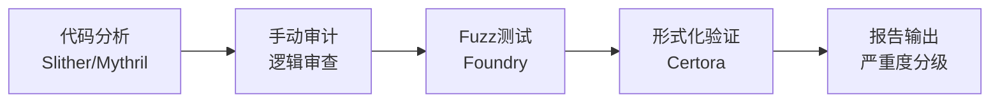

# DeFi 安全与智能合约审计

> 写好 Solidity 只是第一步——审计才是守住资产的核心防线。

---

## 审计流程



## 常见漏洞模式

### 1. 访问控制缺陷

```solidity
// ❌ 漏洞：缺少 onlyOwner 修饰
function mint(address to, uint256 amount) external {
    _mint(to, amount);
}

// ✅ 修复：继承 OpenZeppelin Ownable
function mint(address to, uint256 amount) external onlyOwner {
    _mint(to, amount);
}
```

### 2. 整数溢出/下溢

```solidity
// Solidity 0.8+ 默认开启溢出检查
// 但 unchecked 块中会被关闭

function unsafe_decrement(uint256 x) external {
    unchecked {
        x -= 1; // x=0 时 → x 变为 2^256-1
    }
}
```

### 3. 前端抢跑（Front-running）

```solidity
// ❌ 交易排序被攻击者利用
function swap(uint256 amountIn, uint256 minAmountOut) external {
    uint256 amountOut = getAmountOut(amountIn);
    require(amountOut >= minAmountOut, "Slippage too high");
    _transfer(msg.sender, amountOut);
}

// ✅ 防御：提交成交价签名
function swapWithSig(
    uint256 amountIn,
    uint256 amountOut,
    uint256 deadline,
    bytes memory signature
) external {
    require(block.timestamp <= deadline, "Expired");
    require(verify(msg.sender, amountOut, signature), "Invalid sig");
    _transfer(msg.sender, amountOut);
}
```

### 4. 价格预言机操纵

```solidity
// ❌ 使用瞬时代币对价
function getPrice(address token) public view returns (uint256) {
    (uint112 reserve0, uint112 reserve1,) = 
        IUniswapV2Pair(pair).getReserves();
    return reserve1 * 1e18 / reserve0; // 可被闪电贷操纵
}

// ✅ 使用 Chainlink 去中心化预言机
function getPriceSafe() public view returns (uint256) {
    (, int256 price,,,) = 
        AggregatorV3Interface(chainlinkFeed).latestRoundData();
    require(price > 0, "Invalid price");
    return uint256(price) * 1e10; // 调整精度
}
```

## 审计工具命令

```bash
# Slither 静态分析
slither contracts/ --print human-summary
slither contracts/ --print contract-summary
slither contracts/ --print vars-and-auth

# Mythril 符号执行
myth analyze contracts/Bank.sol --solc-json mythril.json

# Foundry 模糊测试
forge test
# 创建 Fuzz 测试
forge test --fuzz-runs 10000

# Certora Prover（形式化验证）
certoraRun contracts/Bank.sol Bank --verify Bank:vault.spec

# Surya 可视化
surya graph contracts/ | dot -Tpng > graph.png
surya describe contracts/Bank.sol
```

## 审计报告模板

```
─────────────────────────────────────────
严重度:        HIGH/MEDIUM/LOW/INFO
漏洞类型:      重入/访问控制/预言机/闪电贷
文件:         contracts/Bank.sol:L45
影响:         所有资金可被攻击者提取
─────────────────────────────────────────

漏洞描述:
[详细说明问题]

PoC:
[攻击合约代码]

修复建议:
```solidity
[修复后的代码]
```

参考资料:
SWC-107 - Reentrancy
```

## DeFi 安全资源

| 资源 | 用途 |
|------|------|
| **DefiLlama** | TVL 监控 / 协议安全评分 |
| **Rekt News** | 历史攻击复盘 |
| **Etherscan** | 合约源码验证 + 交易追踪 |
| **Forta** | 链上实时监控 |
| **Tenderly** | 交易模拟 + 调试 |
| **Dune** | 链上数据分析 |
| **Uniswap Hooks** | 安全注意事项 |
