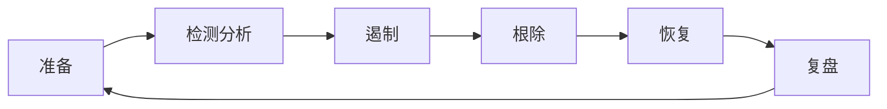

# 数字取证与事件响应（DFIR）

> 黄金 72 小时 —— 从发现入侵到完全控制局势。

---

## 事件响应流程



### SANS PICERL 模型

| 阶段 | 任务 | 产出 |
|------|------|------|
| **P**reparation | 预案/工具/演练 | IR 手册 |
| **I**dentification | 告警确认/范围判定 | 事件票 |
| **C**ontainment | 隔离/断网/快照 | 遏制报告 |
| **E**radication | 清除后门/修补漏洞 | 修复确认 |
| **R**ecovery | 恢复服务/数据还原 | 服务恢复 |
| **L**essons | 根因分析/改进措施 | 复盘报告 |

## 应急响应工具包

### 内存取证

```bash
# 获取内存镜像
# Windows (FTK Imager Lite)
forensic-imager.exe --memory --destination=D:\mem.dmp

# Linux (LiME)
insmod lime.ko "path=./ram.dmp format=raw"

# 分析内存
vol -f mem.dmp windows.info
vol -f mem.dmp windows.pslist
vol -f mem.dmp windows.netscan
vol -f mem.dmp windows.cmdline
vol -f mem.dmp windows.malfind  # 检测注入代码
vol -f mem.dmp windows.handles  # 异常句柄
vol -f mem.dmp windows.dlldump --pid 1234  # Dump进程DLL
```

### 磁盘取证

```bash
# 创建磁盘镜像（Linux）
dd if=/dev/sdb of=disk.dd bs=4M conv=noerror,sync status=progress

# 分析磁盘
mmls disk.dd           # 分区表
fls -o 2048 disk.dd   # 列出分区文件
icat -o 2048 disk.dd 1234 > recovered_file  # 按inode恢复文件

# 恢复已删除文件
extundelete /dev/sdb --restore-all
scalpel disk.dd -o output  # 基于文件签名恢复

# Windows 注册表取证（RegRipper）
rip.exe -r SYSTEM -f system
rip.exe -r SOFTWARE -f software
rip.exe -r NTUSER.DAT
```

### 网络取证

```bash
# tcpdump 抓取（事件前已运行）
tcpdump -i eth0 -w capture.pcap -C 100 -W 10

# 分析 PCAP
# 1. HTTP 对象提取
tshark -r capture.pcap --export-objects "http,/tmp/files"

# 2. DNS 分析
tshark -r capture.pcap -Y "dns" -T fields -e dns.qry.name | sort -u

# 3. TLS 证书提取
tshark -r capture.pcap -Y "ssl.handshake.certificate" \
    -T fields -e x509sat.printableString

# 4. 流量统计
tshark -r capture.pcap -z conv,tcp
tshark -r capture.pcap -z io,stat,60
```

## 恶意软件分析

### 静态分析

```bash
# 基础信息
file malware.exe
strings malware.exe | head -50

# PE 结构分析
pecheck malware.exe
python3 -c "import pefile; p=pefile.PE('malware.exe'); p.dump_info()"

# 检测加壳
Detect It Easy malware.exe
```

### 沙箱分析

```python
# CAPE 沙箱配置
cuckoo.py --device windows7
cuckoo.py submit malware.exe

# 关键观察指标
indicators = {
    "持久化": ["HKCU\\Software\\Microsoft\\Windows\\CurrentVersion\\Run",
                "HKLM\\SYSTEM\\CurrentControlSet\\Services"],
    "C2通信": ["HTTP GET 到 IP:8080",
               "DNS查询: c2.malware.com"],
    "进程注入": ["CreateRemoteThread",
               "WriteProcessMemory"],
    "网络扫描": ["ICMP扫描",
               "445端口连接"]
}
```

## 典型事件时间线

```
Day 0   08:00  攻击者通过钓鱼邮件获得初始访问
Day 0   08:15  投放 Cobalt Strike Beacon
Day 0   09:00  Beacon 回连至 C2（cdn-update.example.com）
Day 1   01:00  横向移动 → 域控
Day 1   02:30  Dump LSASS → 获取域管理员凭据
Day 1   03:00  部署勒索软件
Day 1   03:10  SOC 告警触发（EDR 检测到大规模文件加密）
Day 1   03:15  启动 IR 流程
Day 1   03:30  断网隔离
Day 1   06:00  完成取证快照
Day 1   12:00  根除 C2 通道
Day 2   08:00  开始恢复
Day 7   完成复盘报告
```

## IR 检查清单

```
[✅] 事件确认（确认不是误报）
[✅] 初步范围评估（受影响的系统/数据）
[✅] 取证快照（内存+Disk+日志）
[✅] 断网/隔离（从网络层断开受感染主机）
[✅] 保留证据链（笔录+哈希+SHA256）
[✅] 通知相关方（法务/管理层/监管）
[✅] 分析根因（确定入口点）
[✅] 清除后门（移除恶意软件/持久化机制）
[✅] 修补漏洞（打补丁/改密码/限制访问）
[✅] 恢复验证（确认干净再上线）
[✅] 复盘改进（更新 IR 手册/监控规则）
```
