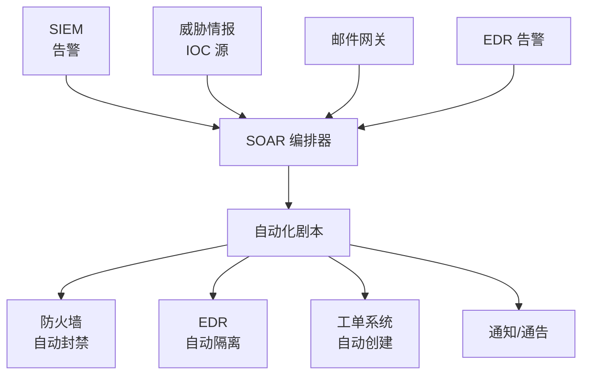

# SOC 自动化与 SOAR

> SOC 不是人越多越好——编排和自动化让 3 人团队做到 30 人的效果。

---

## SOAR 架构



## 剧本编排示例

### YAML 格式剧本

```yaml
playbook:
  name: "Suspicious Login Response"
  trigger:
    source: SIEM
    rule: "Login from new country + admin account"
    priority: high
  
  steps:
    - id: 1
      name: "Verify identity"
      action: query_active_directory
      params:
        user: "{{alert.user}}"
      on_success:
        - "check_if_user_traveling"
      on_failure:
        - "escalate_to_tier2"
    
    - id: 2
      name: "Check if user traveling"
      action: check_calendar
      params:
        user: "{{alert.user}}"
        timeframe: "last 7 days"
      conditions:
        - if: "calendar_has_travel == true"
          then: "close_as_benign"
        - if: "calendar_has_travel == false"
          then: "step_3"
    
    - id: 3
      name: "Force password reset"
      action: reset_password
      params:
        user: "{{alert.user}}"
        notify_user: true
    
    - id: 4
      name: "Revoke sessions"
      action: revoke_sso_sessions
      params:
        user: "{{alert.user}}"
    
    - id: 5
      name: "Add to watchlist"
      action: add_to_watchlist
      params:
        indicator: "{{alert.source_ip}}"
        duration: "30d"
    
    - id: 6
      name: "Create ticket"
      action: create_jira_ticket
      params:
        project: "SOC"
        summary: "Confirmed account compromise: {{alert.user}}"
        priority: "Critical"
```

### Python 实现

```python
import requests
import json
from datetime import datetime

class SOAREngine:
    def __init__(self, config):
        self.integrations = {
            "siem": SplunkClient(config["splunk"]),
            "edr": CrowdStrikeClient(config["crowdstrike"]),
            "firewall": PaloAltoClient(config["pan"]),
            "ticket": JiraClient(config["jira"]),
            "threat_intel": ThreatIntelClient(config["misp"])
        }
    
    def execute_playbook(self, alert: dict, playbook: list):
        """执行自动化剧本"""
        context = {"alert": alert, "results": {}}
        
        for step in playbook:
            try:
                result = self._execute_step(step, context)
                context["results"][step["id"]] = result
                
                # 条件分支
                if "conditions" in step:
                    for condition in step["conditions"]:
                        if self._evaluate_condition(condition, context):
                            context["next_step"] = condition.get("then")
                            break
                
                # 日志记录
                self._log_step(step["id"], "success", result)
                
            except Exception as e:
                self._log_step(step["id"], "failure", str(e))
                if self._should_escalate(step):
                    self._escalate_to_human(alert, context, str(e))
                    break
        
        return context
    
    def _enrich_ioc(self, ioc: str) -> dict:
        """自动化 IOC 丰富"""
        enriched = {}
        for source in ["virustotal", "abuseipdb", "greynoise", "misp"]:
            try:
                client = self.integrations.get(source)
                if client:
                    enriched[source] = client.query(ioc)
            except:
                enriched[source] = {"error": "unavailable"}
        return enriched
```

## 集成组件

| 组件 | 作用 | 常见产品 |
|------|------|---------|
| **告警接入** | SIEM/EDR/邮件网关告警标准化 | Splunk/ELK/SentinelOne |
| **IOC丰富** | IP/域名/哈希自动上下文关联 | VT/AbuseIPDB/MISP |
| **阻断执行** | 自动防火墙/EDR 封禁 | PaloAlto/Fortinet/CrowdStrike |
| **通知** | 邮件/企微/飞书/Slack 自动推送 | Webhook/API |
| **工单** | 自动创建 + 更新 + 关闭 | Jira/ServiceNow |
| **证据收集** | 自动获取取证数据 | Velociraptor/GRR |
| **报告** | 自动生成安全事件报告 | PDF/HTML 模板 |

## 关键剧本场景

```yaml
场景1: "恶意 IP 封禁"
  触发: SIEM 检测到 C2 通信
  动作:
    1. 取整 IP 到 AbuseIPDB/威胁情报确认
    2. 确认后 → 防火墙自动封禁
    3. 检查 EDR 受影响设备
    4. 通知资产负责人
    5. 创建 L3 告警工单
  时间: 30 秒（人工需 5 分钟）

场景2: "钓鱼邮件响应"
  触发: 用户举报 + 网关检测
  动作:
    1. 提取邮件原文 + 附件 + URL
    2. 扫描附件沙箱
    3. 剔除企业邮箱内相同邮件
    4. 通知原始收件人
    5. 冻结疑似泄露账户
  时间: 2 分钟（人工需 30 分钟）

场景3: "EDR 告警 + 隔离"
  触发: EDR 检测到恶意进程
  动作:
    1. 收集进程树 + 网络连接
    2. 隔离主机（EDR 隔离网络）
    3. 关联 SIEM 历史活动
    4. 自动取证
    5. 通知安全值班人员
  时间: 1 分钟（人工需 15 分钟）
```

## SOAR 指标

| 指标 | 人工 | 自动化后 | 改善 |
|------|------|---------|------|
| 恶意 IP 封禁 | 5 分钟 | 30 秒 | 90% |
| 钓鱼邮件响应 | 30 分钟 | 2 分钟 | 93% |
| EDR 隔离 | 15 分钟 | 1 分钟 | 93% |
| IOC 丰富 | 10 分钟 | 5 秒 | 99% |
| 误报处理率 | 60% | 90% | +30% |
| MTTR | 45 分钟 | 8 分钟 | 82% |

## SOAR 实施路线

```
Phase 1 [1-2月] — 基础接入
  SIEM → 标准化告警格式
  Top 5 高频告警剧本化
  
Phase 2 [2-4月] — 自动封禁
  威胁情报 + 防火墙/EDR 联动
  恶意 IOC 自动阻断

Phase 3 [4-6月] — 复杂编排
  多系统联动（取证/通知/工单）
  条件分支 + 人工审批流程

Phase 4 [持续] — 优化
  误报率持续减少
  新场景持续接入
  MTTR 持续追踪
```
