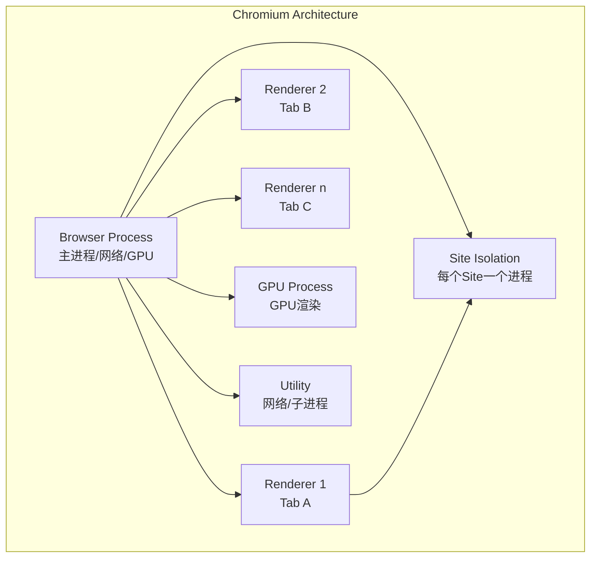

# 浏览器安全机制详解

> 现代浏览器是最复杂的操作系统之一——沙箱、V8、站点隔离、网络堆栈。

---

## 浏览器多进程架构



## 同源策略（Same-Origin Policy）

```
协议 + 域名 + 端口 三者完全一致 → 同源
http://example.com/page1 与 http://example.com/page2 → 同源
http://example.com 与 https://example.com → 不同源(协议不同)
http://example.com 与 http://sub.example.com → 不同源(域名不同)
http://example.com:80 与 http://example.com:8080 → 不同源(端口不同)
```

### 跨源访问限制

| 操作 | 限制 |
|------|------|
| 读取 Response（fetch/XMLHttpRequest） | 必须 CORS |
| 操作 iframe 内容 | 必须同源 |
| 操作 LocalStorage/Cookie | 同源限制 |
| 写入 Cookie | 可设置到父域 |
| 加载 &lt;script&gt; | **允许**（JSONP 风险） |
| 加载 &lt;img&gt; | **允许**（CSRF 风险） |
| 加载 &lt;iframe&gt; | **允许**（Clickjacking 风险） |
| CSS 加载 | **允许** |

## 站点隔离（Site Isolation）

```bash
# Chromium 在 V8 层面隔离不同站的渲染进程
# 即使攻击者获得了一个 Renderer 进程控制权
# 也无法读取另一个站的页面内容

# 验证站点隔离状态
chrome://process-internals

# 关键安全边界
# 1. 不同站点分配不同 Renderer 进程
# 2. 即使同站内 iframe 也会在独立进程中
# 3. 跨进程访问被操作系统保护
```

## V8 引擎安全

### 内存安全机制

```
Pointer Compression: 64位指针压缩为32位 → 减少内存占用
JIT 隔离: JIT 编译代码在独立区域
W^X Protection: 内存要么可写要么可执行（不能同时）
Sandbox 指针: 隔离堆内的指针转发

V8 Sandbox (2023+):
  - 所有 V8 堆访问通过沙箱指针间接引用
  - 堆内指针不能指向堆外内存
  - 限制 sandbox 外内存访问
```

### 常见 V8 漏洞类型

```javascript
// 1. 类型混淆（Type Confusion）
// 利用 JIT 编译器的优化假设错误
// CVE-2023-3079: V8 类型混淆 → RCE

// 2. OOB 读写（Out-of-Bounds）
// 数组边界检查绕过
// let arr = [1.1, 2.2, 3.3];
// arr[100] = 1.1; // 触发 OOB（旧版本）

// 3. UAF（Use-After-Free）
// Map 对象在优化编译后释放但仍被使用
// let obj = {a: 1};
// delete(obj); // 内存释放
// obj.a = 2;  // UAF
```

## 网络安全（Network Stack）

### HTTPS 确认最佳实践

```
HSTS (HTTP Strict Transport Security):
  Strict-Transport-Security: max-age=31536000; includeSubDomains; preload

  Preload List: https://hstspreload.org/
  - Chrome/Firefox/Safari 硬编码的 HTTPS 强制列表
  - 首次访问也走 HTTPS

证书透明度 (Certificate Transparency):
  - 所有 CA 签发的证书必须在公共日志中记录
  - 浏览器验证 SCT（签名证书时间戳）
  - CT 日志检测异常证书签发
```

### Cookie 安全属性

```
Set-Cookie: session=abc123;
  SameSite=Strict;     # 跨站请求不发送
  Secure;              # 仅 HTTPS
  HttpOnly;            # JS 不可访问
  Max-Age=86400;       # 24 小时过期
  Domain=.example.com;
  Path=/;

Cookie 前缀加固:
  __Host-: 只能设置 Secure + Path=/ + 无 Domain
  __Secure-: 只能设置 Secure
  → 防止子域恶意设置高权限 Cookie
```

## 浏览器防御绕过场景

```
SOP 绕过（需多个漏洞组合）:
  - 需要获取 Renderer 漏洞 + 站点隔离绕过
  - 近年 Chrome V8 RCE + sandbox escape = 完整利用

CSP 绕过:
  - JSONP 端点（已知回调注入）
  - CDN 上的 Angular/React 源码（已知 gadgets）
  - 文件上传点 → 上传 SVG/JS 文件到同源
  - base-uri 未限制 → 注入 base 标签改变解析

HTTPS 降级:
  - HSTS 未启用的域名（首次访问 HTTP）
  - 中间人攻击 → SSLStrip → 降级到 HTTP
  - SSL/TLS 版本回退
```

## 浏览器安全特性检查表

```
[ ] HTTPS → HSTS + CT 完整
[ ] CSP 策略（阻止 XSS 和数据外泄）
[ ] X-Frame-Options: DENY（防点击劫持）
[ ] X-Content-Type-Options: nosniff
[ ] Referrer-Policy: strict-origin-when-cross-origin
[ ] Cookie SameSite=Strict + Secure + HttpOnly
[ ] Subresource Integrity（SRI 完整性校验）
[ ] Trusted Types（阻止 DOM XSS）
[ ] Cross-Origin-Embedder-Policy（COEP）
[ ] Cross-Origin-Opener-Policy（COOP）
[ ] Permissions-Policy（禁用不必要 API）
```

*下一篇：[浏览器安全攻击面](02-browser-attacks.md)*
