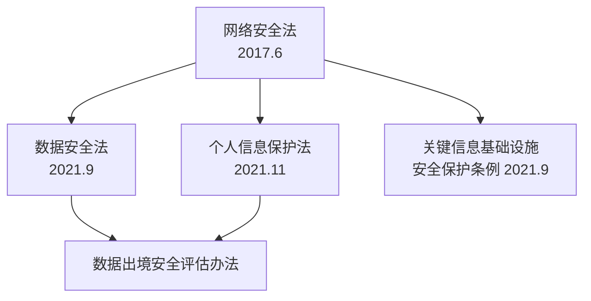

# 中国网络安全法律法规

> 在中国做安全，不懂法律比不懂技术更要命。

---

## 法律体系全景



## 三大法律核心要点

### 网络安全法（2017）

```yaml
适用范围: 在中国境内建设、运营、维护和使用网络

核心义务:
  1. 网络安全等级保护制度（等保 2.0）
  2. 网络安全事件应急预案
  3. 网络安全监测预警
  4. 用户信息保护
  5. 违法信息处置

关键条款:
  第21条: 落实网络安全等级保护制度
  第25条: 安全事件应急预案 + 演练
  第31条: 关键信息基础设施（CII）保护
  第37条: CII 数据境内存储 + 出境评估
  第59条: 未履行安全义务 → 罚款 1-10 万（直接责任人）

处罚升级:
  不履行安全保护义务 → 1-10 万
  导致危害后果 → 10-100 万
  CII 不履行 → 10-100 万
  非法获取数据/侵入系统 → 刑事追诉
```

### 数据安全法（2021）

```yaml
数据分类分级: 核心数据/重要数据/一般数据

核心制度:
  1. 数据分类分级保护制度
  2. 数据安全审查制度（DSR）
  3. 数据出口管制
  4. 数据安全应急处置
  5. 数据安全风险评估

重要数据:
  - 影响国家安全的数据
  - 影响经济运行的数据
  - 影响社会稳定
  - 影响公共利益

处罚:
  一般违法: 5-50 万
  造成严重危害: 50-200 万
  情节特别严重: 200-1000 万 + 暂停业务
  直接责任人: 5-20 万
```

### 个人信息保护法（2021）

```yaml
适用范围: 
  - 中国境内处理个人信息
  - 境外处理中国境内个人信息的活动

核心原则:
  告知-同意: 处理前告知 + 获得明示同意
  最小必要: 收集与处理目的直接相关的最少信息
  公开透明: 处理规则公开
  准确性: 及时更正/补充
  存储期限: 最短必要时间

敏感个人信息:
  生物识别、金融账户、行踪轨迹、
  健康信息、不满14岁未成年人信息

权利:
  知情权、决定权、查阅权、复制权、
  更正权、删除权、要求解释权

处罚:
  一般违法: 最高 50 万
  情节严重: 最高 5000 万或上年收入 5%
  直接责任人: 10-100 万
```

## 等保 2.0 实施流程


### 定级标准

| 等级 | 受损程度 | 对象示例 |
|------|---------|---------|
| L1 | 公民/法人权益受损 | 普通企业官网 |
| L2 | 一般社会秩序/公共利益受损 | 一般信息系统 |
| L3 | 严重社会秩序/公共利益受损 | CII 系统/政务平台 |
| L4 | 特别严重损害/国家安全受损 | 国家级核心系统 |

### 等保必备文件

```
1. 系统定级报告（专家评审）
2. 备案表（公安机关网安）
3. 安全管理制度汇编
4. 安全建设方案
5. 等级测评报告
6. 安全整改报告
7. 系统安全运维记录
```

## CII（关键信息基础设施）保护

```yaml
CII 范围:
  - 公共通信和信息服务
  - 能源/交通/水利/金融
  - 公共服务/电子政务
  - 国防科技工业
  - 其他重要行业

CII 运营者义务:
  1. 设立网络安全负责人 + 安全管理机构
  2. 安全保护措施与信息化同步（三同步）
  3. 网络安全检测评估（每年至少一次）
  4. 网络安全事件报告（1小时内）
  5. CII 安全产品和服务审查
  6. 数据境内存储+出境安全评估
  7. 采购安全可信的网络产品和服务
```

## 数据出境合规

```yaml
需要评估的场景:
  1. CII 运营者向境外提供数据
  2. 处理 100 万+ 个人信息的处理者
  3. 累计向境外提供 10 万+ 个人信息
  4. 累计向境外提供 1 万+ 敏感个人信息

评估流程:
  1. 数据出境风险评估（自评估）
  2. 数据出境安全评估（网信办）
  3. 标准合同备案（监督管理部门）
  4. 认证（第三方机构）

禁止出境的数据:
  - 核心数据
  - 未脱敏的重要数据
  - 国家安全可能受影响的数据
```

## 企业合规检查表

```
[ ] 网络安全管理组织架构
  - 安全负责人（CISO）
  - 安全管理机构
  - 安全管理制度体系
  
[ ] 等级保护
  - 系统定级
  - 公安机关备案
  - 等级测评报告
  
[ ] 数据保护
  - 数据分类分级制度
  - 个人信息保护政策
  - 用户同意机制
  
[ ] 安全措施
  - 日志留存 ≥ 6 个月
  - 网络安全检测评估（每年）
  - 安全事件应急预案 + 演练
  - 漏洞发现及时修复
  
[ ] 数据出境
  - 数据出境风险评估
  - 安全评估/备案/标准合同
```

## 法律责任速查

| 违法类型 | 监管机构 | 罚款（企业） | 罚款（个人） | 刑事责任 |
|---------|---------|------------|------------|---------|
| 不履行等保义务 | 公安机关 | 1-100 万 | 1-10 万 | 拒不整改→3 年以下 |
| 数据安全违规 | 网信办 | 5-1000 万 | 5-20 万 | 情节严重→7 年以下 |
| 个保法违规 | 网信办 | 最高 5000 万 | 10-100 万 | 侵犯个人信息→7 年 |
| 数据出境违规 | 网信办 | 暂停业务 | 5-50 万 | 视情节 |
| CII 违规 | 网信办+行业 | 10-100 万 | 1-10 万 | 整改期间暂停运营 |

*下一篇：[数据安全法深度解读](02-data-security-law-details.md)*
