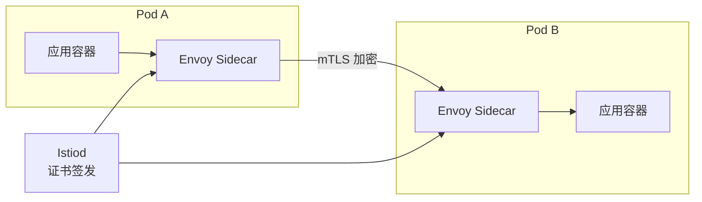

# Service Mesh 安全（Istio 实战）

> 服务网格将安全内建于通信层——mTLS、授权、可观察性开箱即用。

---

## Istio 安全架构



## mTLS 配置

```yaml
# 全集群 mTLS（严格模式）
apiVersion: security.istio.io/v1beta1
kind: PeerAuthentication
metadata:
  name: default
  namespace: istio-system
spec:
  mtls:
    mode: STRICT  # DISABLE/PERMISSIVE/STRICT
---
# 按命名空间覆盖
apiVersion: security.istio.io/v1beta1
kind: PeerAuthentication
metadata:
  name: namespace-mtls
  namespace: production
spec:
  mtls:
    mode: STRICT
  portLevelMtls:
    8080:
      mode: DISABLE  # 健康检查接口不加密
```

## 授权策略

```yaml
# 零信任授权：拒绝所有 + 显式允许
apiVersion: security.istio.io/v1beta1
kind: AuthorizationPolicy
metadata:
  name: deny-all
  namespace: production
spec:
  action: DENY
  rules:
    - to:
        - operation:
            paths: ["/healthz"]
---
# 允许 frontend → backend
apiVersion: security.istio.io/v1beta1
kind: AuthorizationPolicy
metadata:
  name: backend-policy
  namespace: production
spec:
  selector:
    matchLabels:
      app: backend
  action: ALLOW
  rules:
    - from:
        - source:
            principals: ["cluster.local/ns/production/sa/frontend-sa"]
            namespaces: ["production"]
      to:
        - operation:
            methods: ["POST", "GET"]
            paths: ["/api/v1/*"]
      when:
        - key: request.headers[X-Custom-Auth]
          values: ["valid-token"]
```

## 请求认证（JWT）

```yaml
apiVersion: security.istio.io/v1beta1
kind: RequestAuthentication
metadata:
  name: jwt-auth
  namespace: production
spec:
  selector:
    matchLabels:
      app: backend
  jwtRules:
    - issuer: "https://auth.company.com"
      jwksUri: "https://auth.company.com/.well-known/jwks.json"
      forwardOriginalToken: true
      outputPayloadToHeader: "X-JWT-Payload"
---
# 授权策略基于 JWT claims
apiVersion: security.istio.io/v1beta1
kind: AuthorizationPolicy
metadata:
  name: jwt-rbac
spec:
  rules:
    - when:
        - key: request.auth.claims[role]
          values: ["admin"]
```

## 可观察性

```yaml
# 启用全链路追踪
apiVersion: telemetry.istio.io/v1alpha1
kind: Telemetry
metadata:
  name: mesh-default
  namespace: istio-system
spec:
  tracing:
    - providers:
        - name: zipkin
      randomSamplingPercentage: 100
---
# HTTP 访问日志（含安全字段）
apiVersion: telemetry.istio.io/v1alpha1
kind: Telemetry
metadata:
  name: access-log
spec:
  accessLogging:
    - providers:
        - name: envoy
      filter:
        expression: |-
          response.code >= 400 || 
          request.auth.principal == "" && 
          request.url_path != "/healthz"
```

## 安全加固清单

```
[✅] mTLS 严格模式（全集群）
[✅] 默认拒绝授权策略
[✅] 按命名空间隔离（生产/测试/开发）
[✅] JWT 请求认证
[✅] SPIRE 集成（工作负载身份）
[✅] 证书自动轮换（24小时）
[✅] 审计日志开启
[✅] 路径规范化配置
[✅] H2C 升级防护
[✅] SDS 证书分发
```
