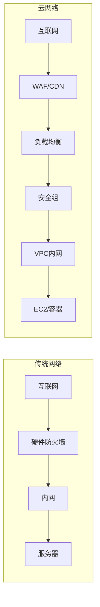

# 云网络安全

> 在云上，网络边界是虚拟的——安全组、VPC、WAF 就是你的防火墙

---

## 云网络 vs 传统网络



**核心区别**：传统网络是物理的（布线→防火墙→服务器），云网络是软件定义的（API→配置→虚拟网络）。

---

## 安全组 vs NACL

### 安全组（Security Group）

- **状态化**：允许入站后，出站自动允许
- **支持允许规则**，不支持拒绝规则
- **作用于实例级别**（EC2/Lambda/RDS）

```json
// 安全的 Web 服务器安全组配置
{
  "IpPermissions": [
    {
      "IpProtocol": "tcp",
      "FromPort": 443,
      "ToPort": 443,
      "IpRanges": [
        { "CidrIp": "0.0.0.0/0", "Description": "HTTPS" }
      ]
    },
    {
      "IpProtocol": "tcp",
      "FromPort": 22,
      "ToPort": 22,
      "IpRanges": [
        { "CidrIp": "10.0.0.0/8", "Description": "仅内网 SSH" }
      ]
    }
  ]
}
```

### NACL（网络 ACL）

- **无状态**：入站和出站需要分别配置规则
- **支持允许和拒绝规则**
- **作用于子网级别**

```json
// 子网 NACL 配置
{
  "Entries": [
    { "RuleNumber": 100, "Protocol": "6", "RuleAction": "allow",
      "CidrBlock": "0.0.0.0/0", "PortRange": { "From": 443, "To": 443 } },
    { "RuleNumber": "*", "Protocol": "-1", "RuleAction": "deny",
      "CidrBlock": "0.0.0.0/0" }
  ]
}
```

### 安全误区

```
❌ "安全组和 NACL 都配了，万无一失了"
→ 安全组不防止端口扫描
→ NACL 规则不能细分到实例
→ 两者配合才是最佳实践
```

---

## VPC 安全

### 公有子网 vs 私有子网

```
                        ┌─────────────────────┐
                        │    Internet Gateway   │
                        └─────────┬───────────┘
                                  │
        ┌─────────────────────────┴─────────────────────────┐
        │                    VPC 10.0.0.0/16                │
        │                                                   │
        │  公有子网                          私有子网        │
        │  10.0.1.0/24                      10.0.2.0/24     │
        │  ┌──────────┐                   ┌──────────┐     │
        │  │  Web LB   │                   │  DB       │     │
        │  │  公网IP   │                   │  无公网IP  │     │
        │  └──────────┘                   └──────────┘     │
        │        │                              ▲           │
        │        └────────── HTTP ──────────────┘           │
        │                                                   │
        └───────────────────────────────────────────────────┘
```

### 关键配置

```bash
# 数据库放在私有子网，不允许公网访问
# Web 服务器在公有子网，只开 80/443

# ✅ 数据库安全组
aws ec2 authorize-security-group-ingress \
  --group-id sg-db \
  --protocol tcp \
  --port 3306 \
  --source-group sg-web  # 只允许来自 Web 安全组的流量

# ❌ 常见错误
aws ec2 authorize-security-group-ingress \
  --group-id sg-db \
  --protocol tcp \
  --port 3306 \
  --cidr 0.0.0.0/0  # 数据库暴露在公网！
```

---

## WAF 配置

### WAF 能做什么

```
✅ 阻止 SQL 注入
✅ 阻止 XSS
✅ IP 黑/白名单
✅ 速率限制（防暴力破解/Brute Force）
✅ 阻止恶意爬虫
✅ 自定义规则（防特定攻击模式）

❌ WAF 不能做什么
❌ 阻止业务逻辑漏洞
❌ 阻止认证绕过
❌ 阻止 IDOR 越权
```

### 基础 WAF 规则

```json
{
  "Name": "block-sqli",
  "Priority": 1,
  "Statement": {
    "SqlInjectionMatchStatement": {
      "FieldToMatch": { "UriPath": {} },
      "TextTransformations": [{ "Priority": 0, "Type": "URL_DECODE" }]
    }
  },
  "Action": { "Block": {} },
  "VisibilityConfig": {
    "CloudWatchMetricsEnabled": true,
    "MetricName": "BlockSQLInjection"
  }
}
```

### 速率限制

```json
{
  "Name": "rate-limit-login",
  "Priority": 2,
  "Statement": {
    "RateBasedStatement": {
      "Limit": 100,
      "AggregateKeyType": "IP"
    }
  },
  "Action": { "Block": {} }
}
```

---

## CDN 安全

### CDN 可以提供的安全能力

| 能力 | 说明 |
|------|------|
| DDoS 防护 | 吸收大流量攻击 |
| SSL/TLS 终止 | 在边缘节点处理加密 |
| 源站 IP 隐藏 | CDN 作为代理，隐藏真实服务器 IP |
| 地理限制 | 阻止特定地区的访问 |

### 源站 IP 暴露——常见问题

```yaml
# 问题：源站 IP 被找到后，攻击者可以直接访问源站
# 绕过 WAF、CDN、速率限制

# 攻击者如何找到源站 IP：
# 1. 历史 DNS 记录（SecurityTrails、Censys）
# 2. 邮件头中的 IP 信息
# 3. GitHub 泄露配置中的 IP
# 4. CloudFlare 的 SSL 证书透明度日志

# 防护：
# - 仅允许 CDN IP 访问源站
# - 源站配置安全组：只允许 CDN 的 IP 段
```

---

## AI 推理端点的网络配置

```yaml
# AI 推理端点的安全网络配置

网络架构:
  公共区域:
    - CloudFront/Akamai CDN
    - WAF 规则（SQL 注入、XSS 过滤）
    - API Gateway（速率限制、认证）
    
  私有区域（VPC 内）:
    - 推理端点（SageMaker/Bedrock 端点）
    - 无公网 IP
    - 仅通过 VPC Endpoint 访问
    
  数据层:
    - 模型存储在 S3/OSS（VPC Endpoint）
    - 推理日志发送到 CloudWatch/日志服务
    - 监控与告警
```

---

## 安全检查清单

- [ ] 数据库在私有子网吗？
- [ ] 安全组只开放必要的端口吗？
- [ ] WAF 已配置并启用吗？
- [ ] CDN 隐藏了源站 IP 吗？
- [ ] 所有网络访问有日志吗？
- [ ] 流量加密了吗？（TLS 1.2+）
- [ ] 定期做网络架构安全审查吗？

---

## 延伸阅读

1. [AWS VPC 安全最佳实践](https://docs.aws.amazon.com/vpc/latest/userguide/vpc-security-best-practices.html)
2. [Azure 网络安全](https://learn.microsoft.com/en-us/azure/security/fundamentals/network-overview)
3. [阿里云网络安全](https://help.aliyun.com/product/100380.html)
4. [OWASP WAF 配置指南](https://cheatsheetseries.owasp.org/cheatsheets/WAF_Cheat_Sheet.html)
5. [Cloudflare 安全参考架构](https://www.cloudflare.com/architecture/)
