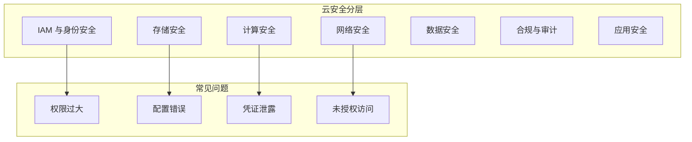

# 云安全概述

> 当你的代码和数据不在你的服务器上——云安全的挑战与应对

---

## 为什么云安全对 AI 至关重要

AI 工作负载几乎全部运行在云上：

```
AI 应用 = 云上训练 + 云上推理 + 云上存储 + 云上 API
```

这意味着：
- 训练数据存储在云存储（S3/Blob）→ 存储配置错误 → 数据泄露
- 模型部署在云容器/Serverless → IAM 权限过大 → 横向移动
- AI API 通过云网关暴露 → 网络配置错误 → 攻击面扩大

---

## 核心概念

### 共享责任模型

```
┌────────────────────────────────────────────┐
│             客户负责（无论什么模式）            │
│  ├─ 数据安全、客户端加密                      │
│  ├─ 身份与访问管理（IAM）                    │
│  ├─ 操作系统补丁（IaaS）                     │
│  └─ 网络配置（安全组、防火墙）                │
├────────────────────────────────────────────┤
│        云厂商负责（底层基础设施）               │
│  ├─ 物理安全、数据中心                       │
│  ├─ 网络基础设施                            │
│  ├─ 虚拟化层                                │
│  └─ 存储基础设施                            │
└────────────────────────────────────────────┘
```

**安全盲区**：双方都认为对方负责的部分 → 就是漏洞所在。

### 云安全 vs 传统安全

| 维度 | 传统安全 | 云安全 |
|------|---------|--------|
| 边界 | 固定边界（防火墙） | 无边界（API 即边界） |
| 资产 | 物理服务器 | 虚拟资源（按需创建） |
| 配置 | 手动配置 | 基础设施即代码（IaC） |
| 身份 | 本地 AD | 云 IAM + 联合身份 |
| 日志 | 本地集中 | 分散多个服务 |
| 漏洞 | 代码漏洞为主 | 配置错误+代码漏洞 |

### 云安全全景



---

## 主流云平台

| 平台 | 市场地位 | AI 服务 | 安全框架 |
|------|---------|---------|---------|
| AWS | 全球第一 | SageMaker, Bedrock | Well-Architected Framework |
| Azure | 企业首选 | OpenAI Service, ML Studio | Azure Security Benchmark |
| 华为云 | 国内领先 | ModelArts | 可信体系 |
| 阿里云 | 国内最大 | PAI, 通义千问 | 云安全白皮书 |
| 腾讯云 | 社交/游戏 | TI-ONE, 混元 | 安全运营中心 |

---

## 云安全核心误区

1. **"云厂商会负责所有安全"** → 共享责任，客户要承担"在云中"的安全
2. **"上云就不需要传统安全了"** → 只是安全形态变了，原理不变
3. **"用云原生服务就安全"** → 服务有默认配置，不一定是安全的配置
4. **"云上资产看不见摸不着，没法做安全"** → 正因如此更需要自动化和 IaC

---

## 本章内容

| 文章 | 内容 |
|------|------|
| 共享责任模型 | 谁负责什么、常见的责任盲区 |
| IAM 与身份安全 | 用户、角色、策略——权限管理的核心 |
| 云存储安全 | S3/OSS/Blob 配置错误与数据泄露 |
| 云网络安全 | VPC、安全组、WAF、CDN |
| Serverless 安全 | Lambda/云函数的攻击面 |
| 合规与治理 | SOC2、ISO27001、等保在云上的落地 |
| CSPM 与自动化 | 云安全态势管理工具链 |

---

> **一句话总结**：云安全不是新课题，而是传统安全在"别人的电脑上"的新形态。配置错误是云上最大的风险，自动化是唯一的应对之道。
