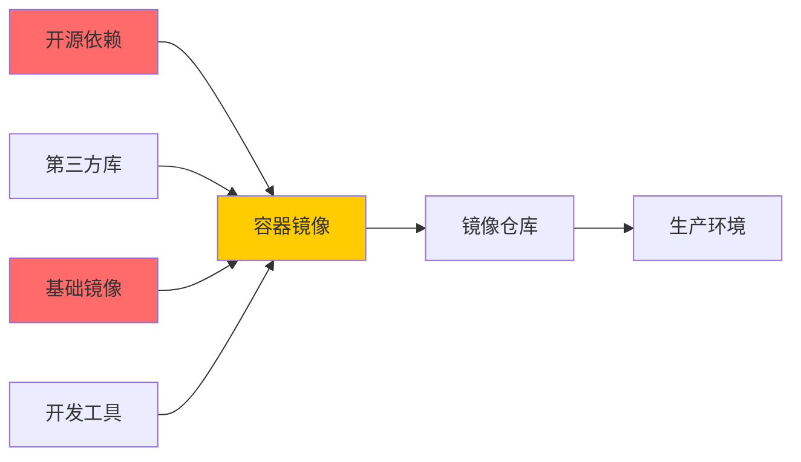

# 容器供应链安全

> 从代码到容器到生产——每一环都可能是攻击入口

---

## 什么是容器供应链安全

```
开发者提交代码 → 构建镜像 → 推送到仓库 → 部署到 K8s
     │              │           │            │
     │              │           │            │
     ▼              ▼           ▼            ▼
  代码审查       镜像扫描    仓库访问控制   准入控制
  依赖扫描      签名验证    镜像签名验   运行时验证
```

**供应链攻击**：攻击者在上述任何一环中注入恶意代码，然后通过自动化的管道扩散到生产环境。

---

## 软件供应链中的攻击面



### 真实案例：SolarWinds 供应链攻击（2020）

```
事件经过：
1. 攻击者入侵 SolarWinds 的构建系统
2. 在 Orion 产品的源码中注入了后门
3. 后门通过正常的软件更新分发到 18,000+ 客户
4. 包括美国政府部门和财富 500 强公司

教训：
- 即使来源可信（SolarWinds 是知名公司），也要验证交付物
- 供应链的每一环都需要安全检查
- 签名和校验可以防止中间人篡改
```

---

## 镜像供应链安全

### 1. 使用可信的基础镜像

```dockerfile
# ❌ 危险：从不明来源拉取镜像
FROM docker.io/unknown-user/custom-python:3.11
# 这个镜像可能包含后门

# ✅ 安全：使用官方镜像
FROM python:3.11-slim
# Docker 官方镜像有安全审核

# 或者使用你组织的镜像仓库（经过安全审查的镜像）
FROM registry.company.com/base/python:3.11-slim
```

### 2. 镜像签名

```bash
# Cosign — 容器镜像签名与验证

# 生成密钥对
cosign generate-key-pair

# 签名镜像
cosign sign --key cosign.key registry.company.com/my-app:latest

# 验证签名
cosign verify --key cosign.pub registry.company.com/my-app:latest

# 在 K8s 准入控制器中验证
# 只有经过签名的镜像才能部署
```

### 3. 镜像漏洞扫描

```yaml
# 在 CI/CD 中集成漏洞扫描

# 扫描到高危漏洞 → 阻断构建
# 扫描到中危漏洞 → 告警但允许构建
# 无漏洞 → 自动批准

GitHub Actions 示例:
  scan:
    steps:
      - name: Scan image
        run: |
          trivy image my-app:latest --severity CRITICAL,HIGH
          # 如果返回非零退出码，则构建失败
```

---

## 依赖供应链安全

### Python 依赖扫描

```bash
# 检查 requirements.txt 中的已知漏洞

# pip-audit
pip-audit -r requirements.txt

# Safety
safety check -r requirements.txt

# Trivy 也可以扫描依赖
trivy fs . --severity CRITICAL
```

### Node.js 依赖

```bash
# npm audit
npm audit

# 在 CI 中：严重漏洞阻止合并
npm audit --audit-level=high
```

### SBOM（软件物料清单）

```bash
# 生成 SBOM
syft my-app:latest -o spdx-json > sbom.json

# 扫描 SBOM 中的漏洞
grype sbom:./sbom.json

# SBOM 的作用：
# 1. 知道你的软件用了什么组件
# 2. 当出现新漏洞时，快速知道是否受影响
# 3. 满足合规要求（如：美国行政命令 EO 14028）
```

---

## 仓库安全

### 镜像仓库访问控制

```yaml
# Harbor 镜像仓库的访问控制示例

项目级别:
  public-library: 所有开发人员可拉取，运维可推送
  ai-models: 仅 AI 团队可拉取，CI 系统可推送
  production: 仅生产环境可拉取，CI 系统可推送（需审批）
  
策略:
  - 镜像自动扫描（Trivy/Clair）
  - 高危漏洞阻止推送
  - 强制镜像签名
  - 自动清理旧版本
```

### 镜像保留策略

```yaml
# 自动清理旧镜像
# 只保留最新的 N 个版本
# 漏洞扫描不合格的不允许部署

Harbor 保留规则:
  - 最近 10 个版本
  - 最新的 30 天内
  - 漏洞扫描通过
  - 已签名
```

---

## 准入控制

### K8s 准入控制

```yaml
# OPA/Gatekeeper 准入控制策略

# 策略：禁止特权容器
apiVersion: constraints.gatekeeper.sh/v1beta1
kind: K8sRequiredLabels
metadata:
  name: no-privileged-containers
spec:
  match:
    kinds:
      - apiGroups: [""]
        kinds: ["Pod"]
  parameters:
    # 检查所有容器不允许 privileged
    rule: "container.securityContext.privileged != true"

# 策略：只允许签名镜像
# 策略：必须设置资源限制
# 策略：必须使用非 root 用户
```

### Kyverno 策略示例

```yaml
# Kyverno — K8s 原生策略引擎

# 策略：强制镜像来自可信仓库
apiVersion: kyverno.io/v1
kind: ClusterPolicy
metadata:
  name: require-trusted-repo
spec:
  validationFailureAction: Enforce
  rules:
  - name: check-image-registry
    match:
      resources:
        kinds:
        - Pod
    validate:
      message: "镜像必须来自公司镜像仓库"
      pattern:
        spec:
          containers:
          - image: "registry.company.com/*"
```

---

## 供应链安全最佳实践

### 多层防御

```yaml
Layer 1: 开发阶段
  - 依赖漏洞扫描
  - 代码安全审查
  - SBOM 生成

Layer 2: 构建阶段
  - 基础镜像审查
  - 镜像签名
  - 镜像漏洞扫描

Layer 3: 分发阶段
  - 签名验证
  - 镜像仓库访问控制
  - 安全传输（HTTPS）

Layer 4: 部署阶段
  - 准入控制（只允许签名+无漏洞的镜像）
  - 运行时安全监控
  - 运行时验证（CIS Benchmark）
```

---

## 安全检查清单

- [ ] 所有基础镜像来自可信来源吗？
- [ ] 镜像在构建时签名了吗？
- [ ] 部署前验证了镜像签名吗？
- [ ] 所有依赖定期扫描漏洞吗？
- [ ] 生成了 SBOM 吗？
- [ ] 镜像仓库有访问控制吗？
- [ ] K8s 有准入控制策略吗？
- [ ] CI/CD 中集成了安全扫描吗？

---

## 延伸阅读

1. [SLSA — Supply-chain Levels for Software Artifacts](https://slsa.dev/)
2. [Sigstore / Cosign — 签名工具](https://www.sigstore.dev/)
3. [OWASP Dependency-Check](https://owasp.org/www-project-dependency-check/)
4. [CNCF Supply Chain Security](https://www.cncf.io/supply-chain-security/)
5. [Google SLSA Framework](https://slsa.dev/spec/v1.0/)
6. [Harbor — 镜像仓库安全](https://goharbor.io/)
7. [Kyverno — K8s 策略引擎](https://kyverno.io/)
