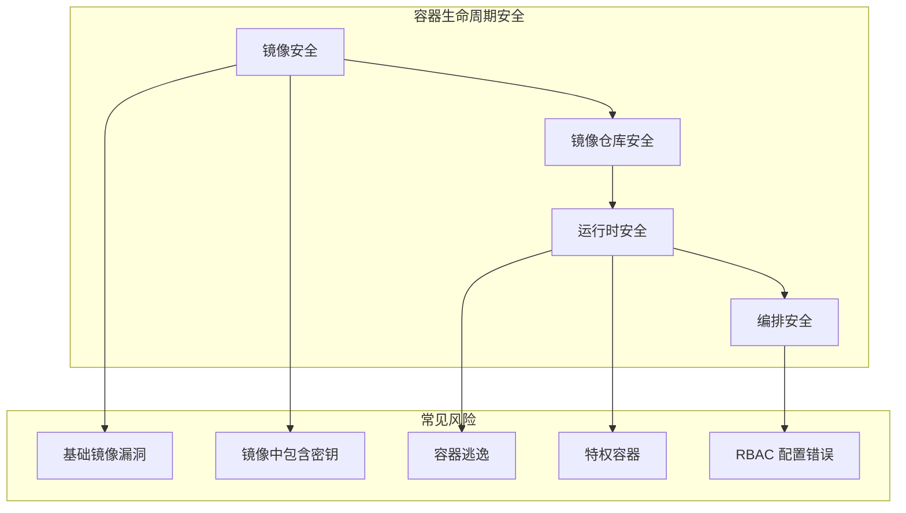

# 容器与 Kubernetes 安全

> 容器化的世界——每一个镜像都是一个攻击面，每一个 Pod 都是一个资产

---

## 为什么容器安全与 AI 高度相关

AI 生产环境几乎已经全面容器化：

```
模型训练 → Docker 容器（GPU 驱动 + 训练框架）
模型推理 → K8s Pod（模型服务器 + API 网关）
模型更新 → 容器镜像流式更新（无停机）
```

一个容器漏洞 → 整个 AI 管道受影响。

---

## 容器安全全景



---

## 本章内容

| 文章 | 内容 |
|------|------|
| Docker 安全 | 镜像安全、容器运行时、最佳实践 |
| Kubernetes 安全 | Pod 安全、RBAC、网络策略 |
| 容器供应链安全 | 镜像签名、漏洞扫描、准入控制 |

---

> **一句话总结**：容器安全是围绕着"镜像"和"运行时"的攻防，K8s 安全核心在 RBAC 和网络策略。
