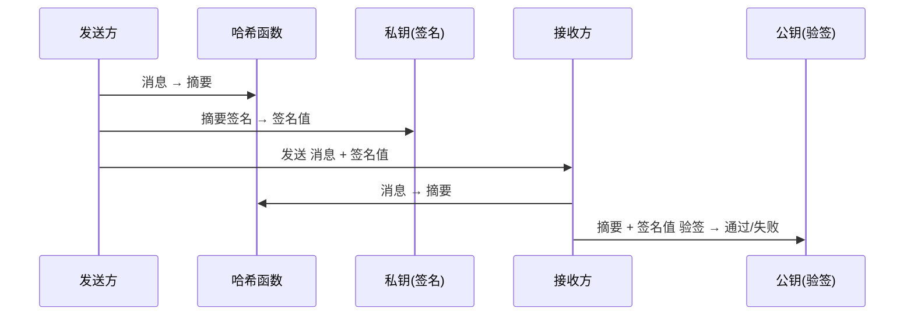
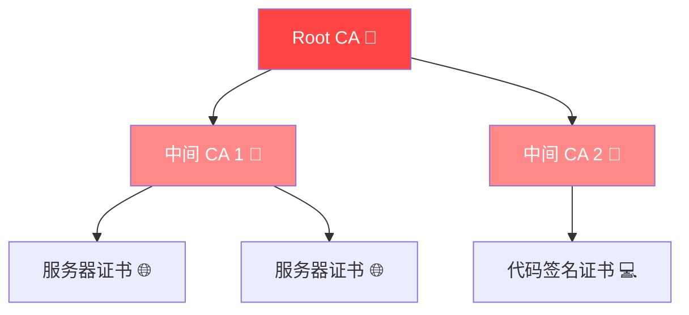

# 数字签名与公钥基础设施

> 数字签名 = 身份认证 + 数据完整性 + 不可否认性

---

## 数字签名原理

### 签名与验签流程



### 常见签名算法

| 算法 | 签名长度 | 安全性 | 用途 |
|------|---------|--------|------|
| RSA-PSS | 256~512 字节 | 强 | SSL/TLS 证书、代码签名 |
| ECDSA | 64~72 字节 | 强（P-256/384） | 比特币、JWT、TLS |
| Ed25519 | 64 字节 | 很强 | SSH、现代协议 |
| DSA | 40~64 字节 | 中等 | 旧系统、PGP |
| SM2 | 64 字节 | 强 | 国密标准 |
| Schnorr | 64 字节 | 强 | 比特币 BIP-340 |

## ECDSA 签名

```python
from cryptography.hazmat.primitives import hashes
from cryptography.hazmat.primitives.asymmetric import ec
from cryptography.hazmat.primitives import serialization

# 生成密钥对
private_key = ec.generate_private_key(ec.SECP256R1())
public_key = private_key.public_key()

# 签名
message = b"Secure message"
signature = private_key.sign(
    message,
    ec.ECDSA(hashes.SHA256())
)

# 验签
try:
    public_key.verify(signature, message, ec.ECDSA(hashes.SHA256()))
    print("✅ 签名验证通过")
except:
    print("❌ 签名验证失败")
```

## Ed25519（推荐使用）

```python
from cryptography.hazmat.primitives.asymmetric.ed25519 import Ed25519PrivateKey

# 生成
private_key = Ed25519PrivateKey.generate()
public_key = private_key.public_key()

# 签名 — 只需一步
signature = private_key.sign(b"message")

# 验签
public_key.verify(signature, b"message")
```

## 常见攻击

### 1. Nonce 重用攻击（PS3 签名密钥泄露）

```python
# 如果同一个 k 签署了两个不同的消息
# 可以通过两个签名计算私钥

# 已知：两个签名 (r, s1), (r, s2) — 同 r 代表同 k
# 计算私钥 d
def recover_private_key(z1, s1, z2, s2, n, r):
    k = ((z1 - z2) * pow(s1 - s2, -1, n)) % n
    d = ((s1 * k - z1) * pow(r, -1, n)) % n
    return d
# PS3 当年就是因为 random k 没用好，整个签名体系崩溃
```

### 2. ECDSA 偏置攻击（偏置的 nonce 导致私钥泄露）

使用 `d = (s*k - z) / r` 公式恢复，但需要足够多的签名样本。

### 3. 哈希算法碰撞

- MD5 已被实际碰撞（2004年王小云团队）
- SHA-1 已被 Google 碰撞（2017年 SHAttered）
- **建议**：SHA-256 起步

## 代码签名实践

```bash
# GPG 签名 Git 提交
git config --global user.signingkey KEY_ID
git config --global commit.gpgsign true
git commit -S -m "签名提交"

# Cosign（容器镜像签名）
cosign generate-key-pair
cosign sign --key cosign.key image:tag
cosign verify --key cosign.pub image:tag
```

## 证书链



## OpenSSL 签名操作

```bash
# 生成密钥
openssl ecparam -genkey -name prime256v1 -out private.pem

# 提取公钥
openssl ec -in private.pem -pubout -out public.pem

# 签名
echo "data" | openssl dgst -sha256 -sign private.pem -out data.sig

# 验签
echo "data" | openssl dgst -sha256 -verify public.pem -signature data.sig
```

*上一篇：[TLS/HTTPS 与 PKI](03-tls-pki.md)*

*下一篇：[零知识证明与隐私计算](04-zkp-zero-knowledge.md)*
