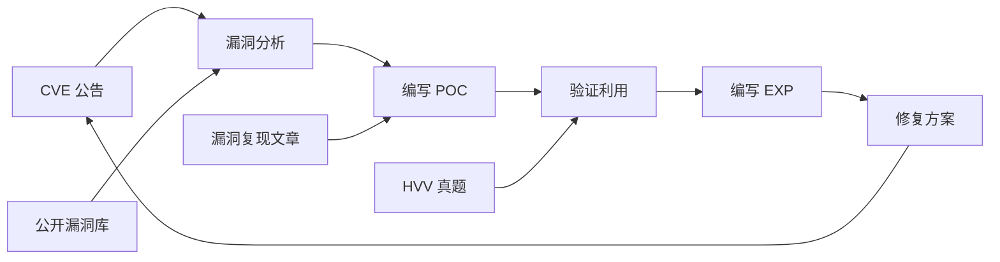

# CVE 漏洞库与 POC 合集

> 从公开漏洞库到实战 POC——系统性收录重大 CVE 与可利用的 PoC/Exp

---

## 为什么需要关注 CVE

```
CVE = Common Vulnerabilities and Exposures
CNVD = China National Vulnerability Database
CNNVD = China National Vulnerability Database of Information Security

趋势:
  2023: 新增 29,000+ CVE（日均 80 个）
  2024: 预计 35,000+ CVE
  每年激增 ~20%

其中:
  - 有公开 POC 的: ~15%
  - 有公开 EXP 的: ~5%
  - 实际被大规模利用: ~1%
```

---

## 核心学习路线



---

## 推荐工具链

| 工具 | 用途 | 链接 |
|------|------|------|
| **Awesome-POC** 🎯 | 最全 POC 集合 | [GitHub](https://github.com/Threekiii/Awesome-POC) |
| exploit-db | 官方 EXP 库 | [Website](https://www.exploit-db.com/) |
| PeiQi-WIKI | 中文漏洞库 | [GitHub](https://github.com/PeiQi0/PeiQi-WIKI-POC) |
| VulHub | 漏洞复现环境 | [GitHub](https://github.com/vulhub/vulhub) |
| NVD | 官方评分系统 | [Website](https://nvd.nist.gov/) |
| CVND | 中国国家漏洞库 | [Website](https://www.cnvd.org.cn/) |
| Seebug | 知道创宇漏洞库 | [Website](https://www.seebug.org/) |

---

## 章节内容

| 章节 | 内容 |
|------|------|
| **Awesome-POC 实战指南** | Threekiii/Awesome-POC 全库分类与使用 |
| **中间件 CVE 深度分析** | Nginx/Apache/Tomcat/WebLogic/JBoss |
| **框架漏洞 CVE** | ThinkPHP/Spring/Shiro/FastJSON/Log4j |
| **HVV 实战 POC 合集** | 2023-2024 HVV 真实漏洞 |
| **CVND 国家漏洞库** | 国内重点关注漏洞 |

---

## 参考资料

- [Threekiii/Awesome-POC](https://github.com/Threekiii/Awesome-POC) - 最全面的 POC 集合
- [PeiQi-WIKI-POC](https://github.com/PeiQi0/PeiQi-WIKI-POC) - 中文 POC Wiki
- [POChouse](https://github.com/DawnFlame/POChouse) - HVV 弹药库
- [Middlewave-Vul-Detection](https://github.com/mai-lang-chai/Middleware-Vulnerability-detection)
- [EdgeSecurityTeam/Vulnerability](https://github.com/EdgeSecurityTeam/Vulnerability)
- [OneWinner/POCS](https://github.com/onewinner/POCS)
- [exploit-db](https://www.exploit-db.com/)
- [PwnWiki](https://www.pwnwiki.org/)
