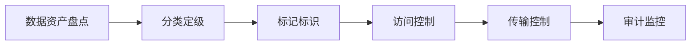

# 数据分类分级与 DLP

> 管好数据的第一步：知道有什么数据、有多敏感，然后控制它怎么流动。

---

## 数据分类分级体系

### 四级分类模型

| 级别 | 名称 | 定义 | 示例 | 允许传播 |
|------|------|------|------|---------|
| L4 | 绝密 | 泄露造成灾难性影响 | 用户密码明文、数据库核心交易 | 仅授权人员/加密环境 |
| L3 | 机密 | 泄露造成严重损失 | PII 个人信息、支付记录、密钥 | 授权人员+加密传输 |
| L2 | 内部 | 泄露造成轻微损失 | 内部文档、会议记录、代码 | 公司内部人员 |
| L1 | 公开 | 无安全影响 | 官网内容、招聘信息 | 任何人 |

### 执行流程



## DLP 技术实现

### 内容检测规则

```python
import re

class DLPScanner:
    def __init__(self):
        self.rules = {
            "credit_card": re.compile(
                r'\b(?:4[0-9]{12}(?:[0-9]{3})?|5[1-5][0-9]{14})\b'
            ),
            "id_card": re.compile(
                r'\b[1-9]\d{5}(?:19|20)\d{2}(?:0[1-9]|1[0-2])'
                r'(?:0[1-9]|[12]\d|3[01])\d{3}[\dXx]\b'
            ),
            "phone": re.compile(
                r'\b1[3-9]\d{9}\b'
            ),
            "email": re.compile(
                r'\b[A-Za-z0-9._%+-]+@[A-Za-z0-9.-]+\.[A-Z|a-z]{2,}\b'
            ),
            "api_key": re.compile(
                r'\b(sk-[A-Za-z0-9]{32,}|AKIA[0-9A-Z]{16})\b'
            ),
            "password": re.compile(
                r'(?i)(password|passwd|pwd)\s*[=:]\s*["\'][^"\']+["\']'
            )
        }
    
    def scan_text(self, text: str) -> list:
        findings = []
        for rule_name, pattern in self.rules.items():
            matches = pattern.findall(text)
            for match in matches:
                findings.append({
                    "rule": rule_name,
                    "match": self._mask(match),
                    "position": text.find(match)
                })
        return findings
    
    def _mask(self, text: str, show: int = 4) -> str:
        """脱敏显示"""
        if len(text) <= show:
            return text
        return text[:show] + "*" * (len(text) - show)
```

### 数据流监控

```python
# DNS 数据外泄检测
def check_dns_exfiltration(dns_query: str) -> bool:
    """检测通过 DNS 隧道的数据外泄"""
    suspicious_patterns = [
        r'[a-z0-9]{30,}\.com',        # 超长子域名
        r'[a-z0-9]{10,}\.(xyz|top)',  # 短 TLD + 长内容
        r'base64',                     # 包含 base64 特征
    ]
    for pattern in suspicious_patterns:
        if re.search(pattern, dns_query):
            return True
    return False

# HTTP 外泄检测
def check_http_exfiltration(request_body: bytes) -> bool:
    """检测 HTTP 请求体中的数据外泄"""
    try:
        text = request_body.decode('utf-8', errors='ignore')
        # 检查是否包含敏感数据
        scanner = DLPScanner()
        findings = scanner.scan_text(text)
        return len(findings) > 3  # 多条敏感数据同时出现
    except:
        return False
```

## 企业 DLP 策略

### 网络层 DLP

```python
# 对出站流量做 DLP 检查
# 示例：检测上传文件中的 PII
dlp_policy = {
    "email_outbound": {
        "action": "block",
        "conditions": {
            "contains_pii": True,
            "recipient_external": True,
            "attachment_count": ">5"
        },
        "notification": "security@company.com"
    },
    "http_upload": {
        "action": "alert",
        "conditions": {
            "contains_l4_data": True,
            "target_domain_not_whitelisted": True
        }
    },
    "usb_copy": {
        "action": "block",
        "conditions": {
            "device_type": "removable",
            "file_label": ["confidential", "secret"]
        }
    }
}
```

### 端点 DLP

```yaml
端点 DLP 规则:
  截图拦截:
    - 禁止截图标记为 "机密" 的应用窗口
    - 例外: 授权人员可使用企业 DLP 合规截图

  打印控制:
    - L3 级以上数据禁止打印
    - L2 级数据需审批后打印（加水印）

  剪贴板控制:
    - 禁止从内部应用复制到外部
    - 允许从外部复制到内部

  文件操作:
    - 敏感文件操作需 MFA 确认
    - 批量文件操作触发额外审批
```

## 数据生命周期安全

| 阶段 | 控制措施 | 技术方案 |
|------|---------|---------|
| 创建 | 自动分类打标 | 内容扫描+规则匹配 |
| 存储 | 加密+访问控制 | AES-256 + KMS |
| 使用 | 最小权限+审计 | PAM + SQL 审计 |
| 传输 | 加密通道 | mTLS + 数据脱敏 |
| 归档 | 离线加密存储 | 磁带加密+HMAC |
| 销毁 | 不可恢复 | 消磁/物理粉碎 |

## DLP 实施路线图

```
Phase 1 [1-2月]:
  ├─ 数据分类分级标准制度
  ├─ 数据资产盘点（发现 Shadow Data）
  └─ 关键系统数据标签化

Phase 2 [3-4月]:
  ├─ 部署 DLP 网关（邮件+Web 出口）
  ├─ 设置自动阻断规则（L3/L4 数据外泄）
  └─ 安全事件告警配置

Phase 3 [5-6月]:
  ├─ 端点 DLP 覆盖全员
  ├─ CASB 集成（SaaS 应用数据管控）
  └─ UEBA 行为基线建立

Phase 4 [持续]:
  ├─ 数据泄露模拟演练
  ├─ DLP 规则优化（减少误报）
  └─ 员工数据安全意识持续培训
```
