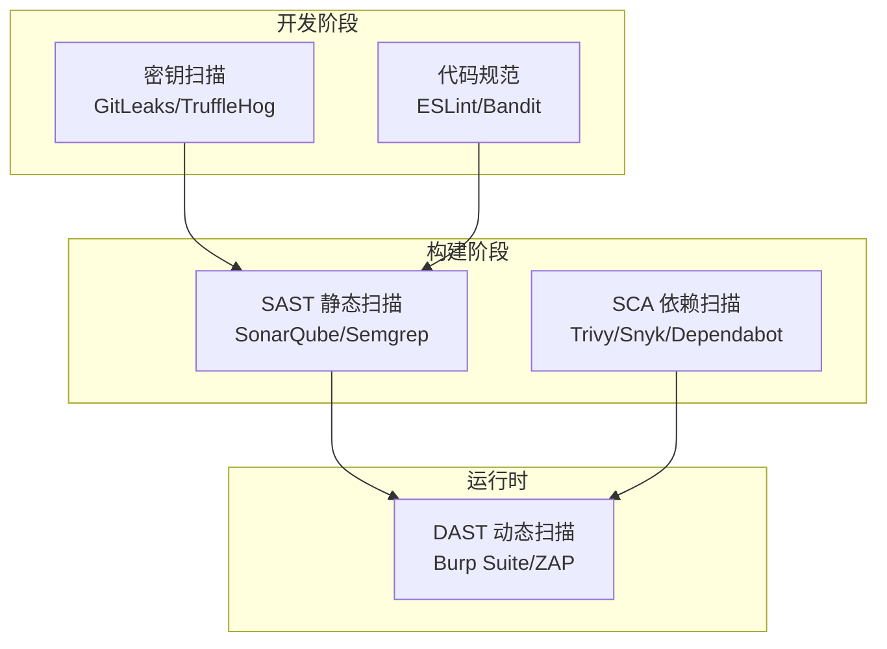

# SAST、DAST 与 Secrets 扫描

> 将安全左移 —— 在开发阶段发现并修复漏洞，成本远低于上线后。

---

## 安全测试金字塔



## SAST 静态扫描

### Semgrep 规则实战

```yaml
# SQL 注入检测规则: sql-injection.yaml
rules:
  - id: sql-injection
    patterns:
      - pattern: |
          cursor.execute("SELECT ... WHERE ... = " + $VALUE)
      - pattern-either:
          - pattern-inside: |
              $VALUE = request.$METHOD(...)
    message: "⚠️ 检测到 SQL 注入风险"
    severity: ERROR
    languages: [python]

# 硬编码密码检测
rules:
  - id: hardcoded-password
    pattern-either:
      - pattern: password = "..."
      - pattern: PASSWORD = "..."
      - pattern-regex: 'passwd\s*=\s*["\'](?!(PLACEHOLDER|\{\{|\$\{))'
    message: "硬编码密码"
    severity: WARNING
```

### 集成到 CI/CD

```yaml
# GitHub Actions SAST
- name: Semgrep SAST
  uses: semgrep/semgrep-action@v1
  with:
    config: >-
      p/owasp-top-10
      p/python
      p/javascript
      p/jwt
    auditOn: push
    publishToken: ${{ secrets.SEMGREP_TOKEN }}

# SonarQube 扫描
- name: SonarQube Scan
  uses: SonarSource/sonarqube-scan-action@v2
  with:
    args: >
      -Dsonar.projectKey=my-app
      -Dsonar.sources=.
      -Dsonar.host.url=${{ secrets.SONAR_HOST_URL }}
      -Dsonar.token=${{ secrets.SONAR_TOKEN }}
```

## DAST 动态扫描

### OWASP ZAP 自动化

```bash
# Docker 运行
docker run -v $(pwd):/zap/wrk/:rw -t ghcr.io/zaproxy/zaproxy:stable \
    zap-full-scan.py \
    -t https://target-site.com \
    -r report.html \
    -x report.xml \
    -w report.md \
    -z "-config rules_dont_use_local_files=1"

# API 扫描（需要 OpenAPI/Swagger 规范）
docker run -v $(pwd):/zap/wrk/:rw -t zaproxy/zap-stable \
    zap-api-scan.py \
    -t openapi.json \
    -f openapi \
    -r api-report.html \
    -z "-config replacer.full_list(0).description=auth  \
         -config replacer.full_list(0).enabled=true    \
         -config replacer.full_list(0).matchtype=REQ_HEADER \
         -config replacer.full_list(0).matchstr=Authorization \
         -config replacer.full_list(0).replacement=Bearer [TOKEN]"
```

## Secrets 扫描

### GitLeaks 使用

```bash
# 本地扫描
gitleaks detect -s . -v

# 扫描 Git 历史
gitleaks detect -s . --log-opts="--all"

# CI 集成
gitleaks detect -s . --report-format json --report-path gitleaks-report.json
```

### TruffleHog

```bash
# 扫描整个仓库历史
trufflehog git https://github.com/org/repo.git \
    --results=verified,unknown \
    --json > secrets.json

# 扫描文件系统
trufflehog filesystem /path/to/project \
    --include-paths="*.{py,js,go}"
```

## 工具集成矩阵

| 阶段 | 工具 | CI 集成方式 | 自动阻断 |
|------|------|------------|---------|
| 提交前 | GitLeaks | pre-commit hook | ✅ |
| PR | Semgrep | GitHub Actions | ✅ |
| 构建 | Trivy | Docker build | ✅ |
| 测试 | OWASP ZAP | CI pipeline | ⚠️ 仅高危 |
| 上线前 | Nuclei | CI release | ✅ 严重 |
| 运行时 | Falco | K8s admission | ✅ |
