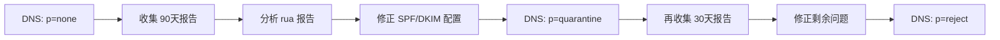

# 电子邮件安全防御体系

## 企业邮件安全架构

构建多层次的邮件安全防御体系，从边界防护到用户行为分析，全链路覆盖。

## 邮件安全网关

### 部署架构

```
互联网 → Anti-Spam/AV (第一层) → DMARC 验证 (第二层) → URL 沙箱 (第三层) → AI 检测 (第四层) → 用户收件箱
```

### 主流邮件安全网关

| 产品 | 特点 | 部署方式 |
|------|------|---------|
| Proofpoint | 动态分类、URL 防护 | 云/SaaS |
| Mimecast | 区域隔离、归档 | 云 |
| Area 1（Cloudflare） | 自动化钓鱼识别 | API 集成 |
| Cisco ESA | 灰度列表、爆发过滤 | 硬件/云 |
| Microsoft Defender DO | 集成 O365/Azure | SaaS |

## DMARC 部署策略

### 渐进式 DMARC 演练



### 报告分析工具

```bash
# 使用 dmarc-tools 分析 rua 报告
pip install parsedmarc

# 配置解析器
echo "
[general]
save_aggregate = True

[imap]
host = imap.gmail.com
user = dmarc@example.com
password = your-password
" > ~/.parsedmarc.ini

# 收集报告
parsedmarc --silent -o dmarc_report/
```

## 内部邮件威胁检测

### 异常行为检测

```python
# 用户行为分析特征
features = {
    'outbound_volume': 30,        # 正常值 /小时
    'auto_create_rules': 0,       # 是否创建了自动规则
    'forward_to_external': False, # 是否有外部转发
    'login_geo_deviation': False, # 登录地理位置偏差
    'reply_to_all_freq': 0.05,    # 全部回复频率
}

# 异常规则评分
score = 0
if features['auto_create_rules'] and features['forward_to_external']:
    score += 50  # 高度可疑 - 内部威胁/账户被盗
if features['outbound_volume'] > 100:
    score += 30  # 数据外泄风险
if features['login_geo_deviation']:
    score += 20  # 账户盗用

if score > 60:
    print("SUSPICIOUS: 用户行为异常，需要调查")
```

### 邮件规则审计

```powershell
# 批量审计所有用户的邮件规则
Connect-ExchangeOnline
Get-Mailbox -ResultSize Unlimited | ForEach-Object {
    $rules = Get-InboxRule -Mailbox $_.Identity
    $rules | Where-Object {
        $_.ForwardTo -or $_.ForwardAsAttachmentTo -or
        $_.RedirectTo -or ($_.Name -match "auto|forward|secret|delete")
    } | Select-Object Identity, Name, ForwardTo, RedirectTo
}
```

## 用户安全意识培训

### 钓鱼演练最佳实践

```yaml
演练策略:
  频率: 每月一次（基准）+ 每季一次（针对性）
  基准测试: 评估当前钓鱼点击率
  类型: 凭证钓鱼、恶意附件、二维码钓鱼、Deepfake 语音钓鱼
  报告机制: 提供"报告钓鱼邮件"按钮
  反馈: 点击者自动进入补充培训
```

### 实时反馈训练

```python
# 检测到可疑点击后，插入交互式警告页面
def anti_phishing_intervention(email_score, url_score):
    if email_score > 0.7 or url_score > 0.8:
        return render_template('phishing_warning.html',
            detected_threats=[
                '发件人域名注册时间 < 30天',
                'URL 重定向至未注册域名',
                '邮件包含紧急要求的语言',
                '附件为启用宏的 Office 文档'
            ],
            reporting_options=[
                '报告为钓鱼邮件',
                '标记为正常邮件（需要理由）',
                '联系安全团队确认'
            ]
        )
```

## BEC（商务邮件欺诈）防护

BEC 是最具财务破坏性的邮件攻击。2024年 FBI IC3 报告 BEC 损失超过 $10B。

### BEC 检测规则

```yaml
检测规则:
  - email_composition:
    - 仅文本、无签名
    - 使用移动设备签名（"Sent from iPhone"）
    - 伪装为高管或供应商域
  - payment_requests:
    - 紧急付款、更改付款账户
    - 要求保密、绕过审批流程
    - 目标财务/应付账款人员
```

## 邮件事件响应模板

```yaml
邮件安全事件响应步骤:
  1. 确认: 用户报告 OR 网关告警 OR DLP 触发
  2. 隔离: 从所有收件箱删除邮件（使用 Search-and-Purge）
  3. 分析: 提取邮件头、附件样本、URL
  4. 范围: 确定有多少收件人点击/回复
  5. 修复: 重置受感染账户凭证、检查自动规则
  6. 改进: 更新邮件过滤规则、补充用户培训
```

```powershell
# Exchange Online 批量删除恶意邮件
Get-Mailbox -ResultSize Unlimited | Search-Mailbox -SearchQuery 'Subject:"紧急付款"' -DeleteContent
```

## 总结

邮件安全防护是一个系统工程，需要技术控制（网关、DMARC、DLP）、行为分析（UEBA、BEC 检测）和人员培训（安全意识、钓鱼演练）的协同工作。
