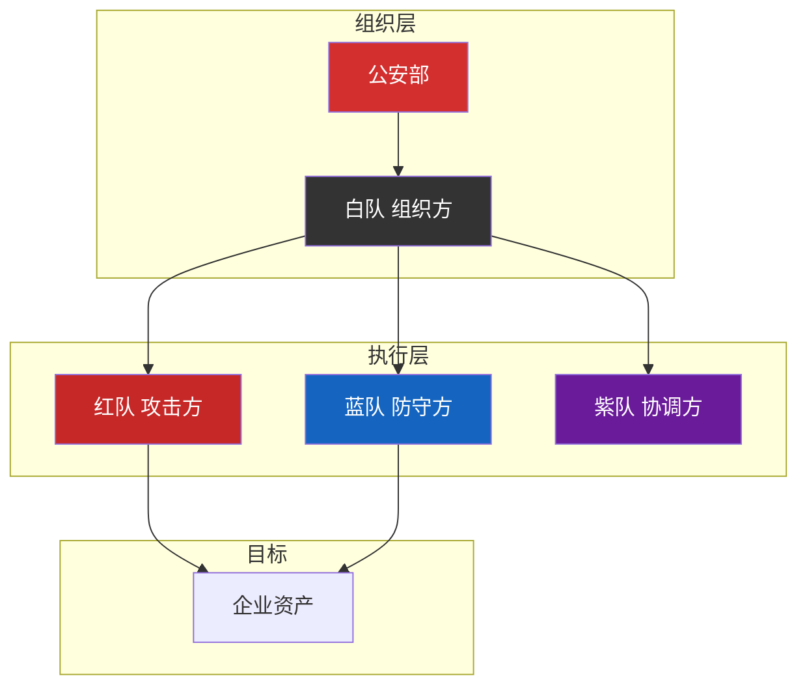

# HVV 护网行动实战指南

> 从 2016 到 2026——中国最大规模网络安全攻防演练的十年进化

---

## 什么是 HVV

```yaml
全称: 护网行动 / HVV 行动
主办方: 公安部
性质: 国家级网络安全实战攻防演练
周期: 每年 7-8 月（国家级），持续 2-3 周
参与方: 能源、金融、通信、交通等关键基础设施

目标: 评估企事业单位的网络安全防护能力
     发现和修复系统安全漏洞
     检验网络安全应急响应体系
```

---

## 发展历程

```yaml
2016 年 — 启动
  首次全国范围 HVV 行动试点
  重点: 政府机构关键信息系统
  规模: 小范围试点

2017 年 — 全面实施
  《网络安全法》正式实施
  首次全面覆盖关键信息基础设施
  加入金融、能源等行业

2018-2019 年 — 扩大
  参与单位从央企扩展到大型民企
  攻击手法从常规渗透升级到 APT 模拟

2020 年 — 常态化
  参与单位数量翻倍
  红队评分规则更严格
  蓝队需"发现+响应+修复"才能得分

2021-2022 年 — 深度化
  供应链攻击进入 HVV 攻击链
  云安全成为重点关注领域
  AI 技术开始用于攻防两端

2023-2024 年 — 智能化
  攻击方法涵盖: 0day、供应链、钓鱼、社工
  蓝队 AI 辅助检测已成标配
  规则更加严格:蓝队发现攻击不再加分，必须及时处置

2025-2026 年 — 体系化
  AI FOR SECURITY 成为主题
  攻防演练覆盖:云原生、AI 模型、物联网
  多角色协调:红队/蓝队/紫队/白队
```

---

## 参与角色



### 红队（攻击方）

```yaml
组成:
  - 国家队: 国家网络安全技术人员 ~60%
  - 厂商技术: 安全厂商渗透专家 ~40%
  - 每队 3-5 人（信息收集、渗透、打扫战场）

攻击手段:
  - 漏洞利用（Nday/1day/0day）
  - 社会工程学（钓鱼/电话/上门）
  - 供应链攻击
  - 物理渗透（模拟混入办公区）
  - WAF/IDS 绕过

评分: 攻破系统并提交有效标记（截图/文件）
```

### 蓝队（防守方）

```yaml
组成: 企业安全运维团队 + 监管专家
初始: 10000 分，被攻破则扣分

防守策略:
  - 资产梳理与暴露面收敛
  - 漏洞修复与应急响应
  - 7×24h 安全监控
  - 攻击溯源与取证

变化:
  2020 年前: 发现攻击可加分
  2021 年起: 必须及时处置才能少扣分
  2023 年后: 发现真实黑客攻击才能加分
```

### 紫队与白队

```yaml
紫队 (Purple Team):
  推动红蓝高效协作
  分析攻防效果
  提出改进建议

白队 (White Team):
  监督演练流程
  确保合规安全公平
  汇总结果发布报告
```

---

## HVV 高价值漏洞

### 历年 TOP 漏洞类型

```yaml
2016-2017:
  - Struts2 RCE（S2-045/S2-048）
  - WebLogic 反序列化
  - 弱口令爆破

2018-2019:
  - 泛微 OA 漏洞（代码执行/文件上传）
  - Shiro 反序列化（rememberMe）
  - 通达 OA 漏洞

2020-2021:
  - Log4j RCE（CVE-2021-44228）
  - Spring Cloud Gateway SpEL
  - FastJSON 反序列化

2022-2023:
  - Spring4Shell（CVE-2022-22965）
  - Nacos 未授权/配置泄露
  - Confluence OGNL（CVE-2022-26134）

2024-2025:
  - K8s API Server 未授权
  - AI 模型训练数据泄露
  - 容器逃逸（RunC/containerd）
```

---

## 红队工作流

```bash
# 阶段 1：信息收集（Red Team Recon）
nmap -sV -A target.com
subfinder -d target.com -o subdomains.txt
httpx -l subdomains.txt -o alive.txt
nuclei -l alive.txt -t cves/ -o vulns.txt

# 阶段 2：漏洞利用
# 针对识别到的中间件/框架使用对应 POC
python3 CVE-2022-22965.py -u http://vuln-target.com

# 阶段 3：权限维持
# webshell / 后门 / 隧道
python3 -c 'import pty; pty.spawn("/bin/bash")'

# 阶段 4：信息收集（内网）
# 横向移动 → 寻找高价值目标
```

---

## 蓝队备战指南

```yaml
备战期（T-90 天）:
  - 资产梳理（所有暴露面清单）
  - 漏洞扫描与修复（高危优先）
  - 安全设备升级（WAF/IPS/EDR）
  - 7×24 排班计划

战前（T-30 天）:
  - 红蓝对抗预演
  - 应急响应演练
  - 日志审计策略优化
  - 告警规则调校

战中（D-Day）:
  - 全天候安全监控
  - 攻击流量实时分析
  - 攻击溯源与反制
  - 白队报告提交

战后（D+30 天）:
  - 复盘报告
  - 新增漏洞修复
  - 加固措施落实
  - 改进方案
```

---

## HVV 相关资源

- [2023 HVV POC 集合 PDF](https://www.redteam.wang/static/downloads/2023hvvday%20POC%E9%9B%86%E5%90%88.pdf)
- [2024 HVV 漏洞合集（283个POC）](https://www.cnblogs.com/cybersecuritystools/p/18392568)
- [2022 HVV POC 整理](https://github.com/caine111/2022-HW-POC)
- [HVV 最新 POC 集合](https://github.com/Threekiii/Awesome-POC)
- [Awesome-POC HVV 目录](https://github.com/Threekiii/Awesome-POC/tree/master/2023-HVV-POC)
- [2024 HVV 漏洞 CVE 库](https://blog.csdn.net/weixin_72543266/article/details/138094998)
- [HVV 护网介绍（搜狐）](https://www.sohu.com/a/869847910_122090124)
- [2025 HVV 全面指南（搜狐）](https://www.sohu.com/a/862871963_122004016)
- [HVV 发展历程详解](https://blog.csdn.net/weixin_41287260/article/details/146336710)
- [《红蓝攻防：构建实战化网络安全防御体系》](https://baike.baidu.com/item/红蓝攻防:构建实战化网络安全防御体系/61676913)
