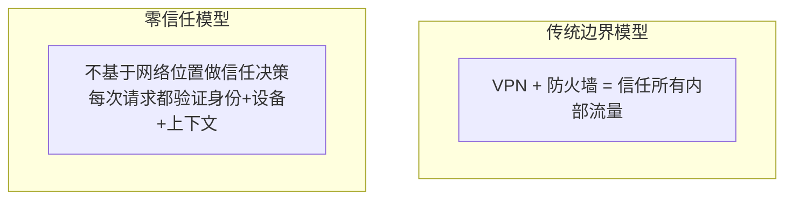

# 零信任架构

> 永不信任，始终验证——零信任（Zero Trust）是 2020s 最重要的安全范式转型。

---

## 核心原则



### NIST 800-207 七大原则

```
1.  所有数据源和计算服务被视为资源
2.  所有通信无论网络位置都要安全
3.  每个资源的访问按会话授权
4.  访问策略基于"身份+设备+环境"动态决定
5.  持续监控和验证（不为静态信任）
6.  最小权限原则
7.  收集尽可能多的行为信息用于检测
```

## ZTNA 架构组件

```
                 +-----------+
请求 → → →      | 策略引擎    |← ← ← 身份/设备/行为数据
        ↓       | (PDP)      |
    +---+---    +-----------+
    | 策略执行点        |
    | (PEP)            |
    +---+---+----+----+
        |       |        |
    应用 A   应用 B   应用 C
    (微隔离)  (微隔离)  (微隔离)
```

## Google BeyondCorp 实现

```yaml
# Google 零信任实施（已知最早的 ZTNA 实践）
组件:
  Access Proxy: 所有应用访问的唯一入口
  Access Policy: 基于"用户+设备+上下文"的访问决策
  Device Inventory: 所有公司设备的清单+状态
  User Identity: 统一身份认证

访问判断因素:
  - 用户身份是否已验证（IDP）
  - 设备是否公司管理 + 补丁最新
  - 设备证书是否有效（客户端证书）
  - 用户位置（办公室/咖啡厅/出差）
  - 请求的敏感度级别

策略示例:
  - 从受管设备访问 HR 系统 → 允许
  - 从非受管设备访问 HR 系统 → 拒绝
  - 从未知位置访问代码仓库 → 需二次验证
  - 从非工作时间访问数据库 → 告警 + 限制
```

## 实现方案对比

| 方案 | 部署 | 优点 | 缺点 | 案例 |
|------|------|------|------|------|
| **ZTNA 1.0** | 自建 | 最大控制 | 运维复杂 | Google BeyondCorp |
| **ZTNA 2.0** | SaaS | 即插即用 | 数据经第三方 | Cloudflare Access |
| **SASE** | 云原生 | 网络+安全统一 | 厂商锁定 | Zscaler, Netskope |
| **开源** | 自建 | 透明可控 | 需定制 | Zalando, Ory |

## Cloudflare Access 配置

```bash
# Cloudflare Zero Trust 命令行
warp-cli register
warp-cli connect

# 配置应用访问策略
# 1. 添加应用（自托管或SaaS）
policies:
  - name: "Internal Dashboard"
    type: self-hosted
    subdomain: internal.company.com
    
  - name: "Production DB Access"
    type: self-hosted
    session_duration: 1h  # 会话有效期1小时

# 2. 定义访问规则
rules:
  - action: allow
    conditions:
      - user.email == "admin@company.com"
      - user.country == "CN"
      - device.posture == "compliant"
  - action: deny
    conditions:
      - true  # 默认拒绝
```

## 微隔离（Micro-segmentation）

```yaml
# K8s 网络策略（微隔离最小权限）
apiVersion: networking.k8s.io/v1
kind: NetworkPolicy
metadata:
  name: api-db-isolation
spec:
  podSelector:
    matchLabels:
      app: postgres
  policyTypes:
    - Ingress
  ingress:
    - from:
        - podSelector:
            matchLabels:
              app: api-server
      ports:
        - protocol: TCP
          port: 5432
  # 其他 Pod 无法访问数据库
```

## 零信任迁移路线图

```
Phase 1 (基础) [1-3个月]
  ├─ 统一身份管理（SSO + MFA）
  ├─ 建立设备资产清单 + 合规基线
  └─ 安装EDR代理全覆盖

Phase 2 (网关) [3-6个月]
  ├─ 部署反向代理/API网关（Nginx/Kong）
  ├─ 内部应用接入零信任网关
  └─ 逐步替换 VPN

Phase 3 (微隔离) [6-12个月]
  ├─ 服务间 mTLS（Istio/Linkerd）
  ├─ 网络微分段（基于角色的流量限制）
  └─ 持续行为监控（UEBA）
```

## 关键指标

| 指标 | 传统 | 零信任后 |
|------|------|---------|
| VPN 用户 | 5000 | 0（已替换） |
| 应用暴露面 | 200个端口开放 | 0（全通过网关） |
| 密码登录 | 100% | 0%（MFA + 证书） |
| 平均访问时间 | 15秒（VPN连接） | <1秒 |
| 横向移动半径 | 整个内网 | 单 Pod/服务 |
