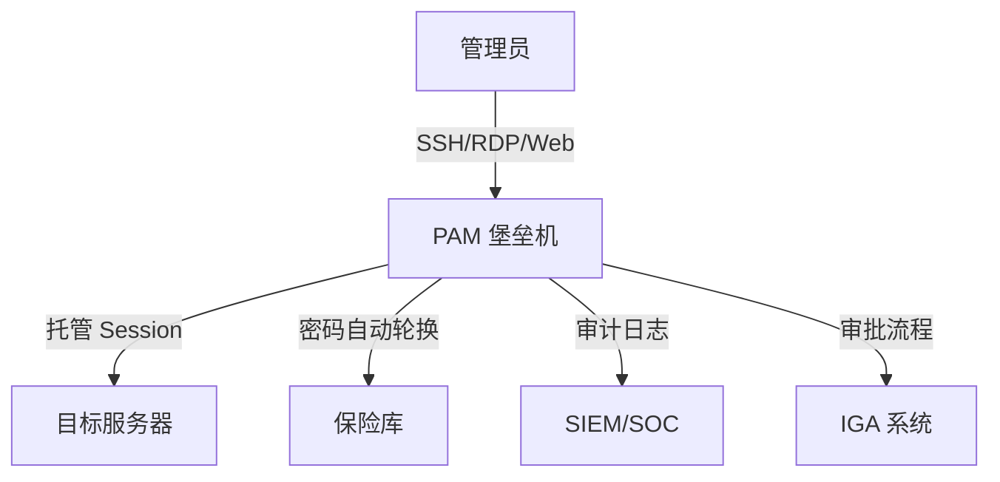
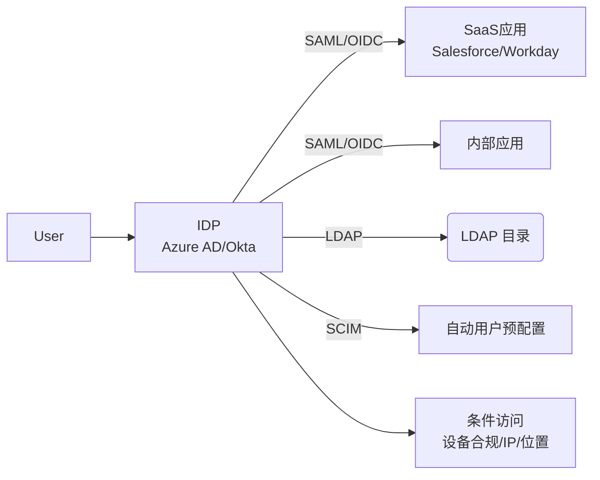

# PAM 与 IGA 实战

> PAM（特权访问管理）+ IGA（身份治理与管理）= IAM 的两大支柱。

---

## PAM 架构



## 特权账户分类

| 类型 | 风险等级 | 数量(千人企业) | 管理方式 |
|------|---------|--------------|---------|
| 域管理员 | 极高 | 5-15 | MFA + 跳板机 + Session录制 |
| 本地管理员 | 高 | 100-500 | LAPS自动管理 |
| 服务账户 | 高 | 200-1000 | 托管服务账户(gMSA) |
| SSH密钥 | 高 | 1000+ | SSH CA 签名 |
| API令牌 | 高 | 500+ | 即时签发+自动过期 |
| 数据库管理员 | 高 | 20-50 | 动态凭证 |
| 云控制台 | 极高 | 10-30 | SSO + 临时权限提升 |

## LAPS 实施

```powershell
# Windows LAPS（本地管理员密码解决方案）
# 自动管理本地管理员密码

# 安装 LAPS
# 下载 LAPS x64.msi

# 扩展 AD Schema
Import-Module AdmPwd.ps
Update-AdmPwdADSchema

# 委派权限
Set-AdmPwdComputerSelfPermission -Identity "OU=Workstations,DC=corp,DC=com"

# 组策略配置
# 计算机配置 > 管理模板 > LAPS
# "启用本地管理员密码管理" → 已启用
# "密码长度" → 16
# "密码有效期" → 30天
```

## 即时（Just-in-Time）权限

```powershell
# Azure AD PIM（Privileged Identity Management）
# 临时提升权限，非永久

# 激活 Azure AD 角色
# 1. 用户请求激活"全局管理员"
# 2. MFA 验证
# 3. 审批（管理员/自动）
# 4. 激活有效 1 小时
# 5. 自动过期（无需手动降级）

# 激活事件记录
# Azure AD 审计日志
# 发邮件通知安全团队
# 创建 SIEM 告警
```

## IGA 核心功能

```
IGA = 身份的全生命周期管理

入职:
  1. HR 系统创建员工记录
  2. 自动创建 AD/Azure AD 账号
  3. 根据岗位模板分配默认权限
  4. 触发审批（高权限组需要）
  5. 通知 IT 准备设备

变动:
  1. 岗位变更触发权限重审
  2. 旧组权限自动移除
  3. 新组权限按需申请
  4. 批准后即时生效

离职:
  1. HR 标记离职
  2. 立即禁用账号
  3. 转移所属文件
  4. 触发审计
  5. 到期后删除账号

定期重审:
  1. 季度权限清单自动生成
  2. 发送给部门经理审批
  3. 未审批的权限自动回收
  4. 异常权限标记
```

## SSO 架构



## 最小权限自动化

```python
class LeastPrivilegeEnforcer:
    def __init__(self):
        self.iam_scanner = IAMScanner()
    
    def detect_orphan_permissions(self):
        """检测孤立权限（未使用>90天）"""
        unused_roles = []
        
        # Azure AD
        for user in self.iam_scanner.list_azure_users():
            for role in user["roles"]:
                last_used = self.iam_scanner.get_role_last_usage(role)
                if last_used and (datetime.now() - last_used).days > 90:
                    unused_roles.append({
                        "user": user["name"],
                        "role": role,
                        "last_used": last_used,
                        "action": "建议移除"
                    })
        
        # AWS IAM
        for user in self.iam_scanner.list_iam_users():
            unused_policies = self.iam_scanner.find_unused_policies(user)
            unused_roles.extend(unused_policies)
        
        return unused_roles
    
    def auto_remove_expired_grants(self):
        """自动移除过期授权"""
        # PIM 超时权限
        # 临时授权到期
        # 项目权限到期
        pass
```

## IAM 成熟度模型

| 级别 | 状态 | 特征 |
|------|------|------|
| L0 | 无管理 | 共享账户、明文密码、无审计 |
| L1 | 基础 | AD 域控、账户密码策略、有准入 |
| L2 | 受控 | SSO+MFA、PAM特权管理、基础审计 |
| L3 | 可衡量 | JIT权限、定期重审、自动回收、基线符合 |
| L4 | 持续优化 | 自适应访问、用户行为分析、零信任架构 |
