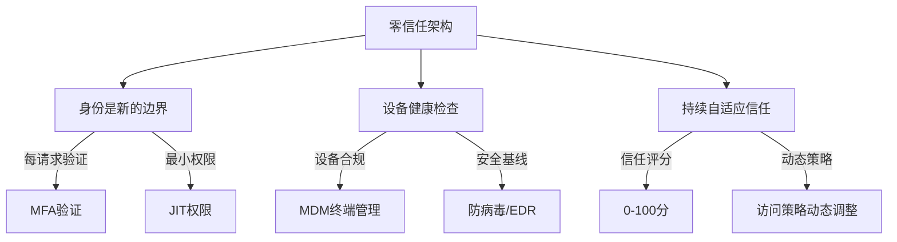
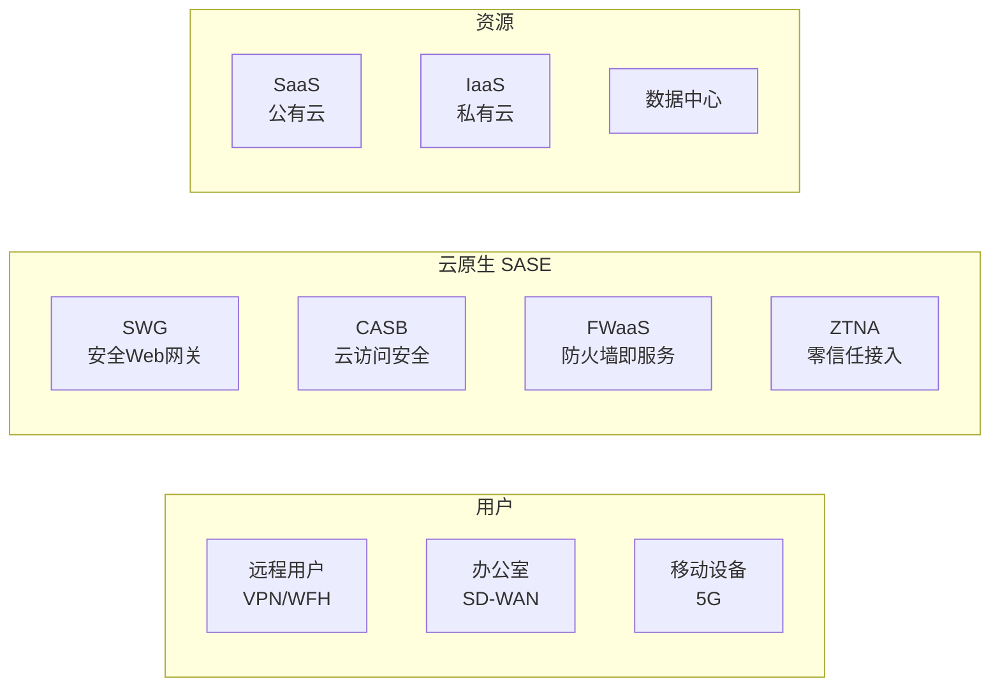

# 零信任落地实战

> 零信任不是产品——是"永不信任，始终验证"的架构原则。

---

## Zero Trust 三大核心



## Google BeyondCorp 模型

```yaml
核心原则:
  1. 不区分内外网
  2. 基于设备和用户身份做访问决策
  3. 所有访问需要认证和授权
  4. 动态评估信任等级

组件:
  Access Proxy: 
    - 所有流量经过的反向代理
    - Google IAP/Apigee/Cloudflare Access
    
  Access Control Engine:
    - 信任评分计算
    - 动态策略决策
    - 支持条件: 用户/设备/IP/位置/行为
    
  Device Inventory:
    - 设备清单（公司发/个人设备）
    - 设备合规状态（补丁/杀毒/加密）
    - 证书管理

实施路径:
  Phase 1: 设备可见性 + 资产盘点
  Phase 2: 内部应用接入（SSO + 设备验证）
  Phase 3: 外部应用统一接入
  Phase 4: 无特权网络（移除内网信任）
```

## 持续自适应信任

```python
class TrustScoreEngine:
    def __init__(self):
        self.factors = {
            "identity": {
                "weight": 30,
                "checks": {
                    "mfa_recent": 10,        # MFA 是否在 1 小时内
                    "password_age": 5,        # 密码是否 < 90 天
                    "login_location": 10,     # 登录位置正常
                    "failed_attempts": 5,     # 失败尝试 < 3 次
                }
            },
            "device": {
                "weight": 25,
                "checks": {
                    "patched": 10,            # 系统补丁最新
                    "antivirus": 5,           # 杀毒软件运行
                    "disk_encrypted": 5,       # 磁盘加密
                    "not_rooted": 5,           # 未越狱/Root
                }
            },
            "behavior": {
                "weight": 25,
                "checks": {
                    "normal_hours": 5,        # 工作时间
                    "known_ip": 5,            # 已知 IP 范围
                    "risk_score": 10,         # UEBA 风险分
                    "unusual_access": 5,      # 无异常访问模式
                }
            },
            "context": {
                "weight": 20,
                "checks": {
                    "sensitivity": 10,        # 数据敏感度
                    "access_frequency": 5,    # 访问频率
                    "peer_behavior": 5,       # 同行行为对比
                }
            }
        }
    
    def calculate_trust(self, context: dict) -> dict:
        """计算信任评分"""
        score = 0
        max_score = 100
        details = {}
        
        for category, config in self.factors.items():
            category_score = 0
            for check_name, points in config["checks"].items():
                if check_name in context and context[check_name]:
                    category_score += points
                    details[f"{category}_{check_name}"] = {"points": points, "passed": True}
                else:
                    details[f"{category}_{check_name}"] = {"points": 0, "passed": False}
            
            score += category_score
        
        # 策略判定
        if score >= 80:
            decision = "allow"
        elif score >= 50:
            decision = "step_up"  # 要求额外MFA
        elif score >= 30:
            decision = "restrict"  # 限制权限（只读）
        else:
            decision = "deny"
        
        return {"score": score, "decision": decision, "details": details}
```

## SASE 架构



## 落地策略决策树

```yaml
场景: 用户访问内部应用

步骤1: 设备检查
  设备是否注册? → 否 → 阻断 + 引导注册
  设备是否合规? → 否 → 仅允许 Web 访问
  → 是 → 进入身份认证

步骤2: 身份认证
  SSO 登录 → MFA (Always)
  令牌类型: Passkey > TOTP > SMS (按优先级)
  
步骤3: 信任评分
  计算实时信任分
  > 80 → 允许全功能
  50-80 → 敏感操作需额外MFA
  < 50 → 只读访问/拒绝

步骤4: 持续监控
  每请求重新评估
  信任分下降 → 主动降权
  异常行为 → 会话终止

实施建议:
  先从低风险应用开始（内网Wiki/文档）
  逐步扩展到中等风险（CRM/项目管理）
  最后是高敏感应用（财务/HR）
  从头开始移除"内网信任"假设
```

## 零信任成熟度

| 级别 | 名称 | 特征 |
|------|------|------|
| L1 | 传统 | VPN + 内网信任、只有账户密码 |
| L2 | 基础 | SSO + MFA、设备准入（NAC） |
| L3 | 演进 | 应用级微隔离、风险评分、策略引擎 |
| L4 | 先进 | 持续验证、行为分析、动态策略、JT权限 |
| L5 | 零信任 | 无内网、全链路加密、AI驱动信任、零配置访问 |
