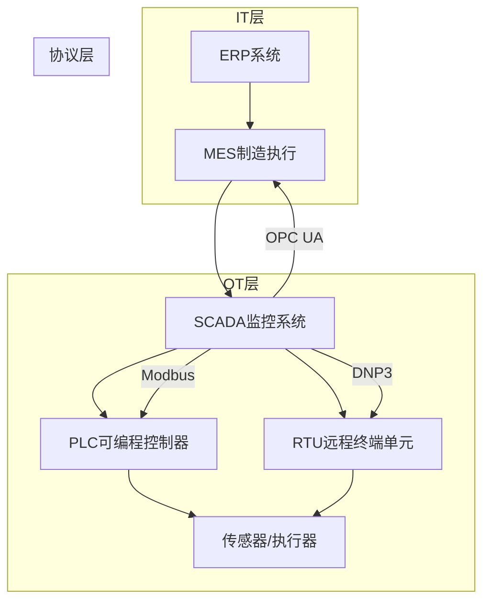

# 工控系统安全（ICS/SCADA）

> 工业控制系统安全关乎国计民生——电网停摆、水厂中断、管道爆炸并非科幻。

---

## 工控系统架构



## 工控协议漏洞

### Modbus（最基础的 ICS 协议）

```python
# Modbus 特点
# - 无认证（任意设备可以读写）
# - 无加密（明文传输）
# - 功能码少（简单但危险）

import socket
import struct

def modbus_read_coils(ip, port=502, start=0, count=10):
    """读取 PLC 线圈状态"""
    sock = socket.socket(socket.AF_INET, socket.SOCK_STREAM)
    sock.connect((ip, port))
    
    # Modbus 请求帧
    trans_id = 0x0001
    proto_id = 0x0000
    length = 0x0006
    unit_id = 0x01
    func_code = 0x01  # Read Coils
    payload = struct.pack('>HHHBBHH',
        trans_id, proto_id, length, unit_id,
        func_code, start, count)
    
    sock.send(payload)
    resp = sock.recv(1024)
    sock.close()
    return resp

# ⚠ 利用方式：直接修改 PLC 寄存器值
# 后果：篡改温度/压力/阀门控制信号
```

### 其他协议

| 协议 | 端口 | 风险 | PoC 工具 |
|------|------|------|---------|
| Modbus | 502/TCP | 无认证 | modbus-cli |
| DNP3 | 20000/TCP | 固定密码 | dnplib |
| S7comm | 102/TCP | 无认证 | Snap7（Python） |
| OPC UA | 4840/TCP | 配置不当 | opcua-asyncio |
| BACnet | 47808/UDP | 广播漏洞 | bacpypes |
| IEC 104 | 2404/TCP | 伪造报文 | IEC60870 |

## 工控安全攻击案例

### 乌克兰电网攻击（2015）
```
攻击链:
1. 鱼叉邮件 → 获取办公网络访问
2. 提取 VPN 凭据 → 进入 OT 网络
3. 扫描识别 SCADA 系统（IEC 60870-5-104）
4. 签发恶意指令 → 断开变电站
5. 删除日志 → 阻断恢复（DoS 调度电话系统）
影响: 22.5 万用户停电 6 小时
```

### Colonial Pipeline 事件（2021）
```
攻击链:
1. VPN 凭据泄露（不用 MFA）
2. 通过 VPN 进入 OT 网络
3. 部署勒索软件
4. 导致美国东海岸 45% 燃油供应中断 11 天
教训: IT/OT 网络隔离不彻底 + 无多因素认证
```

## Shodan 搜索工控系统

```python
import shodan

api = shodan.Shodan('API_KEY')

# 搜索暴露的 PLC
results = api.search('port:502 modicon')
for r in results['matches']:
    print(f"{r['ip_str']}:{r['port']} - {r['org']}")

# 搜索西门子 S7
results = api.search('S7-300 port:102')

# 搜索 SCADA Web 界面
results = api.search('title:"SCADA"')
```

## ICS 安全防护

### Purdue 模型分层防护

| 层级 | 名称 | 安全措施 |
|------|------|---------|
| Level 5 | 企业网络 | 传统 IT 安全 |
| Level 4 | DMZ | 单向网闸（data diode） |
| Level 3 | 操作管理 | 跳板机 + 审计 |
| Level 2 | SCADA | 应用白名单 |
| Level 1 | PLC/RTU | 固件签名 + 程序校验 |
| Level 0 | 物理设备 | 物理安全 |

### 实践建议

```
✅ 强隔离：
  - IT/OT 网络彻底物理隔离
  - 仅通过单向网闸（Data Diode）传输数据
  - 远程访问需跳板机 + MFA + 审计

✅ 协议安全：
  - ModbusTCP → ModbusTLS/TCP 加密
  - OPC Classic → OPC UA 认证加密
  - 禁用不必要协议和服务

✅ 资产管控：
  - 建立完整 ICS 资产清单
  - 固件定期更新（厂商安全公告跟进）
  - PLC 程序的完整性和版本控制

✅ 监控检测：
  - 工控网络流量异常检测（Nozomi/Vectra）
  - 异常 Modbus 功能码告警
  - PLC 梯形图变更审计
```

*下一篇：[工控安全实战（上篇）](02-ics-security.md)*
