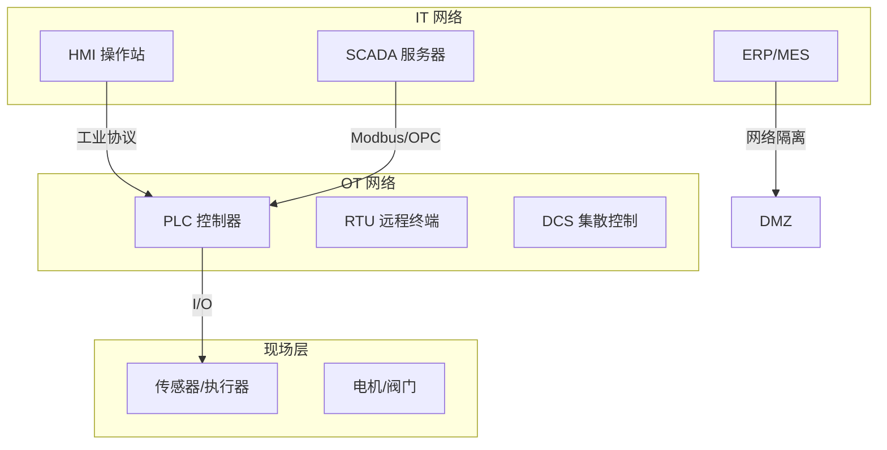

# 工控安全实战（上篇）

> 工控系统不能停——补丁星期二对 PLC 来说就是灾难日。

---

## 工控安全基础架构



## 常见工控协议安全

```yaml
Modbus:
  - 无认证
  - 明文传输
  - 功能码 0x11（读取事件）泄露信息
  - 功能码 0x05/0x0F（写线圈）未授权控制

# Modbus 漏洞利用
# 扫描 PLC
nmap -sV -p 502 192.168.1.0/24

# Modbus 读取
python modbus-cli scan 192.168.1.100
python modbus-cli read 192.168.1.100 %MW0 100

# 功能码枚举
python modbus-cli fc 192.168.1.100 0x11  # 读取事件
python modbus-cli fc 192.168.1.100 0x2B   # 读取设备标识

# 未授权写（危险！）
python modbus-cli write 192.168.1.100 %MW1 0xFF00  # 停止设备

S7Comm (Siemens):
  - 无认证（S7-1200/1500 开始支持）
  - 可枚举 PLC 配置
  - 可上传/下载程序块
  # Sniff7 工具
  python sniff7.py -i eth0

DNP3:
  - 用于电力/能源
  - 支持认证（Secure Authentication 5.0）
  - 但多数部署未启用
  # DNP3 嗅探
  wireshark -k -f "port 20000"

PROFINET:
  - 实时以太网
  - DCP 协议可发现设备
  # PROFINET DCP 扫描
  pn-scan.py eth0

OPC UA:
  - 最新工业标准
  - 支持加密+签名
  - 但证书管理复杂，常被禁用
```

## 工控系统攻击案例

```yaml
Stuxnet (震网):
  目标: 伊朗核设施离心机
  路径: USB → 内部网络 → Step7 → PLC
  效果: 修改 PLC 参数导致离心机损坏
  精妙点: 向监控系统汇报正常数据

Industroyer (2016):
  目标: 乌克兰电网
  攻击: 直接操作变电站开关
  协议: IEC 60870-5-104 / OPC DA
  效果: 22.5万户停电数小时

Triton/Trisis (2017):
  目标: 沙特石化工厂 SIS 系统
  攻击: 通过 Triconex 安全控制器
  效果: 差点触发物理伤害
  发现: 程序 bug 导致过程停堆（误触）

Colonial Pipeline (2021):
  目标: 美国最大燃油管道
  攻击: IT 系统勒索软件 → OT 被迫停机
  效果: 45% 东海岸燃油断供
  教训: IT-OT 分离不够彻底
```

## Purdue 模型安全隔离

```yaml
Purdue 模型层级:

Level 5: 企业网络
  - ERP/CRM/电子邮件
  - 防火墙 → Level 4

Level 4: 站点业务规划
  - MES / 数据库
  - DMZ 区域（工业防火墙）

Level 3: 站点操作
  - SCADA 服务器/历史数据库
  - 严格访问控制

Level 2: 控制
  - HMI / 工程站
  - 最小服务运行

Level 1: 基本控制
  - PLC / RTU / DCS
  - 单向网关

Level 0: 过程
  - 传感器/执行器
  - 纯物理接口

安全建议:
  - Level 3-5: IT 安全标准（补丁/AV/EDR）
  - Level 0-2: 物理隔离 + 网络微隔离
  - 跨层通信: 单向数据二极管/工业防火墙
  - 拒绝从 Level 5 直连 Level 1
```

## 工控安全加固

```yaml
网络隔离:
  - IT/OT 防火墙（工业协议深度检测）
  - 单向数据二极管（物理层隔离）
  - DMZ 区域部署堡垒机跳板
  - 禁止 USB 直连控制设备

访问控制:
  - 最短连接策略
  - 工程站绑定 MAC 白名单
  - 双人操作（重要操作需两人确认）
  - 会话录制（记录操作员所有操作）

扫描与监控:
  - 被动扫描（被动资产发现）
  - 严禁主动扫描（会导致 PLC 宕机）
  # 被动扫描工具
  # GRASSMARLIN → 工控网络拓扑分析
  # Zeek ICS 插件 → 协议深度解析
  
  - 基线告警（异常流量/协议异常）
  - 网络行为分析（NIDS）

补丁管理:
  - 离线测试环境验证
  - 热备份切换窗口
  - 年度停机维护窗口
  - 虚拟补丁（IPS/WAF 虚拟补丁）
```

## 工控安全工具链

```bash
# 工控协议分析
plcscan -t 192.168.1.0/24 --modbus  # 扫描 Modbus PLC
plcscan -t 192.168.1.0/24 --s7      # 扫描西门子

# Modbus 模糊测试
# Sulley/Boofuzz 工控协议模糊测试
boofuzz --target 192.168.1.100 --port 502 --proto tcp

# IEC 61850 模糊测试
# MuDY (MUTATE THE DNP)
python mutadnp.py -i eth0 -t 192.168.1.100

# 工控蜜罐
# Conpot → 低交互工控蜜罐
docker run -d --name conpot -p 502:502 honeynet/conpot
```

*上一篇：[工控系统安全（ICS/SCADA）](01-ics-security.md)*

*下一篇：[工控协议深度解析](03-ics-protocols-deep-dive.md)*
