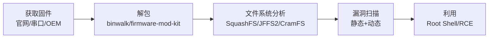

# IoT 固件分析与漏洞挖掘

> 物联网设备的安全水平 = 最薄弱的固件组件。

---

## 固件分析流程



## 获取固件

```bash
# 方法1：官网下载（最简单）
wget https://vendor.com/firmware/fw_v2.1.0.bin

# 方法2：串口读取（物理访问）
# 接上 UART 适配器 → minicom 捕获启动日志
screen /dev/ttyUSB0 115200
cat /dev/mtdblock0 > firmware.bin  # 从运行的设备导出

# 方法3：SPI Flash 编程器读取
flashrom -p ch341a_spi -r firmware.bin  # 读取 Flash 芯片内容

# 方法4：OTA 抓包（无线固件更新）
# Wireshark 过滤 HTTP/FTP/TFTP 中包含 firm的文件
tshark -r capture.pcap -Y "http contains .bin" -T fields -e http.request.uri
```

## 固件解包

```bash
# binwalk 自动解包（根据文件签名识别）
binwalk -Me firmware.bin  # -M: 递归, -e: 提取

# 手动指定偏移
binwalk -D 'squashfs:0:42' firmware.bin

# firmware-mod-kit
./extract-firmware.sh firmware.bin

# 手动解包 SquashFS
dd if=firmware.bin bs=1 skip=$OFFSET of=rootfs.squashfs
unsquashfs rootfs.squashfs
```

## 漏洞挖掘详解

### 1. 硬编码凭据

```bash
# 搜索硬编码密码
grep -r "password" extracted_fs/ | grep -v ".git"
grep -r "passwd" extracted_fs/etc/
grep -rn "'[a-zA-Z0-9]\{8,16\}'" extracted_fs/ --include="*.py" --include="*.js"

# 常见位置
# /etc/shadow — 用户密码哈希
# /etc/config/*.conf — Web 管理密码
# /www/*.html — 前端硬编码 API key
# /bin/ — 二进制中硬编码凭据
strings firmware.bin | grep -i "password"
```

### 2. Web 接口漏洞

```bash
# 暴露的 Web 服务（通常运行在 80/443/8080）
# 默认admin/admin   admin/123456   root/root

# 命令注入
# http://device/cgi-bin/reboot.cgi?cmd=ping 8.8.8.8;cat /etc/shadow

# 路径遍历
# http://device/cgi-bin/download.cgi?file=../../../etc/shadow
```

### 3. 后门端口

```bash
# 常见的 IoT 后门端口
# 23/tcp — Telnet（密码出厂固定）
# 5555/tcp — ADB（Android 设备调试）
# 2323/tcp — 替代 SSH
# 32764/tcp — Linksys 后门

# 端口扫描
nmap -p 23,80,443,5555,2323,32764 192.168.1.1
```

## 固件安全审计清单

```
基础检查:
[ ] 是否为最新固件版本
[ ] 密码强度（是否 > 8位 + 复杂字符）
[ ] 是否开启 SSH/Telnet（如开启能否改密码）
[ ] Web 管理界面启用 HTTPS（还是 HTTP?）

深度检查:
[ ] 固件是否有签名验证（防篡改）
[ ] 是否有安全启动（Secure Boot）
[ ] 是否有硬件调试接口暴露（JTAG/SWD/UART）
[ ] Flash 加密存储
[ ] OTA 更新通道加密传输

静态分析:
[ ] 硬编码凭据搜索
[ ] 命令注入检查
[ ] 缓冲区溢出检查（String/gets/sprintf）
[ ] Web 漏洞（XSS/CSRF/遍历）
```

## 真实案例：路由器漏洞链

```
设备: 某百元级 WiFi 路由器

漏洞1: Telnet 端口暴露（23/tcp）
  └─ 默认密码 admin/admin（/etc/shadow 可读）

漏洞2: Web 管理页面命令注入
  └─ ping 功能未过滤特殊字符
  └─ 构造: ; dropbear -p 2222 -R  → 新开 SSH shell

漏洞3: 固件无签名验证
  └─ 写入修改后的固件
  └─ 植入持久化后门

利用路径: 扫描 → Telnet 尝试默认密码 → 命令注入获得 shell
         → 写入后门固件 → 持久控制
```

*上一篇：[IoT 安全全景](01-iot-security.md)*

*下一篇：[IoT ZigBee/BLE 协议安全](03-iot-protocol-security.md)*
