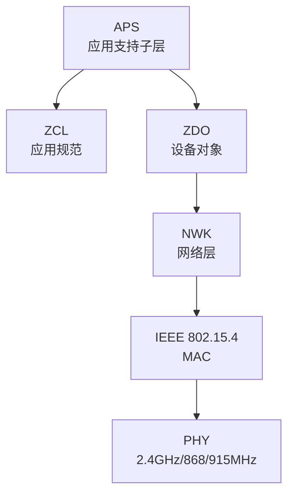

# IoT ZigBee/BLE 协议安全

> 智能家居的安全盲区——ZigBee 嗅探、BLE 中间人、MQTT 无认证。

---

## ZigBee 安全

### ZigBee 协议栈



### ZigBee 安全机制

```yaml
安全层:
  网络层安全（NWK）:
    - AES-128-CCM* 加密 + 完整性
    - 网络密钥（64bit）
    - 所有帧加密（除信标）

  应用层安全（APS）:
    - APS 层链路密钥
    - 端到端加密
    - 信任中心（Trust Center）

已知漏洞:
  - 网络密钥硬编码 → Sniffer 可抓包解密
  - 密钥传输明文 → 可被注入
  - Replay 攻击（旧版未实现 Frame Counter）
  - 未授权设备加入（Touchlink 攻击）
```

### ZigBee 嗅探与攻击

```bash
# 硬件: CC2531 USB 适配器 + 天线
# 软件: Wireshark + ZigBee 解析器

# 1. 扫描信道
# Ubiqua Protocol Analyzer
# Killerbee (Python 工具集)

# 2. 捕获 ZigBee 帧
# Windows: SmartRF Packet Sniffer
# Linux: rx_tx -d /dev/ttyACM0 -A 0x11 -c 22

# 3. 获取网络密钥（已知漏洞）
# Touchlink 攻击
# 攻击者伪装为新设备 → 信任中心下发密钥
# 使用 Killerbee:
zbid.py -x scan    # 扫描 ZigBee 网络
zbwireshark -w zigbee.pcap  # 抓包

# 4. 解密 ZigBee 流量
# Wireshark: Edit → Preferences → Protocols → ZigBee
# 填写 NWK Key: 破解读取密钥后填入
```

## BLE 安全

### BLE 攻击面

```yaml
BLE 安全问题:

Just Works 配对:
  - 无用户交互验证
  - 明文链路（除非开启 LE Secure）
  - 易被 MITM 攻击

LE Legacy 配对:
  - TK (临时密钥) 只有 16 位 → 可爆破
  - 不提供 MITM 防护

被动嗅探:
  - BLE 广播包明文 → 可追踪设备
  - 静态 MAC 地址 → 长期追踪
  - 广告数据泄露设备类型/状态

GATT Profile 攻击:
  - 服务/特征值未加密
  - 无需认证即可读写特征值
  - 发现隐藏特征值
```

### BLE 攻击工具

```bash
# BetterCAP BLE 模块
sudo bettercap -eval "ble.recon on"
# 扫描 BLE 设备
# 连接到目标
ble.enum 1  # 枚举服务和特征值

# GATT 攻击
gatttool -b AA:BB:CC:DD:EE:FF --primary
gatttool -b AA:BB:CC:DD:EE:FF --characteristics
gatttool -b AA:BB:CC:DD:EE:FF --char-read -a 0x0025

# BlueZ 工具
hcitool lescan  # BLE 扫描
hcitool leinfo AA:BB:CC:DD:EE:FF  # 设备信息
btlejack -f  # BLE 帧嗅探和破解

# BLE 中间人攻击
# Gattacker (Node.js)
sudo node gattacker.js

# Btlejack —— 破解 BLE 连接
btlejack -s -f  # 嗅探连接
btlejack -c -a AA:BB:CC:DD:EE:FF -t  # MITM 攻击
```

## MQTT 安全

```yaml
MQTT IoT 协议安全风险:

默认问题:
  - 无认证（允许匿名连接）
  - 无加密（明文 TCP 1883 端口）
  - 无访问控制（全量订阅发布）
  - 通配符订阅（# → 所有主题）

攻击场景:
  1. 匿名发布控制指令
     mosquitto_pub -h broker -t "devices/light/livingroom" -m "OFF"
   
  2. 通配符嗅探所有数据
     mosquitto_sub -h broker -t "#" -v

  3. 重放攻击（无序列号校验）
  
  4. 订阅阈值耗尽（大量订阅→异常）
```

## MQTT 安全配置

```yaml
mosquitto.conf 安全配置:

# 认证
allow_anonymous false
password_file /etc/mosquitto/passwd
# 创建用户: mosquitto_passwd -c /etc/mosquitto/passwd sensor1

# TLS 加密
listener 8883
cafile /etc/mosquitto/certs/ca.crt
certfile /etc/mosquitto/certs/server.crt
keyfile /etc/mosquitto/certs/server.key
require_certificate true  # 客户端证书验证
use_identity_as_username true

# ACL 访问控制
acl_file /etc/mosquitto/acl.conf
# acl.conf:
# user sensor1
# topic write devices/sensor1/#
# user admin
# topic read #
# topic write devices/admin/#

# 安全参数
max_connections 1000
max_client_id_length 64
allow_zero_length_clientid false
set_tcp_nodelay true
```

## IoT 安全加固清单

```
设备层:
[ ] 禁用 Telnet/HTTP（仅 SSH/HTTPS）
[ ] 默认密码强制修改
[ ] OTA 更新签名验证
[ ] 固件加密

传输层:
[ ] TLS 1.2+（非自签名证书）
[ ] mTLS 双向认证
[ ] MQTT 认证加密
[ ] CoAP 使用 DTLS

应用层:
[ ] 输入验证（防止注入）
[ ] API 认证和授权
[ ] 速率限制
[ ] 最小权限 API 接口

平台层:
[ ] 设备唯一身份
[ ] 设备黑/白名单
[ ] 异常行为检测
[ ] 安全日志审计
```

*上一篇：[IoT 固件分析与漏洞挖掘](02-iot-firmware.md)*

*下一篇：[IoT 云端安全](04-iot-cloud-security.md)*
