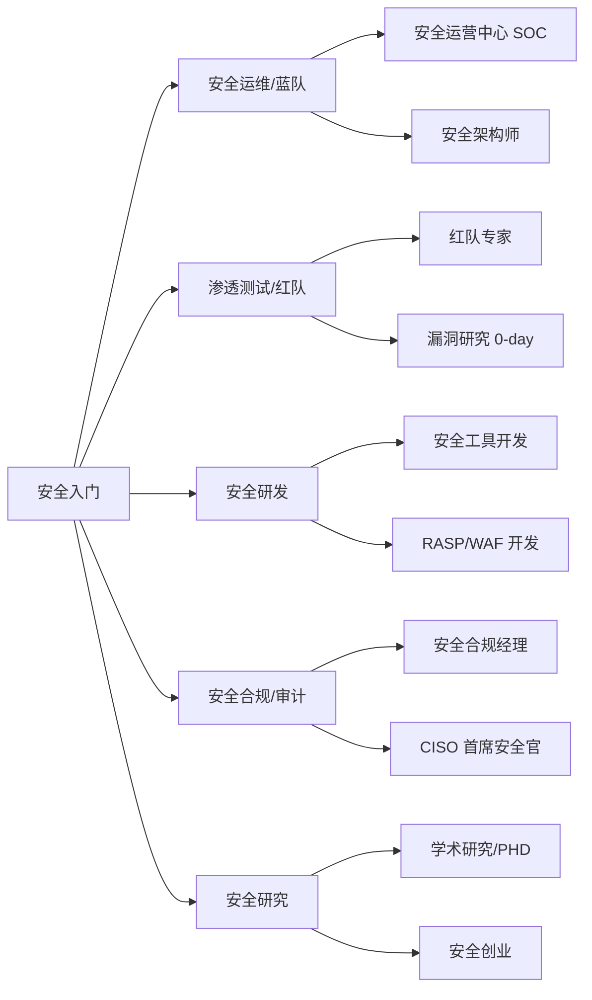

# 安全职业发展

> **安全不只是技术，更是思维** — 从入门到成长为安全专家的路径选择

---

## 安全行业岗位

### 典型岗位全景



### 岗位详解

| 岗位 | 薪资范围（一线城市） | 核心技能 |
|------|---------------------|----------|
| 安全运维工程师 | 15K-30K | 安全设备运维、日志分析、应急响应 |
| 渗透测试工程师 | 20K-40K | Web/App/内网渗透、代码审计、报告撰写 |
| 安全研发工程师 | 25K-50K | 安全产品开发、Go/Python/Rust |
| 安全架构师 | 40K-80K | 安全体系设计、零信任、SDL |
| 安全研究员 | 30K-60K+ | 漏洞挖掘、逆向工程、POC 开发 |
| CSO/CISO | 80K-150K+ | 安全管理、合规、团队建设 |

## 薪资与经验关系

```
0-1 年：8K-15K（实习生/初级安全工程师）
1-3 年：15K-25K（安全工程师）
3-5 年：25K-40K（高级安全工程师）
5-8 年：40K-70K（安全专家/技术负责人）
8-10年：70K-100K+（安全架构师/安全总监）
```

> 注：以上为一线城市（北京/上海/深圳/杭州）参考范围，具体因公司规模和行业有差异。金融和互联网行业通常更高。

## 发展路径建议

### 路径 A：技术深耕

```
初级渗透 → 高级渗透 → 红队专家 → 0-day 研究员
```

**适合**：热爱技术、享受突破的快感
**关键**：持续学习、参加 Pwn2Own/GeekPwn 等比赛

### 路径 B：管理与架构

```
安全工程师 → 安全负责人 → 安全架构师 → CISO
```

**适合**：沟通能力强、喜欢从整体看问题
**关键**：安全+业务结合、合规知识、跨部门协作

### 路径 C：安全研发

```
后端开发 → 安全工具开发 → 安全产品经理
```

**适合**：有开发背景、想结合安全和研发
**关键**：代码能力 + 安全知识缺一不可

### 路径 D：自由职业/独立顾问

```
企业安全 → 独立渗透测试 → 漏洞赏金 → 安全顾问
```

**适合**：喜欢自由时间、自我驱动力强
**关键**：建立个人品牌、积累客户资源

## 持续学习策略

### 日常学习节奏

- **每天**：30 分钟阅读安全新闻（安全客/FreeBuf/Twitter）
- **每周**：完成 1-2 个靶场挑战或 CTF 题目
- **每月**：读 1 篇安全论文或深度分析文章
- **每季**：参加 1 次安全会议或线下交流
- **每年**：考 1 个认证或系统学习 1 个新领域

### 保持竞争力的关键

1. **建立知识体系**：不要碎片化学习，用思维导图/Notion 建立个人知识库
2. **输出倒逼输入**：写博客、录视频、做分享是最好的学习方式
3. **开源贡献**：参与安全工具的 GitHub 项目，写文档、修 Bug
4. **社交网络**：参加安全会议（KCon、ISC、Black Hat）、认识同行
5. **模拟真实的**：在授权的环境中做接近真实的攻防演练

### 跟踪前沿

- 关注 CVE 公告（https://cve.mitre.org/）
- 订阅 NVD 推送
- 关注 Google Project Zero 博客
- 关注各大安全厂商（奇安信、360、深信服）的研究报告

## 常见误区

### ❌ 误区 1：会使用工具就算安全专家

**事实**：工具只是手段。理解原理、能根据场景定制工具才是真正的能力。

### ❌ 误区 2：只学攻击不学防御

**事实**：不懂防御的攻击是盲目的。理解防御才能找到绕过方式。

### ❌ 误区 3：安全不需要编程

**事实**：编写 POC、自动化脚本、开发工具都需要编程能力。

### ❌ 误区 4：证书越多越好

**事实**：1-2 个高质量的认证 + 实战经验 > 10 个低质量证书。

---

## 总结

安全行业最大的魅力在于**需要持续学习**——这对一些人来说是压力，对另一些人是乐趣。如果你享受解谜的快感和攻防博弈的过程，这个行业会让你乐在其中。

*上一篇：[推荐学习平台](02-platforms.md)*

*下一篇：[安全认证完全指南](04-certifications.md)*
