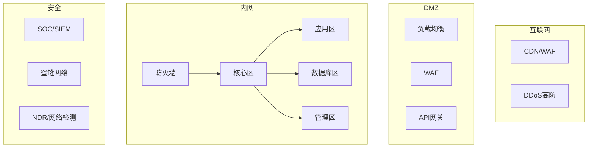

# 网络架构安全

> 防火墙只是起点——现代网络架构安全在于可观测性、微分段和防御纵深。

---

## 企业网络安全架构



## 防火墙策略设计

### 最小权限防火墙规则

```yaml
# 拒绝所有 + 显式允许
default: deny all

# 出站策略（出口防火墙）
outbound_rules:
  - source: "10.0.0.0/8"
    dest: "0.0.0.0/0"
    port: 443
    protocol: tcp
    action: allow
    description: "HTTPS 出站"
  - source: "10.0.0.0/8"  
    dest: "cloud-monitor.com"
    port: 443
    protocol: tcp
    action: allow
    description: "监控 Agent 上报"
  - source: "10.0.0.0/8"
    dest: "dns-servers"
    port: 53
    protocol: udp
    action: allow
    description: "DNS 解析"
  - source: "10.0.0.0/8"
    dest: "ntp.company.com"
    port: 123
    protocol: udp
    action: allow
    description: "NTP 时间同步"

# 入站策略（边界防火墙）
inbound_rules:
  - source: "cloudflare-cdn"
    dest: "web-servers"
    port: 443
    protocol: tcp
    action: allow
    description: "CDN → Web 服务器"
  - source: "vpn-pool"
    dest: "internal-apps"
    port: 443
    protocol: tcp
    action: allow
    description: "VPN 用户访问内部应用"
```

### VPC 架构设计（AWS 示例）

```yaml
# 多层 VPC 设计
VPC:
  CIDR: 10.0.0.0/16
  subnets:
    public:
      - 10.0.1.0/24  # ALB / NAT Gateway
    application:
      - 10.0.10.0/24  # 应用服务器（private）
    database:
      - 10.0.20.0/24  # RDS（private, no internet）
    management:
      - 10.0.30.0/24  # Bastion / Jumpbox
  
  network_acl:
    public_subnet_ingress:
      - rule: 100
        proto: tcp
        port: 443
        source: 0.0.0.0/0
        action: allow
      - rule: 200  
        proto: tcp
        port: 80
        source: 0.0.0.0/0
        action: allow
      - rule: 65535
        proto: all
        source: 0.0.0.0/0
        action: deny  # 默认拒绝
    
    app_subnet_ingress:
      - rule: 100
        proto: tcp
        port: 8080
        source: 10.0.1.0/24
        action: allow  # 仅允许来自 ALB
    
    db_subnet_ingress:
      - rule: 100
        proto: tcp
        port: 5432
        source: 10.0.10.0/24
        action: allow  # 仅允许来自应用层
```

## CDN 安全

```yaml
CDN 安全配置要点（以 Cloudflare / 腾讯云 CDN 为例）:

源站保护:
  - 源站 IP 隐藏（仅 CDN 回源）
  - 源站配置 IP 白名单（只允许 CDN IP）
  - 回源鉴权 Header

WAF 规则:
  - SQL 注入 / XSS 拦截
  - 恶意 Bot 拦截
  - CC 攻击防御
  - HTTP 协议异常检测
  - GeoIP 访问限制

速率限制:
  - 单 IP 每分钟 100 请求
  - 单 IP 每 10 秒 20 请求
  - 登录接口 5 次/分钟
  - API 接口按用户限流

HTTPS 配置:
  - 强制 HTTPS 重定向
  - HSTS: max-age=31536000
  - TLS 1.2+ 协议
  - 自定义安全 Header
```

## DDoS 防御体系

```yaml
多层防御:

L3/L4 (网络层):
  - 高防 IP（单线/ BGP）
  - 流量清洗（DDoS 高防机房）
  - 黑洞路由（极端情况自动触发）

L7 (应用层):
  - WAF CC 防护
  - CDN 边缘缓存（防源站过载）
  - 人机验证（CAPTCHA）
  - 请求频率控制

防御容量规划:
  - 正常流量: 500 Mbps
  - 高防容量: 1 Tbps（可选升级）
  - 清洗能力: 5 Tbps
  - 黑洞阈值: 5 Gbps（触发自动黑洞）
```

## 零信任网络（ZTNA）

```yaml
ZTNA 网络层落地:

身份感知网络:
  - 所有流量经过身份验证（非 IP 白名单）
  - 动态权限调整（基于信任评分）

网络微隔离（Micro-segmentation）:
  - 应用间：mTLS（Istio/Linkerd）
  - 主机间：NetworkPolicy（K8s）
  - 租户间：VPC peering + NACL

网络隐身:
  - 不暴露 IP/端口（使用连接器出站）
  - 端口敲门（Port Knocking）
  - 单包授权（SPA, Single Packet Authorization）

## 网络监控与响应

# 流量基线
baseline = {
    "normal_outbound_traffic": "~50 Mbps",
    "normal_connection_count": "~2000 active",
    "normal_dns_queries": "~100/s",
    "allowed_countries": ["CN", "HK", "US", "SG"]
}

# 异常检测
anomaly_alerts:
  - "出站流量 > 3σ after baseline"  → "可能数据外泄"
  - "DNS 查询到未知域名 > 100/s"   → "DNS 隧道"
  - "ICMP 流量突然暴增"            → "DDoS 攻击"
  - "非工作时间 SSH 连接"          → "入侵信号"
  - "单个 IP 连接 > 1000"          → "扫描/攻击"
```

*下一篇：[网络安全架构与零信任网络设计](02-zero-trust-network.md)*
