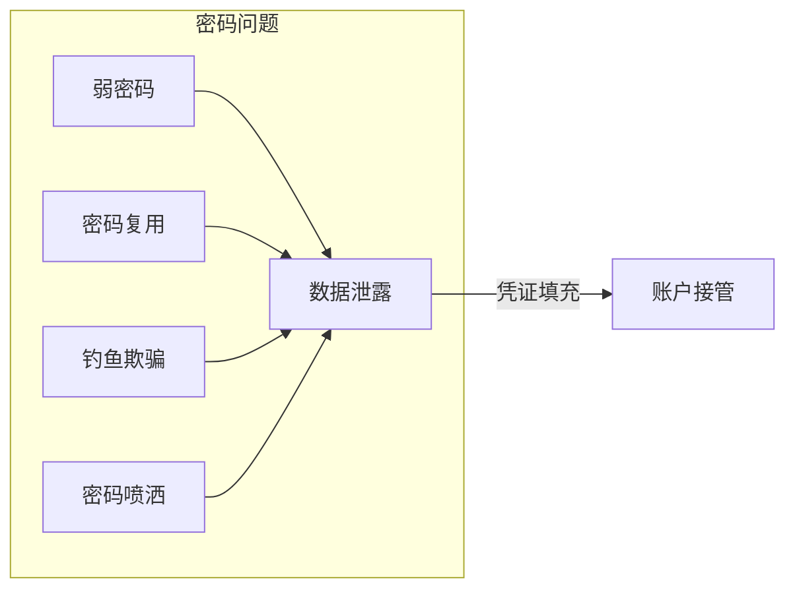
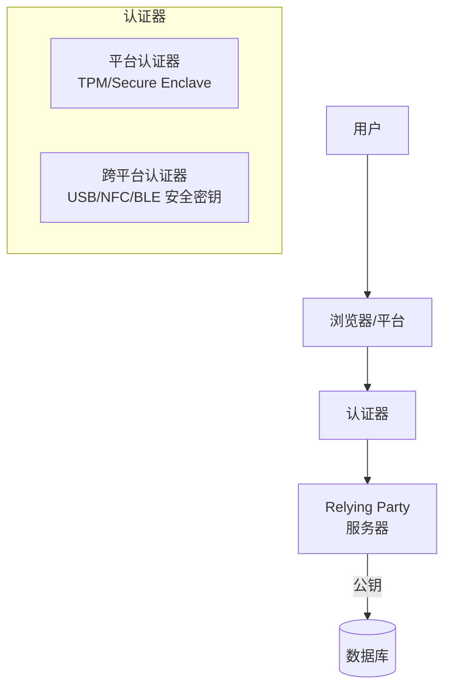

# 密码安全与无密码认证

> 密码是最大的攻击面——FIDO2/WebAuthn 正在终结密码时代。

---

## 密码安全现状



## FIDO2 / WebAuthn 架构



### WebAuthn 注册流程

```javascript
// 1. 生成注册选项
const credential = await navigator.credentials.create({
    publicKey: {
        challenge: new Uint8Array(serverChallenge),
        rp: { name: "Company", id: "company.com" },
        user: {
            id: new TextEncoder().encode(userId),
            name: "user@company.com",
            displayName: "User Name"
        },
        pubKeyCredParams: [
            { type: "public-key", alg: -7 },    // ES256
            { type: "public-key", alg: -257 }   // RS256
        ],
        authenticatorSelection: {
            authenticatorAttachment: "platform",
            residentKey: "required",
            userVerification: "preferred"
        },
        attestation: "direct",
        timeout: 60000
    }
});

// 2. 发送给服务器验证
// credential.id — 凭据 ID
// credential.rawId — 原始凭据 ID
// credential.response — 包含公钥 + 签名
```

### WebAuthn 认证流程

```javascript
// 1. 服务器返回挑战
const assertion = await navigator.credentials.get({
    publicKey: {
        challenge: new Uint8Array(serverChallenge),
        timeout: 60000,
        userVerification: "required",
        allowCredentials: [{
            id: new Uint8Array(credentialId),
            type: "public-key",
            transports: ["internal", "usb", "nfc"]
        }]
    }
});

// 2. 验证签名
// assertion.response.signature — 使用私钥签名
// assertion.response.authenticatorData — 认证器数据
// 服务器用公钥验证签名 → 认证通过
```

## Passkeys（通行密钥）

```
Passkey = 跨设备同步的 FIDO2 凭据

功能:
  - 生物特征（Face ID / Touch ID / Windows Hello）
  - iCloud/Google 密码管理器同步
  - 端到端加密同步
  - 无密码登录（替代密码 + MFA）

安全优势:
  - 私钥永不离设备
  - 防钓鱼（绑定到域名）
  - 抗凭证填充
  - 抗中间人攻击
```

## 密码管理器安全

| 方案 | 存储方式 | 加密 | 同步 | 安全风险 |
|------|---------|------|------|---------|
| **浏览器内置** | 本地加密+云同步 | AES-256 | 厂商 | 主密码泄露即全暴露 |
| **1Password** | 本地+云 | Secret Key + Master Password | 自有 | Secret Key 不在云端 |
| **Bitwarden** | 本地加密+可选自托管 | AES-256 + PBKDF2 | 可选 | 开源可审计 |
| **KeePass** | 本地文件 | AES-256 / ChaCha20 | 手动 | 文件同步风险 |

### 自建密码管理器原则

```python
# 密码管理器核心安全设计
import hashlib
import secrets
from cryptography.fernet import Fernet
from cryptography.hazmat.primitives.kdf.pbkdf2 import PBKDF2HMAC
from cryptography.hazmat.primitives import hashes

class PasswordVault:
    def __init__(self):
        self.encryption_key = None
    
    def derive_key(self, master_password: str, salt: bytes) -> bytes:
        """PBKDF2 派生加密密钥"""
        kdf = PBKDF2HMAC(
            algorithm=hashes.SHA256(),
            length=32,
            salt=salt,
            iterations=600000,  # OWASP 推荐 ≥ 600K
        )
        return base64.urlsafe_b64encode(kdf.derive(master_password.encode()))
    
    def encrypt_vault(self, data: dict, master_password: str) -> bytes:
        """加密整个 vault"""
        salt = secrets.token_bytes(32)
        key = self.derive_key(master_password, salt)
        fernet = Fernet(key)
        encrypted = fernet.encrypt(json.dumps(data).encode())
        return salt + encrypted  # salt 前缀存储
    
    def decrypt_vault(self, encrypted_data: bytes, master_password: str) -> dict:
        """解密 vault"""
        salt = encrypted_data[:32]
        key = self.derive_key(master_password, salt)
        fernet = Fernet(key)
        decrypted = fernet.decrypt(encrypted_data[32:])
        return json.loads(decrypted)
```

## 无密码认证对比

| 方案 | 防钓鱼 | 防重放 | 设备绑定 | 用户友好度 | 部署难度 |
|------|--------|--------|---------|-----------|---------|
| **密码** | ❌ | ❌ | ❌ | ❌ | ✅ |
| **密码+MFA** | ⚠️ | ✅ | ✅ | ⚠️ | ✅ |
| **SMS OTP** | ❌ | ✅ | ❌ | ⚠️ | ✅ |
| **TOTP** | ⚠️ | ✅ | ⚠️ | ⚠️ | ✅ |
| **Push MFA** | ✅ | ✅ | ✅ | ✅ | ⚠️ |
| **FIDO2/Passkey** | ✅ | ✅ | ✅ | ✅ | ⚠️ |
| **FIDO2 (硬件密钥)** | ✅ | ✅ | ✅ | ⚠️ | ❌ |

## 密码策略现代化

```
传统密码策略（不推荐）:
  密码每 90 天强制更换
  最少 8 位 + 大小写字母 + 数字 + 特殊字符
  禁止使用之前 24 个密码

现代密码策略（NIST SP 800-63B）:
  最少 8 位（建议 12+ 位）
  不强制特殊字符（越长越好）
  不强制定期更换（除非泄露）
  检查是否在已知泄露密码中
  支持 MFA
  失败锁定 5 次

推荐实施:
  - 逐步迁移到 Passkeys/FIDO2
  - 过渡期: 密码 + TOTP MFA
  - 使用 Have I Been Pwned API 检查密码泄露
  - 阻止常见密码（rockyou top 10000）
  - 禁用密码复制粘贴限制（诱导用户设简单密码）
```

*下一篇：[WebAuthn 实战实现](02-webauthn-implementation.md)*
