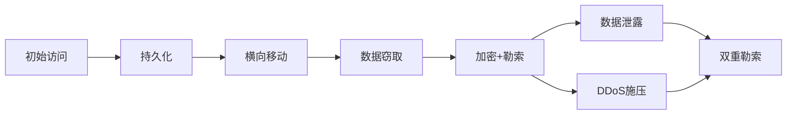

# 勒索软件攻防与 APT 案例分析

> 2024 年全球勒索软件赎金支付超 12 亿美元——没有企业能免疫。

---

## 勒索软件攻击链



### LockBit 3.0 攻击流程

```
1. 初始访问
   ├─ 钓鱼邮件（QakBot/IcedID）
   ├─ RDP 暴力破解
   └─ 漏洞利用（Log4j/Exchange）

2. 建立据点
   ├─ Cobalt Strike Beacon
   ├─ C2 通信
   └─ 凭证窃取（Mimikatz）

3. 横向移动
   ├─ PsExec/WMI 远程执行
   ├─ SMB 传播
   └─ 通过组策略推送

4. 数据窃取
   ├─ 上传到 MEGA/Filezilla
   ├─ 提取重要文档和数据库
   └─ 筛选有价值数据

5. 加密
   ├─ 禁用 VSS（卷影副本）
   ├─ 加密本地 + 网络共享
   └─ 删除事件日志
```

## 常见勒索软件家族

| 家族 | 活动年份 | 攻击方式 | 赎金(平均) | 备注 |
|------|---------|---------|-----------|------|
| LockBit | 2019-今 | RDP+漏洞 | $500K-5M | 最活跃 |
| Clop | 2019-今 | 漏洞利用 | $1M-10M | Accellion/GoAnywhere |
| BlackCat/ALPHV | 2021-今 | Rust编写 | $500K-15M | Change Healthcare $22M |
| Black Basta | 2022-今 | QakBot | $200K-1M | 快速加密 |
| RansomHouse | 2022-今 | 仅窃取不加密 | $100K-1M | 新型模式 |
| Play | 2022-今 | 双重勒索 | $200K-5M | 快速扩展 |
| 8Base | 2023-今 | 钓鱼 | $50K-500K | 新玩家 |

## 企业防御矩阵

### 预防层

```yaml
邮件安全:
  - DMARC p=reject
  - 附件沙箱扫描
  - URL 点击前分析

终端防护:
  - EDR 全覆盖
  - ASR 规则启用
  - Controlled Folder Access
  - AppLocker/Windows Defender Application Control

网络防护:
  - RDP 关闭 / VPN + MFA
  - SMB v1 禁用
  - 网络微分段
  - 443/80 出站限制
```

### 检测层

```kql
// 检测大规模文件加密
DeviceFileEvents
| where Timestamp > ago(1h)
| where FileName endswith ".lockbit" or FileName endswith ".encrypted"
| summarize count() by DeviceName
| where count_ > 50  // 1小时内加密 > 50 文件

// 检测 VSS 删除
DeviceProcessEvents
| where ProcessCommandLine contains "vssadmin" 
    and ProcessCommandLine contains "delete" 
    and ProcessCommandLine contains "shadows"
| project Timestamp, DeviceName, ProcessCommandLine

// 检测常见勒索软件工具
DeviceProcessEvents
| where FileName in~ ("vssadmin.exe", "wmic.exe", "bcdedit.exe")
| where ProcessCommandLine matches regex 
    "delete shadows|shadowcopy|resize|wmic.exe shadowcopy delete"
```

### 响应层

```
立即响应 (0-2h):
  1. 隔离感染主机（断网）
  2. 关停 RDP/VPN 入口
  3. 禁用域管理员账户
  4. 保留取证数据包（不要关机）

遏制 (2-24h):
  5. 确认攻击面（未感染主机断外网）
  6. 重置所有服务账户密码
  7. 分析日志确定入口点
  8. 联系执法 + 保险

恢复 (24-72h):
  9. 从离线备份恢复（确认无加密）
  10. 重建受感染系统
  11. 修复入口点漏洞
  12. 分阶段恢复服务
```

## APT 案例分析

### SolarWinds 供应链攻击

```
背景: 2020年, 俄罗斯 APT (UNC2452 / Nobelium)
攻击链:
  1. 入侵 SolarWinds 构建环境
  2. 在 Orion 产品中植入 SUNBURST 后门
  3. 信任的签名更新 → 18,000 客户安装
  4. 仅高价值目标激活后门（美国政府/科技公司）
  5. 后门休眠2周 → 建立C2 → 横向移动 → 窃取数据
  
影响: 
  - 美国财政部/商务部/能源部/国土安全部受入侵
  - 微软/CrowdStrike/FireEye 内部系统被访问
  - 持续 9+ 个月未被发现

教训:
  - Code Signing ≠ 安全
  - 需要 SLSA 级别 3+ 构建完整性
  - 出站流量基线 + 异常 DNS 监控
```

### 近期 APT 战术速查

```
APT29 (Cozy Bear):
  - 俄罗斯, 针对政府/智库
  - TTP: 鱼叉钓鱼 + 合法云服务 C2（Microsoft 365）
  - 特征: 慢速潜伏、DLL 侧加载

APT41 (Winnti):
  - 中国, 针对游戏/科技/制药
  - TTP: 供应链攻击 + MBR Rootkit
  - 特征: 双重目的（情报+经济）

Lazarus (APT38):
  - 朝鲜, 针对金融机构/加密货币
  - TTP: 社交工程 + macOS/Windows 恶意软件
  - 特征: 加密货币盗窃、SWIFT 攻击

Scarlet Mimic:
  - 伊朗, 针对政府/基础设施
  - TTP: VPN 漏洞 + 凭证窃取
  - 特征: DDoS + 数据擦除
```

*下一篇：[APT 组织深度分析](02-apt-groups.md)*
