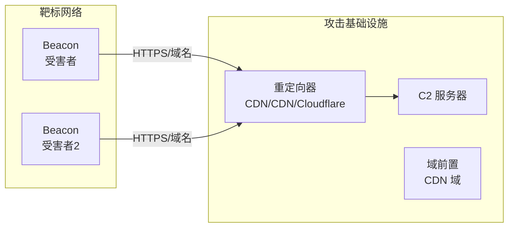

# C2 框架与基础设施

> C2（命令与控制）是红队/APT 的核心——控制通道被掐断，所有植入就作废了。

---

## C2 架构模型



## 常见 C2 框架

| 框架 | 语言 | 协议 | 特点 |
|------|------|------|------|
| Cobalt Strike | Java | HTTPS/DNS/SMB | 业界标准，全功能，昂贵 |
| Sliver | Go | HTTP/mTLS/DNS/ WireGuard | 开源，活跃维护 |
| Mythic | Python/C# | HTTP/Websocket/DNS | 多代理架构，容错 |
| Havoc | C++ | HTTP/SMB | 现代化UI，开源 |
| Brute Ratel | C/C++ | HTTPS/DNS | 专注反检测 |
| Empire | PowerShell | HTTP/HTTPS | 纯 PowerShell 后门 |
| Covenant | C# | HTTP/HTTPS/GRPC | .NET 架构 |

## 域前置（Domain Fronting）

```yaml
原理:
  用户请求: https://cdn-provider.com/redirect/payload
  CDN 解析到: c2-backend.attacker.com
  HTTPS TLS SNI: cdn-provider.com (CDN的合法域名)
  HTTP Host: c2-backend.attacker.com (真正的C2)

防御检测:
  - 检查 TLS SNI 与 HTTP Host 是否一致
  - 云提供商已逐步封禁（AWS/GCP/Cloudflare）

替代方案:
  - CDN 回退（CDN 重定向）
  - 可信第三方服务(SaaS C2)
  - 云函数代理
```

## 基础设施安全

```yaml
C2 服务器部署:

前置 Nginx 反向代理:
  - 限制访问 IP（运营 IP 白名单）
  - HTTP Basic Auth（运营认证）
  - 暴露似正常页面（apache default page）

域名策略:
  - 模拟正常业务域名（api-checker.com）
  - 使用高信誉域名（过期域名/停车场）
  - 不使用新注册域名（触发威胁情报）

Let's Encrypt 证书:
  - 自动续签
  - 仿冒常见服务（CloudFront/Akamai）
  - 启用 OCSP Stapling

流量混淆:
  - 模拟正常 HTTPS 流量（JARM 指纹）
  - JA3 指纹修改（使用常见客户端指纹）
  - 不定时信标（jitter 30%+）
  - 响应 padding（填充到固定大小）
```

## 反溯源技术

```bash
# 1. 跳板机链
ssh -J jump1,jump2,c2-gate c2-server

# 2. 出口 IP 轮换
# 使用住宅代理（Residential Proxy）
# 使用 Tor 出口节点
# 使用 VPS 轮换

# 3. Nginx 反向代理（前置保护）
# nginx.conf
server {
    listen 443 ssl;
    server_name api-checker.com;
    
    location /check {
        # 前置验证
        if ($http_x_forwarded_for !~ ^(IP1|IP2)$) {
            return 404;
        }
        
        # 请求限制
        limit_req zone=onelit burst=2;
        
        # 代理到 C2
        proxy_pass https://c2-server:443;
    }
    
    # 暴露的正常页面
    location / {
        root /var/www/html;
        index index.html;
    }
}

# 4. 关键配置
# C2 配置 HTTPS 证书（自定义而非 Let's Encrypt）
# 启用双向认证（mTLS between beacon and C2）
# 通信加密+Payload 签名
```

## 红队基础设施架构

```yaml
分层架构:

L1 - 管理网络:
  C2 面板
  Phishing 服务器
  Payload 生成器
  仅通过 SSH tunnels 访问

L2 - 重定向器:
  Nginx reverse proxy × 3
  Cloudflare Workers
  域前置 CDN

L3 - Payload 传输:
  S3 bucket (私有)
  GitHub releases (匿名)
  云存储服务

L4 - 出站伪装:
  模拟 CDN IP (CloudFront)
  模拟正常 API 流量
  合法服务的 API 隧道
```

## 基础设施清理

```bash
# 运营后清理全链路

# 1. 销毁 VPS
doctl compute droplet delete c2-server --force

# 2. 删除 DNS 记录
# 删除域名 A/AAAA/CNAME
# 删除 PTR 记录

# 3. 撤销证书
certbot revoke --cert-path /etc/letsencrypt/live/domain

# 4. 清理日志
# VPS 日志: shred -n 3 /var/log/nginx/*
# 本地日志: 加密存储或安全删除

# 5. 检查残留
# VirusTotal 查询域名
# Shodan 搜索公开服务
# Censys 扫描留存迹
```
