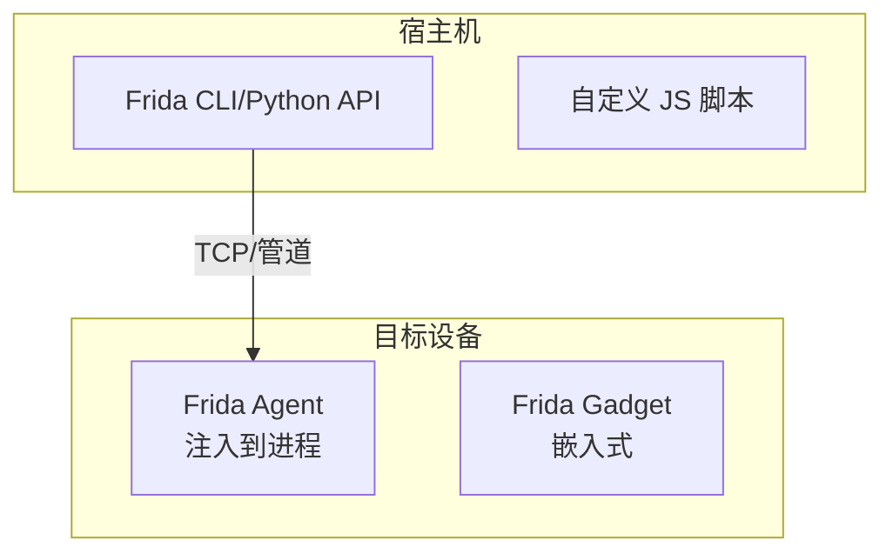

# Frida 高级使用与脱壳

> Frida 是动态逆向的瑞士军刀——Hook 任何函数，无需源码。

---

## Frida 架构



## 基本 Hook 模式

```javascript
// 1. 参数 Hook
Interceptor.attach(Module.findExportByName("libc.so", "strcmp"), {
    onEnter(args) {
        const s1 = Memory.readUtf8String(args[0]);
        const s2 = Memory.readUtf8String(args[1]);
        // 修改比较结果
        if (s2 === "secret_password") {
            args[1] = Memory.allocUtf8String(s1); // 使密码匹配
        }
    },
    onLeave(retval) {
        // 修改返回值
        retval.replace(0); // 返回"相等"
    }
});

// 2. 函数替换
const open = Module.findExportByName("libc.so", "open");
Interceptor.replace(open, new NativeCallback(function(path, flags) {
    send(`open called: ${path}`);
    // 替换文件路径
    if (path.readUtf8String() === "/etc/real_config") {
        path = Memory.allocUtf8String("/tmp/fake_config");
    }
    const fd = this.open(path, flags);
    return fd;
}, "int", ["pointer", "int"]));
```

## 脱壳（Dump DEX）

```javascript
// 从内存中 dump DEX（已解密）
function dump_dex() {
    // 方法1: 枚举加载的 DEX
    Java.perform(() => {
        const ClassLoader = Java.use("java.lang.ClassLoader");
        const DexFile = Java.use("dalvik.system.DexFile");
        
        Java.enumerateLoadedClasses({
            onMatch(name, handle) {
                // 获取类所在 DEX
                // 通过 ClassLoader 加载
            },
            onComplete() {}
        });
    });
    
    // 方法2: 从内存扫描 DEX Magic
    // DEX magic: "dex\n035\0"
    Process.enumerateRanges('r--', {
        onMatch(range) {
            try {
                const magic = Memory.readUtf8String(range.base, 8);
                if (magic.startsWith("dex\n")) {
                    // DEX 数据解密后了，dump
                    const size = Memory.readUInt(range.base.add(0x20));
                    const dexData = Memory.readByteArray(range.base, size);
                    send({type: "dex", data: dexData});
                    
                    // 写入文件
                    const f = new File(`/sdcard/dump_${range.base}.dex`, "wb");
                    f.write(dexData);
                    f.close();
                }
            } catch(e) {}
        },
        onComplete() {}
    });
}

// 运行: frida -U -l dump-dex.js com.target.app
```

## 绕过 SSL Pinning

```javascript
// 通用 SSL Pinning 绕过
Java.perform(() => {
    // 方法1: 获取 X509TrustManager 并替换
    const TrustManager = Java.registerClass({
        name: 'com.example.TrustManager',
        implements: [Java.use('javax.net.ssl.X509TrustManager')],
        methods: {
            checkClientTrusted: function(chain, authType) {},
            checkServerTrusted: function(chain, authType) {},
            getAcceptedIssuers: function() { return []; }
        }
    });
    
    // 方法2: OkHttp 全局拦截
    const OkHttpClient = Java.use("okhttp3.OkHttpClient");
    OkHttpClient.newCall.overload("okhttp3.Request").implementation = function(request) {
        // 修改请求
        const builder = request.newBuilder();
        builder.header("X-Bypass", "true");  // 添加自定义头
        return this.newCall(builder.build());
    };
    
    // 方法3: 绕过证书验证
    const SSLSocket = Java.use("javax.net.ssl.SSLSocketFactory");
    SSLSocket.createSocket.overload().implementation = function() {
        const socket = this.createSocket();
        // 自定义 TrustManager
        return socket;
    };
});
```

## 内存操作与反调试

```javascript
// 反反调试: 绕过进程检测
const Thread = Java.use("java.lang.Thread");
Thread.sleep.implementation = function(ms) {
    // 跳过长时间 sleep（反沙箱延迟）
    if (ms > 5000) {
        send(`Bypassing sleep: ${ms}ms`);
        return;
    }
    this.sleep(ms);
};

// 绕过 TracerPid 检测
function bypass_tracer_pid() {
    const fopen = Module.findExportByName("libc.so", "fopen");
    Interceptor.attach(fopen, {
        onEnter(args) {
            this.path = args[0].readCString();
        },
        onLeave(retval) {
            if (this.path && this.path.includes("status")) {
                // 替换 TracerPid 输出
                // ... 详见 TracerPid 绕过
            }
        }
    });
}

// 枚举模块 + 检测加固
function detect_packer() {
    Process.enumerateModules({
        onMatch(mod) {
            if (mod.name.toLowerCase().includes("jiagu") ||
                mod.name.toLowerCase().includes("360") ||
                mod.name.toLowerCase().includes("bangcle") ||
                mod.name.toLowerCase().includes("libsec")) {
                send(`Pack detected: ${mod.name} @ ${mod.base}`);
            }
        },
        onComplete() {}
    });
}
```

## Frida 高级技巧

```javascript
// 1. Stalker —— 代码跟踪
function trace_instructions(address) {
    Stalker.follow({
        events: {
            call: true,  // 跟踪函数调用
            ret: true,   // 跟踪返回
            exec: false  // 跟踪指令执行(慎用，会极慢)
        },
        onCallSummary(summary) {
            for (const [target, count] of summary) {
                send(`${target}: called ${count} times`);
            }
        }
    });
}

// 2. 动态代码 Patch
function patch_instruction(address, new_bytes) {
    Memory.patchCode(address, new_bytes.length, code => {
        const writer = new Arm64Writer(code, { pc: address });
        writer.putBytes(new_bytes);
        writer.flush();
    });
}

// 3. OBJC 方法 Hook（iOS）
if (ObjC.available) {
    var hook = ObjC.classes.NSURLSession['- dataTaskWithRequest:completionHandler:'];
    Interceptor.attach(hook.implementation, {
        onEnter(args) {
            const request = ObjC.Object(args[2]);
            send(`URL: ${request.URL().toString()}`);
        }
    });
}
```

## Frida 工具链

```bash
# 常用 Frida 命令

# 基本注入
frida -U com.target.app -l script.js
frida -n app_name -l script.js

# 进程列表
frida-ps -U

# Objection (基于 Frida 的工具)
objection -g com.target.app explore

# Frida CLI 模式
frida -U com.target.app
# > %eval Java.perform(() => send("Hello"))
# > %resume

# 绕过 Root 检测
frida -U -l bypass-root.js -f com.target.app --no-pause

# 跟踪特定类方法
frida-trace -U com.target.app -m "com.example.*"
```
