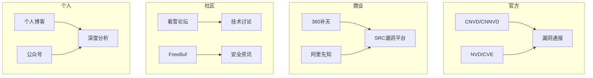

# 安全社区、公众号与深度资源

> 除了官方平台，还有更多宝藏——个人博客、公众号、技术社区和冷门平台

---

## 安全社区生态



---

## 安全 SRC（漏洞响应平台）

| 平台 | 网址 | 特点 |
|------|------|------|
| **360 补天** | https://butian.360.cn/ | 国内最大 SRC，白帽社区活跃 |
| **阿里云安全** | https://security.aliyun.com/ | 阿里系产品漏洞奖励 |
| **腾讯安全** | https://security.tencent.com/ | 腾讯 SRC |
| **京东安全** | https://security.jd.com/ | 京东 SRC |
| **百度安全** | https://sec.baidu.com/ | 百度 SRC |
| **字节跳动** | https://security.bytedance.com/ | 字节 SRC |
| **美团安全** | https://security.meituan.com/ | 美团 SRC |
| **华为安全** | https://security.huawei.com/ | 华为 SRC |
| **漏洞盒子** | https://www.vulnerabilitybox.com/ | 第三方漏洞平台 |
| **CNVD** | https://www.cnvd.org.cn/ | 国家原创漏洞证书 |

---

## 安全大会与会议

```yaml
国内:
  KCon（知道创宇）— 每年 8 月北京
  ISC（360 互联网安全大会）— 每年 9 月
  XCTF Final — CTF 总决赛
  CSS（腾讯安全）— 行业安全峰会
  PSRC 白帽大会 — 腾讯
  阿里安全峰会 — 云安全

国际:
  DEF CON — 全球最著名的黑客大会（拉斯维加斯）
  Black Hat — 企业级安全会议
  RSA Conference — 安全行业最大博览会
  POC — 韩国安全大会
  HITB — 亚太地区安全会议
  OffensiveCon — 攻击安全会议
```

---

## WeChat 公众号精选

```yaml
漏洞情报类（关注及时获取高危预警）:
  阿里云安全        → 最新漏洞+修复方案
  腾讯安全          → 漏洞通报+安全策略
  奇安信 CERT       → 国家级漏洞预警
  知道创宇          → Seebug 漏洞情报
  绿盟科技          → 安全研究+漏洞分析
  360安全            → 安全资讯+漏洞响应

技术教学类（适合系统学习）:
  橘猫学安全        → Web 渗透教程+CTF 题解
  HACK学习呀       → 从入门到实战的系统教程
  听风安全          → 漏洞分析+红队技巧
  暴暴的皮卡丘      → 安全工具+渗透测试
  暗影安全          → 实操技巧+经验分享
  信安之路          → 信息安全从业者成长指南
  网络安全自修室    → 基础到进阶的全覆盖

工具与资源类:
  白帽汇            → 安全工具推荐
  安全引擎          → 技术原理分析
  Kali 中文 社区     → Kali Linux 教程
  内网渗透            → 内网安全专题
  渗透测试实战       → 实战案例分享

注意: 公众号是重要的学习渠道，但注意辨别信息质量
      建议关注官方/知名安全公司公众号获取一手情报
```

---

## 个人博客推荐

```yaml
国内安全博客:
  🏆 先知社区（阿里安全）— https://xz.aliyun.com/
  月光博客 — https://www.williamlong.info/
  左耳朵耗子（陈皓）— https://coolshell.cn/
  Ruotian's blog — 红队技巧
  火线安全 — https://zone.huoxian.cn/

国际安全博客:
  PortSwigger Research — https://portswigger.net/research
  Google Project Zero — https://googleprojectzero.blogspot.com/
  Trail of Bits — https://blog.trailofbits.com/
  SANS ISC — https://isc.sans.edu/
  MDSec — https://www.mdsec.co.uk/
```

---

## 知识库与 Wiki

| 名称 | 网址 | 内容 |
|------|------|------|
| **CTF Wiki** | https://ctf-wiki.org/ | CTF 各方向基础 |
| **HackTricks** | https://book.hacktricks.xyz/ | 渗透测试百科全书 |
| **PayloadsAllTheThings** | https://github.com/swisskyrepo/PayloadsAllTheThings | POC 载荷大全 |
| **GTFOBins** | https://gtfobins.github.io/ | Linux 提权技术 |
| **LOLBAS** | https://lolbas-project.github.io/ | Windows 白利用 |
| **HackTricks Cloud** | https://cloud.hacktricks.xyz/ | 云安全技术 |
| **Seebug Paper** | https://www.seebug.org/paper/ | 中文安全分析 |
| **Exploit Notes** | https://exploit-notes.hdks.org/ | 渗透笔记 |
| **Pentest Wiki** | https://pentestwiki.org/ | 渗透测试维基 |

---

## YouTube/B站 UP 主

```yaml
B站 UP 主:
  @极客湾   — 硬件安全+逆向分析
  @CodeSheep — 程序员+安全科普
  @泷羽Sec  — Web 安全教程
  @暗月渗透 — 渗透测试实战
  @安全客   — 安全新闻快报
  @看雪学院 — 逆向工程系列

YouTube 频道:
  IppSec — HTB 靶机 writeup（强烈推荐）
  John Hammond — CTF writeup
  LiveOverflow — 二进制安全
  STÖK — Web 安全
  NetworkChuck — 网络安全入门
  ＿HackerSploit — 渗透测试
  The Cyber Mentor — OSCP 备考
  PwnFunction — Web 安全简明教程
```

---

## 冷门但有价值的平台

| 平台 | 网址 | 特点 |
|------|------|------|
| **VulnMachines** | https://www.vulnmachines.com/ | 类似 HTB 的轻量靶场 |
| **PentesterLab** | https://pentesterlab.com/ | Web 安全专项（部分免费） |
| **Exploit Education** | https://exploit.education/ | 二进制漏洞实验 |
| **pwn.college** | https://pwn.college/ | ASU 在线 Pwn 课程 |
| **WebGoat** | https://github.com/WebGoat/WebGoat | OWASP 官方 Web 靶场 |
| **Hackademic** | https://www.hackademic.gr/ | 初中级安全挑战 |
| **HackInTheBox** | https://www.hackinthebox.org/ | 安全社区 |
| **NetSPI Blog** | https://www.netspi.com/blog/ | 高水准技术文章 |
| **Corelan Team** | https://www.corelan.be/ | 经典漏洞利用教程 |
| **FuzzySecurity** | https://fuzzysecurity.com/ | Windows 利用教程 |
| **SamsClass** | https://samsclass.info/ | 大学网络安全课程资料 |

---

## 安全认证体系

```yaml
国际认证:
  OSCP — OffSec 渗透测试认证（最推荐入门）
  OSWP — OffSec 无线安全
  OSEP — OffSec 渗透测试进阶
  OSED — OffSec 漏洞利用开发
  OSWE — OffSec Web 安全专家
  GPEN — GIAC 渗透测试
  CISSP — (ISC)² 安全专家
  CEH — EC-Council 道德黑客

国内认证:
  CISP — 国家注册信息安全专业人员
  CISP-PTE — CISP 渗透测试工程师
  NISP — 国家信息安全水平考试
  等级保护测评师 — 等保相关

考证建议:
  学生: NISP → CISP（学历+1 即可）
  入门: OSCP 是最好的"实战"认证
  进阶: OSEP / CISSP
```

---

## 延伸阅读

- [先知社区 — 阿里安全](https://xz.aliyun.com/)
- [CTF Wiki 中文](https://ctf-wiki.org/)
- [HackTricks 渗透百科](https://book.hacktricks.xyz/)
- [PayloadsAllTheThings](https://github.com/swisskyrepo/PayloadsAllTheThings)
- [KCon 大会官网](https://kcon.knownsec.com/)
- [DEF CON 官方](https://defcon.org/)
- [FreeBuf 安全社区](https://www.freebuf.com/)
- [安全客 — 漏洞情报](https://www.anquanke.com/)
- [OSCP 认证详情](https://www.offsec.com/courses/pen-200/)
- [CISP 认证详情](https://www.cisp.org.cn/)

*上一篇：[CTF 赛事与练习策略](01-ctf-practice.md)*

*下一篇：[CTF Web 题型与解题思路](03-ctf-web.md)*
