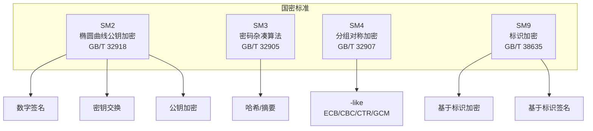

# 国密算法（SM2/SM3/SM4）

> 国密算法是中国密码标准，等保 2.0 和密评强制要求。

---

## 国密算法体系



## SM2 算法

```python
# 使用 gmssl 库
from gmssl import sm2, func

# SM2 密钥对生成
private_key = '00B9AB0B828FF68872F21A837FC303668428DEA11DCD1B24429D0C99E24EED83D5'
public_key = 'B9C9A6E04E9C91F7BA880429473747D7F12897480FE2E0B725B94456F27DC3B92' \
            'E46385F9B839D4A8C5D4B5E5B4E1B1D4E9C9A1B2C3D4E5F6A7B8C9D0E1F2'

# SM2 加密
plaintext = b"Sensitive Data"
sm2_crypt = sm2.CryptSM2(private_key, public_key)
enc_data = sm2_crypt.encrypt(plaintext)

# SM2 解密
dec_data = sm2_crypt.decrypt(enc_data)
print(dec_data)  # b'Sensitive Data'

# SM2 签名
sign = sm2_crypt.sign(plaintext, private_key)
# SM2 验签
assert sm2_crypt.verify(sign, plaintext)
```

## SM3 哈希算法

```python
from gmssl import sm3

# SM3 哈希
data = b"Hello, 国密世界!"
hash_value = sm3.sm3_hash(func.bytes_to_list(data))
print(hash_value)  # 64位十六进制哈希值

# SM3 的特性
# - 输出长度: 256 bit (32 bytes)
# - 分组大小: 512 bit
# - 安全强度: 等同 SHA-256
# - 国密标配，密评必查

# SM3 HMAC
from gmssl import sm3, func

def sm3_hmac(key: bytes, message: bytes) -> str:
    """SM3 的 HMAC 实现"""
    block_size = 64
    if len(key) > block_size:
        key = bytes.fromhex(sm3.sm3_hash(func.bytes_to_list(key)))
    if len(key) < block_size:
        key = key + b'\x00' * (block_size - len(key))
    
    o_key_pad = bytes([k ^ 0x5c for k in key])
    i_key_pad = bytes([k ^ 0x36 for k in key])
    
    inner_hash = sm3.sm3_hash(func.bytes_to_list(i_key_pad + message))
    outer_hash = sm3.sm3_hash(func.bytes_to_list(o_key_pad + bytes.fromhex(inner_hash)))
    return outer_hash
```

## SM4 对称加密

```python
from gmssl import sm4

# SM4 ECB 模式
key = b'\x01\x23\x45\x67\x89\xAB\xCD\xEF\xFE\xDC\xBA\x98\x76\x54\x32\x10'
plaintext = b"This is sensitive data that needs encryption"

sm4_enc = sm4.CryptSM4(key, sm4.SM4_ENCRYPT, sm4.SM4_CBC)
enc_value = sm4_enc.crypt(plaintext)  # 加密

sm4_dec = sm4.CryptSM4(key, sm4.SM4_DECRYPT, sm4.SM4_CBC)
dec_value = sm4_dec.crypt(enc_value)  # 解密

# SM4 GCM 模式（认证加密，推荐）
# 需要支持 GCM 模式的第三方库
# features: 加密 + 完整性校验 + 防重放
```

## SM9 标识加密

```python
# SM9: 基于标识的密码体制
# - 不需要证书/公钥基础设施
# - 直接使用 Email/手机号/ID 作为公钥
# - KGC（密钥生成中心）负责生成私钥

# SM9 签名
# signer_id = "user@company.com"
# private_key = KGC_derive_key(signer_id)
# signature = sm9_sign(message, private_key)

# SM9 加密
# receiver = "receiver@company.com"
# enc = sm9_encrypt(message, receiver)
# 只有 receiver 用 KGC 下发的私钥才能解密

# 应用场景:
# - IoT 设备认证（设备标识为公钥）
# - 邮件加密（邮箱为公钥）
# - 物联网轻量级安全
```

## 国密合规场景

```yaml
密评（商用密码应用安全性评估）要求:

系统定级 → 密码应用方案 → 建设实施 → 密评

测评指标:
  1. 密码技术应用（10个方面）
     - 物理和环境安全
     - 网络和通信安全
     - 设备和计算安全
     - 应用和数据安全
  
  2. 密钥管理（全生命周期）
     - 生成/分发/存储/使用/备份/归档/销毁
  
  3. 密码管理制度
     - 密码安全策略
     - 密码设备和人员管理

国密实施:
  TLS: 使用 SM2/SM3/SM4 替换 RSA/ECC/AES
  数字证书: GM/T 0015 SM2 证书
  签名验签: SM2 with SM3
  数据加密: SM4 (替代 AES)
  完整性: SM3 (替代 SHA-256)
  密钥交换: SM2 (替代 ECDH)
```

## 国密 vs 国际算法对比

| 功能 | 国密 | 国际 | 等效安全强度 |
|------|------|------|------------|
| 公钥加密 | SM2 | RSA-2048 / ECC-256 | ECC P-256 |
| 数字签名 | SM2 | ECDSA | 等同 |
| 密钥交换 | SM2 | ECDH | 等同 |
| 哈希 | SM3 | SHA-256 | 等同 |
| 对称加密 | SM4 | AES-128 | 等同 |
| 标识加密 | SM9 | IBE | 等同 |
| 证书 | SM2 证书 | X.509 | 等同 |
| TLS | 国密TLCP | TLS 1.3 | 可用性等同 |

## 密钥管理

```python
class SMKeyManager:
    """国密密钥管理系统"""
    def __init__(self):
        self.backend = HSMBackend()  # 硬件加密机
    
    def generate_sm2_keypair(self, key_id: str):
        """生成 SM2 密钥对（在 HSM 内）"""
        return self.backend.generate_keypair("SM2", key_id)
    
    def generate_sm4_key(self, key_id: str):
        """生成 SM4 密钥"""
        return self.backend.generate_symmetric_key("SM4", key_id)
    
    def sign_with_sm2(self, key_id: str, data: bytes) -> bytes:
        """使用 HSM 内 SM2 私钥签名"""
        hash_digest = sm3.sm3_hash(func.bytes_to_list(data))
        return self.backend.sign("SM2", key_id, hash_digest)
```
