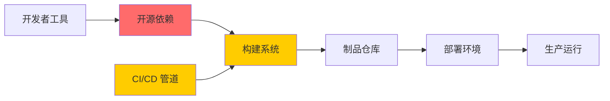

# 软件供应链安全

> 你用的每一个开源包都可能被植入后门——这不是危言耸听

---

## 供应链安全全景



### 为什么供应链安全与 AI 相关

```
AI 应用 = 大量开源依赖 + CI/CD 自动化 + 模型分发
├── PyTorch/TensorFlow — 底层框架漏洞
├── transformers/diffusers — 第三方库漏洞
├── Hugging Face Hub — 模型分发供应链
├── Docker 镜像 — 基础镜像+依赖层
└── CI/CD — 自动化构建中的投毒风险
```

---

## 真实供应链攻击案例

### 案例 1：SolarWinds（2020）

```
攻击者入侵构建系统 → 注入后门 → 通过合法更新分发
影响：18,000+ 客户，包括美国政府机构
```

### 案例 2：log4shell（2021）

```
Apache Log4j 2 中的远程代码执行漏洞
影响：数十亿应用，持续数月难以完全修复
```

### 案例 3：xz-utils 后门（2024）

```
攻击者花了 3 年时间建立信任
→ 成为 xz 项目的维护者
→ 在 liblzma 中植入 SSH 后门（CVE-2024-3094）
→ 险些进入主要 Linux 发行版
```

---

## 软件供应链攻击类型

### 1. 依赖混淆

```text
攻击方式：
  1. 公司内部使用 my-library 这个包名
  2. 攻击者在 PyPI/npm 上注册同名的公开包
  3. 构建系统自动拉取公开包（优先级更高）
  4. 恶意代码被执行

防御：
  - 配置包管理器优先使用私有仓库
  - 使用 scope/namespace 隔离内部包
  - 锁定依赖版本（lockfile）
```

### 2. 恶意包投毒

```bash
# 攻击者上传恶意包到 PyPI/npm
# 包名与流行包相似（typosquatting）

# 示例：typosquatting 攻击
# 目标: requests (流行 HTTP 库)
# 恶意: requestes / requets / reqests

# 防御：验证包来源，使用可信镜像
pip install --require-hashes -r requirements.txt
```

### 3. 构建系统入侵

```yaml
# CI/CD 中的供应链风险

# ❌ 不安全的 CI 配置
steps:
  - name: Run tests
    run: |
      pip install -r requirements.txt  # 自动安装依赖
      python -m pytest

# ✅ 安全的 CI 配置
steps:
  - name: Verify dependencies
    run: |
      pip-audit -r requirements.txt
      safety check -r requirements.txt
  - name: Run tests (restricted sandbox)
    run: |
      pip install --no-deps -r requirements.txt
      python -m pytest
```

---

## SLSA 框架

SLSA（Supply-chain Levels for Software Artifacts）定义了供应链安全的分级标准：

| 级别 | 要求 | 说明 |
|------|------|------|
| SLSA 1 | 构建过程记录 | 有来源记录 |
| SLSA 2 | 构建隔离 + 签名 | 构建环境独立 |
| SLSA 3 | 防篡改构建 | 构建不可篡改 |
| SLSA 4 | 完整审计 + 可复现 | 最高级别 |

```bash
# 通过 SLSA 验证构建完整性
slsa-verifier verify-image \
  --source-uri github.com/org/repo \
  --source-tag v1.2.3 \
  registry.company.com/my-app@sha256:abc...
```

---

## CI/CD 管道安全

### 不安全 vs 安全

```yaml
# ❌ 不安全的 CI/CD
name: Build & Deploy

on: push

jobs:
  build:
    runs-on: ubuntu-latest
    steps:
      - uses: actions/checkout@v2  # 不指定 SHA
      - name: Build
        run: |
          npm install  # 自动安装依赖，有投毒风险
          npm run build
      - name: Deploy
        run: |
          kubectl apply -f deploy/  # 直接部署到生产

# ✅ 安全的 CI/CD
name: Secure Build & Deploy

on:
  pull_request:
    branches: [main]

jobs:
  dependency-scan:
    runs-on: ubuntu-latest
    steps:
      - uses: actions/checkout@v3
      - name: Scan deps
        run: |
          pip-audit -r requirements.txt
          trivy fs . --severity CRITICAL,HIGH

  build-and-sign:
    needs: dependency-scan
    runs-on: ubuntu-latest
    steps:
      - name: Build container
        run: docker build -t my-app:${{ github.sha }} .
      - name: Sign image
        run: cosign sign --key cosign.key my-app:${{ github.sha }}
      - name: Push image
        run: docker push my-app:${{ github.sha }}

  deploy:
    needs: build-and-sign
    runs-on: ubuntu-latest
    # 需要人工审批才能部署到生产
    environment: production
    steps:
      - name: Verify signature
        run: cosign verify --key cosign.pub my-app:${{ github.sha }}
      - name: Deploy
        run: kubectl apply -f deploy/
```

### CI/CD 安全最佳实践

```yaml
CI/CD 安全原则:
  1. 最小权限: CI 角色只给构建部署需要的权限
  2. 依赖验证: 扫描依赖和镜像
  3. 代码签名: 所有构建产物签名
  4. 隔离构建: 构建环境隔离，不共享缓存
  5. 审批控制: 生产部署需要人工审批
  6. 审计日志: 所有构建和部署操作记录
```

---

## 依赖管理最佳实践

### Python 项目

```bash
# 锁定依赖版本
pip freeze > requirements.txt

# 使用哈希校验
pip install --require-hashes -r requirements.txt

# 扫描已知漏洞
pip-audit
safety check
```

### Node.js 项目

```bash
# 锁定依赖
npm ci  # 使用 package-lock.json 精确安装

# 漏洞扫描
npm audit

# 自动修复
npm audit fix
```

### 通用建议

```yaml
依赖管理:
  - 锁定所有依赖版本（lockfile）
  - 定期扫描依赖漏洞
  - 及时更新有漏洞的依赖
  - 最小化依赖引用
  - 私有依赖使用 scope 隔离
  - SBOM 生成和追踪
```

---

## AI 特有的供应链风险

### Hugging Face 模型供应链

```python
# ❌ 危险：从不可信的模型仓库加载模型
from transformers import AutoModel

model = AutoModel.from_pretrained("some-random-user/suspicious-model")
# 这个模型可能包含恶意代码
# Pickle 反序列化可以执行任意代码

# ✅ 安全做法：
# 1. 只从官方或可信组织下载模型
# 2. 使用 safetensors 格式（而非 pickle）
model = AutoModel.from_pretrained(
    "google-bert/bert-base-uncased",  # 官方组织
    use_safetensors=True  # 安全的序列化格式
)
# 3. 验证模型哈希
# 4. 下载后扫描模型文件
```

### ML 依赖的漏洞

```bash
# 检查 AI 相关依赖
pip-audit --ignore-packages torch 2>/dev/null || true
# 输出：如果 torch 有已知漏洞，会提示

# 常用 AI 库的安全注意事项
# - PyTorch: Model.load 可能执行 pickle 代码
# - TensorFlow: SavedModel 可能有恶意操作
# - ONNX: 外部模型格式解析可能有漏洞
```

---

## 安全检查清单

- [ ] 所有依赖版本已锁定（lockfile）
- [ ] 依赖定期扫描漏洞（pip-audit/npm audit）
- [ ] 不使用来源不明的第三方包/镜像
- [ ] CI/CD 中集成了依赖和镜像扫描
- [ ] 构建产物进行了签名
- [ ] AI 模型只从可信来源下载（safetensors 格式）
- [ ] 生产部署有人工审批环节
- [ ] 有 SBOM 生成和追踪流程

---

## 延伸阅读

1. [SLSA 框架](https://slsa.dev/)
2. [OpenSSF Scorecard](https://securityscorecards.dev/)
3. [OWASP Dependency-Check](https://owasp.org/www-project-dependency-check/)
4. [CNCF Supply Chain Security Whitepaper](https://www.cncf.io/reports/supply-chain-security/)
5. [xz 后门事件详细分析](https://boehs.org/node/everything-i-know-about-the-xz-backdoor)
6. [Hugging Face 安全最佳实践](https://huggingface.co/docs/hub/security)
