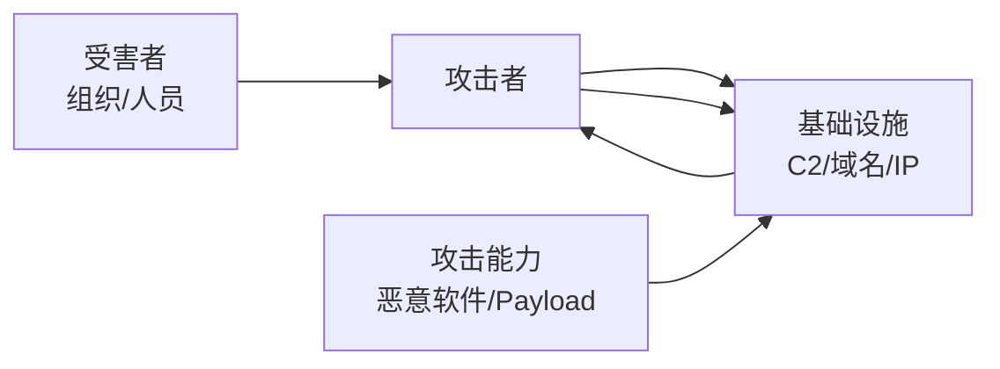

# 威胁情报与 MITRE ATT&CK

> 知己知彼——理解攻击者的战术、技术和流程（TTPs）是防御的第一步。

---

## 什么是威胁情报

```
威胁情报 = 关于攻击者的意图、能力、机会和TTPs的
          循证知识（包括上下文、机制、指标、含义和
          可操作的建议）
```

### 情报层级（Diamond Model）



## MITRE ATT&CK 框架

ATT&CK = 攻击者的战术（Tactics）→ 技术（Techniques）→ 子技术（Sub-techniques）→ 程序（Procedures）

### 14 个战术阶段

| ID | 战术 | 说明 | 示例技术 |
|----|------|------|---------|
| TA0043 | 侦察 | 信息收集 | T1595 主动扫描 |
| TA0042 | 资源开发 | 构建攻击资源 | T1583 购买域名 |
| TA0001 | 初始访问 | 进入目标网络 | T1566 钓鱼 |
| TA0002 | 执行 | 运行恶意代码 | T1059 命令解释器 |
| TA0003 | 持久化 | 维持访问 | T1547 自启动 |
| TA0004 | 权限提升 | 获取更高权限 | T1068 漏洞利用 |
| TA0005 | 防御规避 | 绕过安全检测 | T1564 隐藏工件 |
| TA0006 | 凭据访问 | 窃取身份凭证 | T1003 LSASS Dump |
| TA0007 | 发现 | 环境探测 | T1082 系统信息 |
| TA0008 | 横向移动 | 扩散到其他系统 | T1021 远程服务 |
| TA0009 | 收集 | 收集目标数据 | T1074 数据暂存 |
| TA0010 | 渗出 | 窃取数据 | T1041 通过C2通道渗出 |
| TA0011 | 指挥与控制 | C2通信 | T1071 应用层协议 |
| TA0040 | 影响 | 破坏系统/数据 | T1486 数据加密(勒索) |

### 常用技术矩阵示例

```
初始访问层:
├── T1566.001 鱼叉邮件（附件）
├── T1566.002 鱼叉邮件（链接）
├── T1190 面向公网的应用漏洞
└── T1078 有效账户

持久化层:
├── T1547.001 注册表运行键
├── T1053.005 计划任务
└── T1505.003 Web Shell

防御规避层:
├── T1055.001 进程注入（DLL）
├── T1562.001 禁用安全工具
└── T1027 混淆/编码
```

## 威胁情报平台

| 平台 | 类型 | 特点 |
|------|------|------|
| **AlienVault OTX** | 社区 | 免费，Pulse 共享 |
| **MISP** | 自建 | 开源威胁情报平台 |
| **VirusTotal** | 分析 | 文件/URL/IOC 关联 |
| **IBM X-Force** | 商业 | 全球威胁情报 |
| **Recorded Future** | 商业 | AI 驱动 |
| **ThreatBook** | 中文 | 微步在线 |
| **安恒威胁情报** | 中文 | 综合情报 |

## CTI 工作流程

```python
# 1. 收集 IOC（折中指标）
iocs = [
    "malware.exe" -> SHA256: a1b2c3...,
    "C2" -> IP: 1.2.3.4:8080,
    "Domain" -> malicious.xyz
]

# 2. 丰富情报（关联分析）
def enrich_ioc(ioc_value, ioc_type):
    """丰富 IOC 信息"""
    # VirusTotal 查询
    vt = requests.get(f"https://www.virustotal.com/api/v3/files/{ioc_value}")
    
    # Passive DNS
    pdns = requests.get(f"https://passivedns.api/query?q={ioc_value}")
    
    # WHOIS
    whois = whois_lookup(ioc_value)
    
    return {
        "type": ioc_type,
        "value": ioc_value,
        "detections": vt.json().get("data", {}).get("attributes", {}).get("last_analysis_stats"),
        "whois": whois,
        "first_seen": pdns[0]["first_seen"],
        "last_seen": pdns[0]["last_seen"]
    }

# 3. 关联分析
# 同 IP 关联 → 确定同一攻击组织
# 同 C2 域 → 确定攻击活动

# 4. 产出情报报告
# - TTPs 描述
# - IOC 清单
# - 影响评估
# - 缓解建议
```

## 狩猎规则示例

```yaml
# SIGMA 规则（通用检测规则格式）
title: Suspicious PowerShell Download
id: abcdefgh-1234-5678-90ab-cdef01234567
status: experimental
description: Detects PowerShell downloading files from internet
logsource:
    category: process_creation
    product: windows
detection:
    selection:
        Image|endswith: '\powershell.exe'
        CommandLine|contains:
            - 'Invoke-WebRequest'
            - 'DownloadFile'
            - 'Net.WebClient'
            - 'Start-BitsTransfer'
    condition: selection
falsepositives:
    - Legitimate administrative tasks
level: medium
```

*上一篇：[威胁情报分析实战](03-threat-intel-analysis.md)*

*下一篇：[威胁狩猎与攻击溯源](05-threat-hunting.md)*
