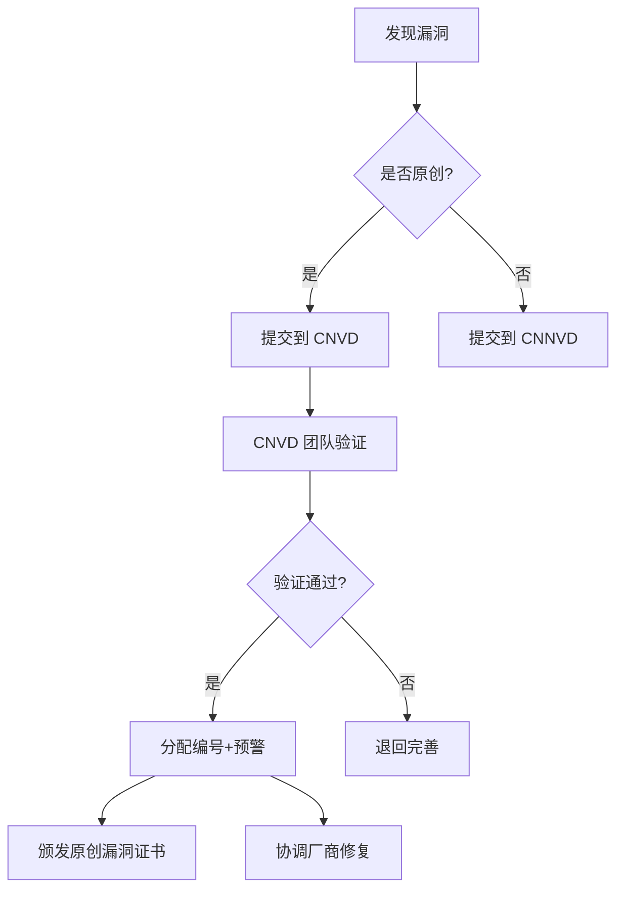

# CNVD 与 CNNVD 详解

> 中国两大官方漏洞库——CNVD（国家信息安全漏洞共享平台）与 CNNVD（中国国家信息安全漏洞库）

---

## CNVD 官方信息

```yaml
全称: China National Vulnerability Database（国家信息安全漏洞共享平台）
维护方: 国家计算机网络应急技术处理协调中心（CNCERT/CC）
网址: https://www.cnvd.org.cn/
成立时间: 2009年
定位: 信息共享知识库，漏洞统一收集验证、预警发布及应急处置
性质: 非营利性公益平台

合作单位: 工信部、公安部、国家安全部、国家认监委等
合作伙伴: 奇安信、360、绿盟、启明星辰等安全厂商
```

### CNVD 的核心功能

```yaml
1. 漏洞收集与验证
   - 接收国内外漏洞提交
   - 验证漏洞的可利用性和影响范围
   - 统一编号（CNVD-YYYY-XXXXX）

2. 预警发布
   - 高危漏洞实时告警
   - 行业定向通报（电信、金融、能源等）
   - 面向社会公众的安全公告

3. 应急处置
   - 协调厂商发布补丁
   - 指导应急响应
   - 漏洞修复跟踪

4. CNVD 原创漏洞证书
   - 向发现者颁发"原创漏洞证明"
   - 含金量高、可求职加分
   - 需提交有一定技术难度的未公开漏洞
```

### CNVD 漏洞编号格式

```text
CNVD-YYYY-XXXXX
例如: CNVD-2025-01234

严重性编码:
  - CNVD-C-XXXX → 严重 (Critical)
  - CNVD-H-XXXX → 高危 (High)
  - CNVD-M-XXXX → 中危 (Medium)
  - CNVD-L-XXXX → 低危 (Low)
```

---

## CNNVD 官方信息

```yaml
全称: China National Vulnerability Database of Information Security
      （中国国家信息安全漏洞库）
维护方: 中国信息安全测评中心
网址: https://www.cnnvd.org.cn/
成立时间: 2009年10月18日
定位: 国家级信息安全漏洞数据管理平台
性质: 国家信息安全权威测评机构

核心职能: 漏洞分析和风险评估
技术支撑: 设核心技术支撑单位（一级/核心等）
```

### CNNVD 的技术支撑单位体系

```yaml
级别体系:
  核心技术支撑单位（一级、二级、三级）
  一般技术支撑单位
  其他合作单位

2026年认证:
  天融信 → 核心技术支撑单位（一级+核心双重认证）
  奇安信、绿盟、启明星辰等均有认证

职责:
  - 重大漏洞发现和上报
  - 漏洞分析与验证
  - 本地化漏洞威胁研判
```

### CNNVD 与 CNVD 的关键区别

| 对比维度 | CNVD | CNNVD |
|---------|------|-------|
| **主管单位** | 国家计算机网络应急中心 | 中国信息安全测评中心 |
| **核心任务** | 漏洞应急响应 | 漏洞认证与测评 |
| **覆盖范围** | 国内重点系统 | 全球漏洞（含物联网、云计算） |
| **响应速度** | 国内漏洞最快 2 小时 | 国际漏洞 24 小时内响应 |
| **服务对象** | 国内企业/普通单位 | 政府/科研机构/安全厂商 |
| **国际影响力** | 专注国内 | 世界三大漏洞库之一 |
| **生活比喻** | 120 急救中心 | 国际新闻频道 |

> **通俗理解**：CNNVD 是国家级"漏洞质检局"做专业认证，CNVD 更像是网络世界的"120 急救中心"做应急处理。

---

## 如何利用这些平台

### 日常使用

```bash
# 1. 每日检查 CNVD 最新公告
curl -s https://www.cnvd.org.cn/flaw/typelist?typeId=1 | less

# 2. 通过 CNNVD 查询特定 CVE 的中国影响
curl -s "https://www.cnnvd.org.cn/home/globalSearch?keyword=CVE-2024-1234"

# 3. 搜索 exploit-db 确认 POC 状态
searchsploit CVE-2024-5678

# 4. 在 Seebug 查看中文分析报告
# https://www.seebug.org/vuldb/ssvid-XXXXX
```

### 漏洞申报流程



### CNVD 原创漏洞证书申请条件

```yaml
基本条件:
  1. 漏洞必须是首次发现并提交
  2. 需提供完整的漏洞信息（描述、复现步骤、POC）
  3. 不能在公开渠道提前发布

加分项:
  - 影响范围广（如通用型产品漏洞）
  - 漏洞价值高（RCE/命令执行等）
  - 提交技术报告详细

用途:
  - 求职敲门砖
  - 高校综合测评加分
  - 安全社区个人品牌建设
```

---

## 学习建议

```yaml
新手入门:
  1. 先学会看 CVE 编号 → 理解漏洞分类
  2. 每天刷 CNVD 公告 → 培养安全意识
  3. 使用 CNNVD 查 CVE 的国内影响 → 理解本地化
  4. 尝试提交低危漏洞 → 获取 CNVD 编号体验

进阶:
  - 参加 CNNVD 技术支撑单位应急响应
  - 申请 CNVD 原创漏洞证书
  - 跟踪工控专项库 CICSVD
```

---

## 延伸阅读

- [CNVD 官方网站](https://www.cnvd.org.cn/)
- [CNNVD 官方网站](https://www.cnnvd.org.cn/)
- [CNNVD vs CNVD 区别详解](https://blog.csdn.net/weixin_43172311/article/details/147552382)
- [三大官方安全漏洞库介绍](https://blog.csdn.net/2401_84915584/article/details/139564603)
- [CNNVD 技术支撑单位计划指南 PDF](https://www.cnnvd.org.cn/static/download/CNNVD_technical_support_unit_plan_guide.pdf)
- [CVE 百度百科](https://baike.baidu.com/item/CVE/9483464)
