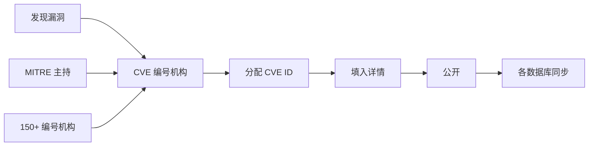
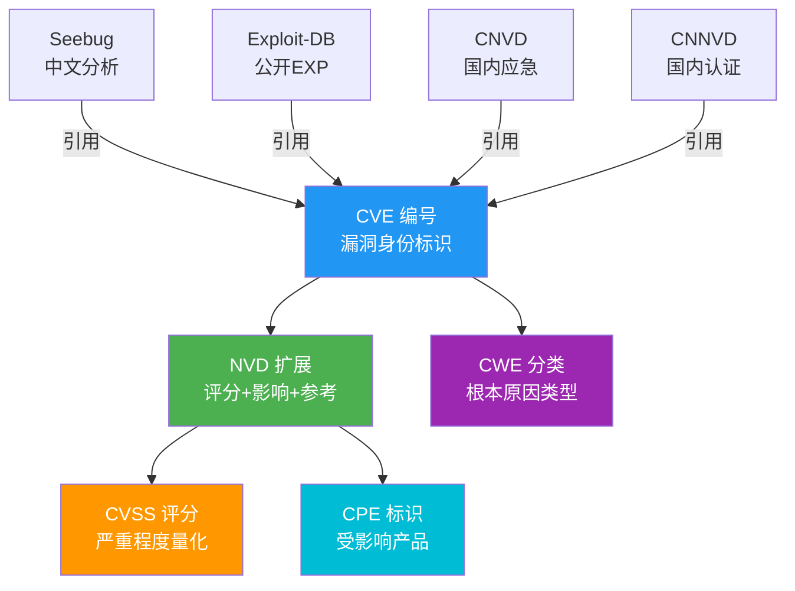

# NVD、CVE、MITRE、CWE 与 CVSS

> 国际漏洞标准体系详解——从 CVE 编号到 CVSS 评分

---

## CVE — 通用漏洞披露

```yaml
全称: Common Vulnerabilities and Exposures
维护方: MITRE Corporation（由美国 DHS/CISA 赞助）
网址: https://cve.mitre.org/
成立时间: 1999 年
收录: 24 万 +（2025 年数据）
性质: 漏洞标识的"字典"——不是数据库，是编号系统

核心作用:
  统一漏洞标识 → CVE-YYYY-NNNNN
  不同漏洞库之间共享数据的"关键字"
```

### CVE 编号结构

```text
CVE-2025-01234
│    │     │
│    │     └── 序列号（每年从 1 开始）
│    └──────── 分配年份
└───────────── 固定前缀

示例:
  CVE-2021-44228 → Log4Shell
  CVE-2017-0144  → EternalBlue
  CVE-2022-22965 → Spring4Shell
```

### CVE 分配流程



- CVE 本身不评级、不提供修复方案
- 只维护一个编号与简要描述的列表
- 详细信息需到 NVD 或厂商安全公告查询

---

## NVD — 美国国家漏洞数据库

```yaml
全称: National Vulnerability Database
维护方: 美国国家标准与技术研究院（NIST）
网址: https://nvd.nist.gov/
成立时间: 2005 年
收录: 26 万 +
特点: 基于 SCAP（安全内容自动化协议）
定位: 美国政府主导的全球第一个国家级安全漏洞数据库
```

### NVD 的核心数据

```yaml
每个 CVE 在 NVD 中扩展为:

1. 基础信息
   - CVE ID、CWE 分类、发布时间
   - 受影响的产品和版本（通过 CPE）

2. CVSS 评分
   - CVSS v3.1 / v4.0 评分
   - 攻击向量、影响评估

3. 参考信息
   - 厂商公告链接
   - 补丁下载地址
   - 公开 POC

4. 状态信息
   - 分析状态（已分析/待分析）
   - 修改时间
```

### NVD 近年变化

```yaml
2026 年 4 月:
  NIST 宣布调整工作流程 → 优先分析关键漏洞
  原因: CVE 提交量 5 年暴增 263%
  对安全从业者的影响:
    - 低危/中危漏洞的 NVD 分析可能延迟
    - 需自行通过厂商公告获取信息
    - 第三方分析工具重要性上升
```

---

## CVSS — 通用漏洞评分系统

```yaml
全称: Common Vulnerability Scoring System
维护方: FIRST.Org（Forum of Incident Response and Security Teams）
版本: v3.1（当前主流） / v4.0（逐步推广）
网址: https://www.first.org/cvss/
作用: 用数字量化漏洞严重程度
```

### CVSS v3.1 评分

```text
评分分级:
  ┌─────┬──────────┐
  │ 分数 │ 等级     │
  ├─────┼──────────┤
  │ 9.0-10.0 │ 严重 │
  │ 7.0-8.9  │ 高危 │
  │ 4.0-6.9  │ 中危 │
  │ 0.1-3.9  │ 低危 │
  └─────┴──────────┘

评分维度（基础指标）:
  AV: 攻击向量（网络/邻接/本地/物理）
  AC: 攻击复杂度（低/高）
  PR: 所需权限（无/低/高）
  UI: 用户交互（无/需要）
  S: 影响范围（不变/改变）
  C: 机密性影响
  I: 完整性影响
  A: 可用性影响

公式: CVSS = f(AV, AC, PR, UI, S, C, I, A)
```

### CVSS v4.0 变化

```yaml
CVSS v4.0 新增:
  1. 新增 CVSS v4.0 基础分数计算法
  2. 对 OT/工控系统更好的评分支持
  3. 改进了环境指标的计算
  4. 新增威胁指标（针对实际利用情况）

注意: NVD 目前同时支持 v3.1 和 v4.0
```

---

## CWE — 通用弱点枚举

```yaml
全称: Common Weakness Enumeration
维护方: MITRE Corporation
网址: https://cwe.mitre.org/
作用: 漏洞的根本原因分类

与 CVE 的区别:
  CVE → 具体漏洞实例
  CWE → 漏洞类型/模式

例如:
  CVE-2021-44228 = Log4j 具体漏洞
  CWE-917 = 表达式语言注入（根本原因）
```

### 常见 CWE 编号

| 编号 | 描述 | 典型漏洞 |
|------|------|---------|
| CWE-79 | XSS 跨站脚本 | 反射型/存储型 XSS |
| CWE-89 | SQL 注入 | 所有 SQL 注入 |
| CWE-94 | 代码注入 | RCE、代码执行 |
| CWE-200 | 信息泄露 | 敏感数据暴露 |
| CWE-287 | 认证绕过 | 未授权访问 |
| CWE-352 | CSRF | 跨站请求伪造 |
| CWE-434 | 文件上传限制不足 | Webshell 上传 |
| CWE-502 | 反序列化 | 反序列化 RCE |
| CWE-787 | 缓冲区越界写 | 栈溢出/堆溢出 |
| CWE-918 | SSRF | 服务端请求伪造 |

---

## CPE — 通用平台枚举

```yaml
全称: Common Platform Enumeration
维护方: NIST
网址: https://nvd.nist.gov/products/cpe
作用: 标准化标识软件/硬件/操作系统

格式: cpe:2.3:a:vendor:product:version:update:*:*:*:*:*:*

示例:
  cpe:2.3:a:apache:log4j:2.14.1:*:*:*:*:*:*
  cpe:2.3:o:microsoft:windows_10:22h2:*:*:*:*:*:*

用途:
  - 漏洞扫描器使用 CPE 匹配受影响的软件
  - SBOM 中使用 CPE 标识组件
  - NVD 搜索支持 CPE 过滤
```

---

## 关系图



---

## 实际应用场景

```bash
# 场景 1：收到安全告警后该做什么？
# CVE-2024-xxxxx 影响了你使用的组件

1. 查 CVE → https://cve.mitre.org/cgi-bin/cvename.cgi?name=CVE-2024-xxxxx
   了解基本信息

2. 查 NVD → https://nvd.nist.gov/vuln/detail/CVE-2024-xxxxx
   查看 CVSS 评分、受影响版本

3. 查 CWE → 了解根本原因类型

4. 确定优先级: CVSS ≥ 7.0 → 紧急修复
                     CVSS 4.0-6.9 → 制定修复计划
                     CVSS < 4.0 → 下次维护时修复

5. 搜索 POC/EXP → 确认是否被公开利用
   searchsploit CVE-2024-xxxxx
```

---

## 延伸阅读

- [CVE MITRE](https://cve.mitre.org/)
- [NVD 官方网站](https://nvd.nist.gov/)
- [CVSS 计算器 v3.1](https://www.first.org/cvss/calculator/3.1)
- [CWE MITRE](https://cwe.mitre.org/)
- [CPE 字典](https://nvd.nist.gov/products/cpe)
- [CVE 百度百科](https://baike.baidu.com/item/CVE/9483464)
- [业界十大漏洞库介绍](https://blog.csdn.net/Javachichi/article/details/141242277)
- [信息安全术语大全 — CVSS/CVE/CNVD/CNNVD](https://blog.csdn.net/qq_43750882/article/details/130580223)
